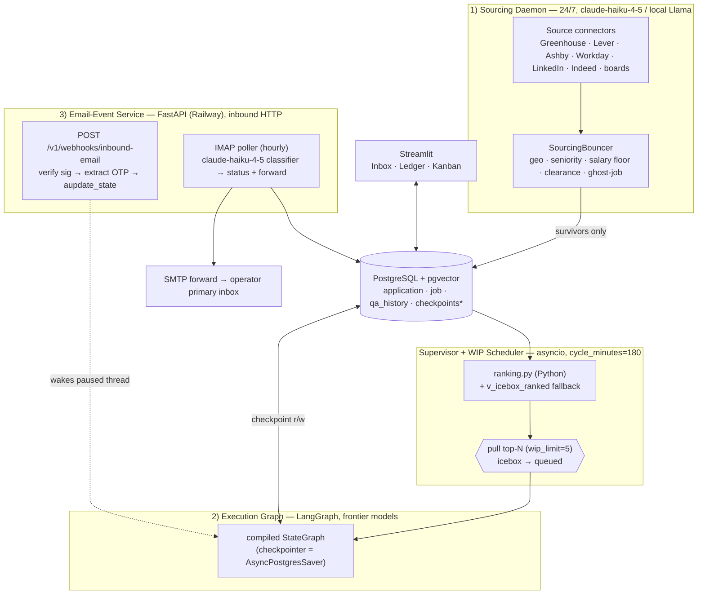
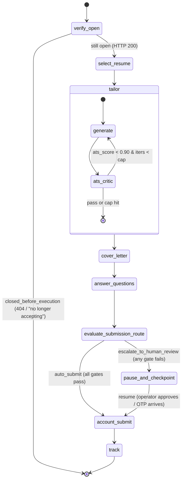
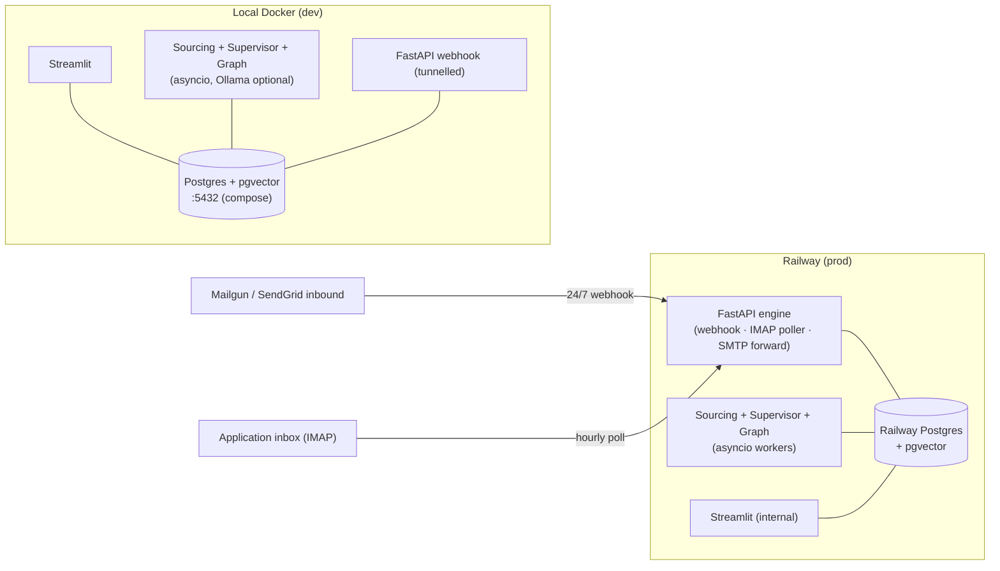

# System Architecture

> Purpose: the canonical engineering map of AeroApply's always-on daemon — its three subsystems, the LangGraph execution graph, the WIP scheduler, and the dev→prod deployment topology — derived directly from `PROJECT_BRIEF.md`, `scripts/bootstrap.sql`, and `config/profile.example.yaml`.

---

## 1. The always-on daemon model

AeroApply is **not** a CLI you invoke per job. It is a persistent, always-on process tree built from **three cooperating subsystems that share one Postgres** (with `pgvector` in the same instance — no Pinecone, no Redis):

1. **Sourcing Daemon** — runs 24/7 on cheap/local models. Source connectors (Greenhouse, Lever, Ashby, Workday, LinkedIn, Indeed, company boards) scrape postings; the `SourcingBouncer` applies edge filters and **drops junk before any DB write**. Survivors land in the Tier-1 Icebox.
2. **Execution Graph** — a WIP-limited LangGraph state machine that runs frontier models only on jobs the Supervisor has promoted. This is where tokens get spent: verify, tailor, draft, answer, route, submit, track.
3. **Email-Event Service** — a FastAPI app (the only inbound HTTP surface) that turns the operator's inbox into control signals: an OTP webhook that **wakes a paused browser thread**, and an hourly IMAP poller that classifies lifecycle mail and updates `application.status`.

The three subsystems are decoupled by the database, not by RPC. The Sourcing Daemon never calls the Execution Graph directly — it writes `application` rows at `wip_status='icebox'`; the Supervisor reads and ranks them via the Python ranker (`ranking.rank_jobs`). The Email-Event Service never reaches into graph memory except through the one sanctioned door, `graph.aupdate_state(...)`. Postgres is the integration bus, the checkpoint store, and the vector store at once.



---

## 2. The Execution Graph (LangGraph state machine)

The Execution Graph is a single `StateGraph` compiled with an async Postgres checkpointer. State is a typed dict carrying the `application` row plus working artifacts (`tailored_resume_json`, `cover_letter`, `answers`, `ats_score`, `agent_confidence`, `blockers`, `verification_code`). Each node reads `model_config[node_name]` to pick its provider/model/params — model choice is config, never hard-coded.



### Node inventory

| Node | Job | Default model |
|---|---|---|
| `verify_open` | **First node, stale-queue guard.** HTTP-pings `job.portal_url`; on 404 / "no longer accepting" sets `status='closed_before_execution'` and exits so the Supervisor pulls the next job — zero drafting wasted. | none (httpx) |
| `select_resume` | Picks the best `resume_variant` for the role (AI PM base vs Senior BA base) by role focus + embedding match against `resume_chunk`. | `claude-haiku-4-5` |
| `tailor` (subgraph) | The **Generator ⇄ ATS-Critic** cyclic loop. Generator drafts the tailored resume; the ATS-Critic scores keyword coverage at `temperature=0` and flags gaps; iterate until `ats_score ≥ 0.90` or the iteration cap trips. | gen `claude-opus-4-8` · critic `claude-sonnet-4-6` |
| `cover_letter` | Writes a cover letter **only if the posting requires one**. | `claude-opus-4-8` |
| `answer_questions` | AITL: for each screening question, embeds it and similarity-searches `qa_history`. High-confidence match → answer; novel/sensitive (EEO/visa/clearance) → record a blocker, **never fabricate**. | `claude-opus-4-8` (draft) · `claude-haiku-4-5` (match) |
| `evaluate_submission_route` | The conditional router (see §4). Returns the semantic label `auto_submit` or `escalate_to_human_review`, which the conditional edge maps to `account_submit` / `pause_and_checkpoint`. | none (pure Python) |
| `pause_and_checkpoint` | Sets `needs_human=TRUE`, writes `blockers`, surfaces the item to the Streamlit Inbox, and yields control. The checkpoint freezes the thread until a human approves or an OTP arrives. | none |
| `account_submit` | Resolves `portal_credentials` by `company_domain` (decrypt Fernet, or generate via `secrets` + sign up + store `credential_id`), then files via clean API or Playwright. Account creation is Tier B → always HITL in v1. | none (connectors/Playwright) |
| `track` | Persists outcome: `status`, `submitted_at`, an append-only `application_event`, and a `run` row. Hands the lifecycle off to the Email-Event Service. | none |

The two peer-review systems must not be conflated: `tailor`'s critic loop is **runtime** peer review (inside the product); the `cross-review` CI gate where a different vendor reviews our code is **build-time** peer review (how we develop AeroApply).

---

## 3. Supervisor + WIP scheduler, and the two-tier backlog

The Supervisor is an `asyncio` task that wakes every `cycle_minutes` (default **180**), ranks Icebox rows via `ranking.rank_jobs(profile.ranking_weights)` and promotes the top `wip_limit` (default **5**) from `wip_status='icebox'` to `'queued'`, then spawns an Execution Graph worker per promoted application. This is the **only** place Icebox volume converts into frontier-model spend.

```python
# Supervisor loop (asyncio; cycle_minutes / wip_limit from config/profile.yaml)
async def supervise(pool: AsyncConnectionPool, cfg: SchedulerCfg) -> None:
    while True:
        async with pool.connection() as conn:
            rows = await fetch_top_n(conn, limit=cfg.wip_limit)   # icebox rows ranked by ranking.rank_jobs()
            for r in rows:
                await mark_queued(conn, r.application_id)         # wip_status: icebox -> queued
        await asyncio.gather(*(run_application(r.application_id) for r in rows))
        await asyncio.sleep(cfg.cycle_minutes * 60)
```

**Two-tier backlog:**

- **Tier 1 — Icebox** (`wip_status='icebox'`): raw volume. Cheap/local models scrape continuously; the `SourcingBouncer` drops junk *before* the DB write, so the Icebox holds only survivors. Jobs wait here indefinitely at near-zero cost.
- **Tier 2 — Execution Queue** (WIP-limited): the bounded working set. Promotion is gated by the Supervisor's `wip_limit`, so the heavy graph never runs unbounded.

`execution_priority` is computed in **Python** by `src/aeroapply/sourcing/ranking.py` from `profile.ranking_weights` (live — a config edit retunes it, no migration). `manual_override` is an absolute trump (`+100`); the remaining factors — title alignment 35%, location 25%, recency 20%, competition 10%, urgency 10% — are operator-tunable in `config/profile.yaml`. The `v_icebox_ranked` SQL view mirrors the formula with **frozen** weights as a debug/fallback and filters to `wip_status='icebox' AND status='sourced'`, so only un-started jobs compete for slots.

`wip_status` (`icebox | queued | active | parked | done`) is internal scheduler state and is tracked **separately** from the operator-facing `status` machine: `sourced → queued → drafting → needs_review → approved → submitting → submitted → questionnaire → interview → offer → accepted → rejected`, plus terminals `user_rejected`, `closed_before_execution`, `withdrawn`, `error`.

---

## 4. The conditional submission edge (secure-by-default)

Submission mode is decided **per-application at runtime** via a **conditional edge** — deliberately *not* a static `interrupt_before`, because eligibility depends on the specific source, scores, and questions of each job. `evaluate_submission_route(state)` (canonical logic in `src/aeroapply/graph/routing.py`) enforces four gates and returns a semantic label — `auto_submit` or `escalate_to_human_review`; **failing any one** gate returns `escalate_to_human_review`. The conditional edge maps these labels to nodes: `{"auto_submit": "account_submit", "escalate_to_human_review": "pause_and_checkpoint"}`.

```python
def evaluate_submission_route(state: AppState) -> Literal["auto_submit", "escalate_to_human_review"]:
    # Source gate: DOM/browser portals are never auto-submitted (Tier B).
    if state["portal_type"] in {"workday", "taleo", "custom"} or state["source_key"] == "linkedin":
        return "escalate_to_human_review"
    # Quality gate
    if state["ats_score"] < 0.90 or state["agent_confidence"] < 0.95:
        return "escalate_to_human_review"
    # Preference gate: operator opt-in for this application/source
    if not state["auto_submit"]:
        return "escalate_to_human_review"
    # Honesty gate: any novel or sensitive (eeo/visa/clearance) question not matched in qa_history
    if state["blockers"].get("novel_questions") or state["blockers"].get("sensitive_unmatched"):
        return "escalate_to_human_review"
    return "auto_submit"   # only when ALL gates pass
```

This binds the brief's **autonomy tiers** to the graph: **Tier A** (clean-API ATS — Greenhouse, Lever, Ashby) is auto-submit *eligible*; **Tier B** (Workday, Taleo, company sites, LinkedIn) is always HITL; **Tier C** (anything requiring fabrication or ToS-prohibited automation) is blocked. Thresholds map straight from `config/profile.yaml` (`min_ats_score: 0.90`, `min_agent_confidence: 0.95`, `auto_submit_sources`, `always_human_sources`). Default operator posture is **review-before-submit**; auto-submit is earned, not assumed.

---

## 5. Checkpointer, threads, and async workers

Durability comes from LangGraph's Postgres checkpointer. The brief locks two invariants:

- **`thread_id == application.id`.** Each application is exactly one durable thread. The `application.thread_id` column stores it; a `run` row maps each execution attempt back to its thread for observability.
- **Checkpoint tables are auto-created.** `checkpoints`, `checkpoint_blobs`, and `checkpoint_writes` are made by `await checkpointer.setup()` and are **never** hand-written in `bootstrap.sql` (which owns every application table instead). Schema changes flow through Alembic; the checkpoint tables are owned by LangGraph.

```python
from langgraph.checkpoint.postgres.aio import AsyncPostgresSaver
from psycopg_pool import AsyncConnectionPool

pool = AsyncConnectionPool(conninfo=DATABASE_URL, max_size=20, open=False)
async with pool:
    checkpointer = AsyncPostgresSaver(pool)
    await checkpointer.setup()                      # creates checkpoints* tables idempotently
    graph = builder.compile(checkpointer=checkpointer)
    cfg = {"configurable": {"thread_id": str(application.id)}}   # thread_id == application.id
    await graph.ainvoke(initial_state, cfg)
```

Workers are **`asyncio` task workers** sharing a psycopg3 `AsyncConnectionPool` — no Celery in v1 (added only if the load actually demands it). When `evaluate_submission_route` lands on `pause_and_checkpoint`, the checkpoint persists and the thread idles with no compute held. Two distinct events resume it:

- **Operator approval** in the Streamlit Inbox flips `status` to `approved`, and the worker resumes from the checkpoint into `account_submit`.
- **OTP injection**: the inbound webhook matches the sender domain to the active application and calls
  `await graph.aupdate_state(config, {"verification_code": code}, as_node="account_node")` — feeding the code straight into the paused thread so the Playwright session types it and proceeds unsupervised. (`aupdate_state` is a method on the **compiled graph**, not the checkpointer; Mailgun inbound arrives as multipart form fields parsed via `await request.form()`, not JSON.)

---

## 6. Deployment topology (local Docker dev → Railway prod)

**Dev — local Docker.** A `docker-compose` Postgres with `pgvector` (canonical decision: **local Docker Postgres, not Supabase**) gives the fastest loop, zero cost, and instant checkpoint writes. Schema is applied from `scripts/bootstrap.sql`; the checkpointer's `setup()` adds its tables on first run. The Sourcing Daemon, Supervisor, Execution Graph, and Streamlit UI run as local processes against `localhost:5432`; sourcing/classification can run fully local via Ollama (Llama) for $0. Secrets (`AEROAPPLY_FERNET_KEY`, provider API keys) come from `.env`; the inbound webhook is exposed with a tunnel for testing.

**Prod — Railway.** The FastAPI engine and Postgres are **co-located on Railway** for low checkpoint latency and a stable 24/7 public endpoint to receive Mailgun/SendGrid inbound webhooks. The Fernet key is KMS-backed rather than a raw env var; the IMAP poller and Supervisor run as scheduled/long-lived workers; SMTP forwarding uses `aiosmtplib` fire-and-forget via FastAPI `BackgroundTasks`. **Security note:** the internal Streamlit UI must **never** be exposed unauthenticated on a public Railway URL — it surfaces the full Inbox/Ledger and operator data. Keep it off the public ingress: reach it via Railway private networking, gate it behind basic auth backed by `st.secrets`, or restrict access to VPN-only.



The same codebase runs in both environments; only the connection string, the Fernet key source (env vs KMS), and the public ingress differ. Migrations generated from `bootstrap.sql` via Alembic keep dev and prod schemas identical, so a thread checkpointed in dev has the same shape it would in prod.
