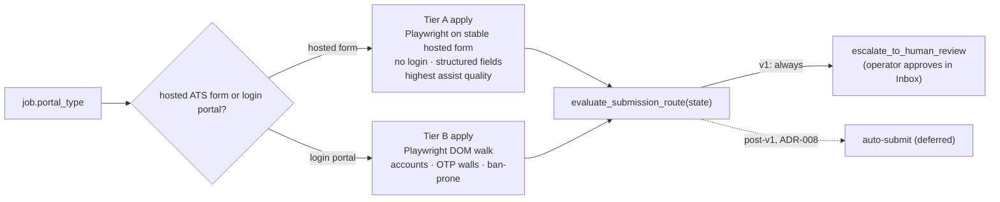
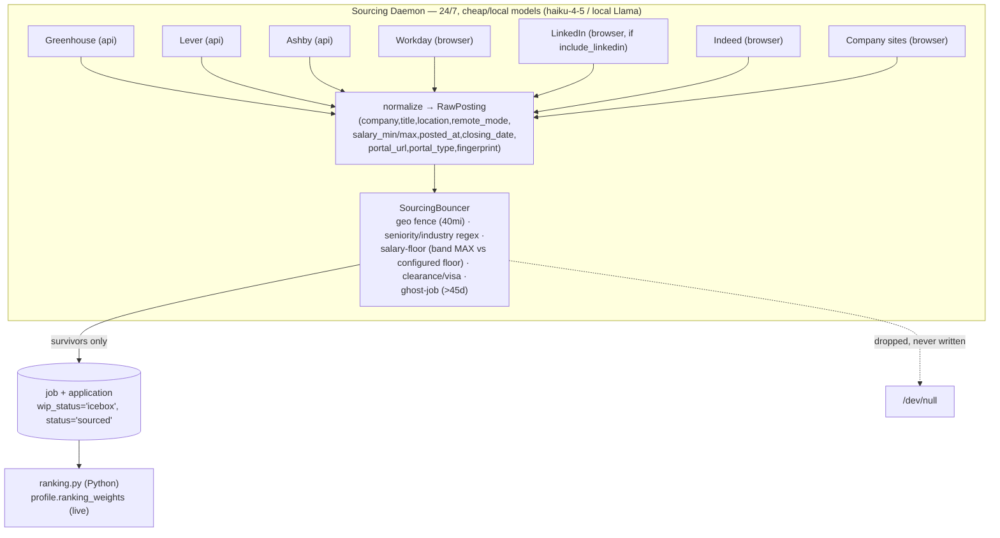

# Source & Apply Connectors

> **Purpose:** Define how AeroApply ingests jobs (source side) and files applications (apply side) per ATS/portal, and the autonomy tier and rate-limit/anti-ban posture of each. Aligns with `docs/PROJECT_BRIEF.md` (canonical), `docs/adr/ADR-008` (apply path), `scripts/bootstrap.sql`, and `config/profile.example.yaml`.
>
> **ADR-008 (2026-06-09):** the candidate-side apply APIs this doc originally assumed for Greenhouse/Lever/Ashby **do not exist** — their application-submission APIs are employer-keyed. Every v1 submission is a Playwright walk of the portal's **hosted application form**, operator-approved. Tiers now describe hosted-form predictability, not API availability.

---

## 1. The connector interface (two capabilities, one registry)

A connector wraps a single ATS/portal family (Greenhouse, Lever, Workday, …). Every connector advertises up to **two independent capabilities** — it may implement one or both:

- **Source capability** — discover postings matching a `search_profile`, normalize them into `job` rows, and hand each to the `SourcingBouncer` (`src/aeroapply/sourcing/bouncer.py`). This is the high-volume, cheap/local-model path of the **Sourcing Daemon**.
- **Apply capability** — given an `application` row whose draft has cleared the submission gate and been operator-approved, file the application through the portal's hosted form (Playwright DOM walk — ADR-008) and return a submission receipt. This is invoked only inside the **Execution Graph** at the `submit` node.

The two halves are deliberately decoupled: we frequently **source** a posting from one place (e.g., LinkedIn surfaces a role) but **apply** through another (the role's underlying Greenhouse board). The `job` table records both — `url` (where we found it) and `portal_url` + `portal_type` (where the application is actually filed). The apply connector is chosen from `portal_type`, never from where the job was scraped.

```python
# src/aeroapply/connectors/base.py  (illustrative — Pydantic v2, async)
class SourceConnector(Protocol):
    key: str                  # 'greenhouse' | 'lever' | ... matches source.key
    kind: Literal["api", "browser"]
    async def search(self, profile: SearchProfile) -> AsyncIterator[RawPosting]: ...
    async def hydrate(self, posting: RawPosting) -> RawPosting: ...   # full JD, salary, dates

class ApplyConnector(Protocol):
    key: str
    autonomy_tier: Literal["A", "B", "C"]      # mirrors source.autonomy_tier
    auto_submit_eligible: bool                  # False for every v1 connector (ADR-008)
    async def submit(self, ctx: ApplicationContext) -> SubmissionReceipt: ...
```

Each connector is backed by exactly one `source` row (`scripts/bootstrap.sql`), which is the **runtime authority** for its classification:

```sql
-- source: kind constrains to api|browser; autonomy_tier to A|B|C; rate_limit is per-connector JSONB
CREATE TABLE source (
    key           VARCHAR(80) UNIQUE,                 -- 'greenhouse' | 'lever' | 'workday' | 'linkedin' ...
    kind          VARCHAR(20) CHECK (kind IN ('api','browser')),
    autonomy_tier CHAR(1) DEFAULT 'B' CHECK (autonomy_tier IN ('A','B','C')),
    enabled       BOOLEAN DEFAULT TRUE,
    config        JSONB DEFAULT '{}',
    rate_limit    JSONB DEFAULT '{}'                  -- pacing / anti-ban hygiene
);
```

Code (`src/aeroapply/connectors/*`) declares defaults; the DB row can override `enabled`, `autonomy_tier`, and `rate_limit` without a deploy. The routing logic in `evaluate_submission_route(state)` reads the live tier, so demoting a flaky connector to Tier B is a one-row `UPDATE`.

## 2. Capability matrix

| Connector | `kind` | Tier | Source | Apply (all Playwright hosted-form — ADR-008) | Auto-submit (v1) | Notes |
|---|---|---|---|---|---|---|
| **Greenhouse** | api (source) | **A** | yes (public job board API, read-only) | hosted form (`boards.greenhouse.io`) | no | Apply API is **employer-keyed** — unusable candidate-side. Hosted form is stable, structured, no login. |
| **Lever** | api (source) | **A** | yes (public postings API, read-only) | hosted form (`jobs.lever.co`) | no | Apply POST requires a key only a Lever Super Admin can generate. Hosted form predictable, no login. |
| **Ashby** | api (source) | **A** | yes (public job-posting API, read-only) | hosted form (`jobs.ashbyhq.com`) | no | Application API is org-keyed. Hosted form typed/structured. |
| **Workday** | browser | **B** | partial (per-tenant DOM/CxS) | yes (Playwright) | no | Per-tenant subdomains (`*.myworkdayjobs.com`), heavy multi-step forms, account required → always HITL. |
| **Taleo** | browser | **B** | partial (DOM) | yes (Playwright) | no | Legacy Oracle flows, brittle iframes, frequent account walls → always HITL. |
| **Company sites (custom)** | browser | **B** | yes (DOM scrape) | yes (Playwright) | no | Bespoke markup; resilient DOM via optional `browser-use`/Stagehand → HITL. |
| **LinkedIn** | browser | **B** (ToS-restricted) | yes (gated by `include_linkedin`) | Easy Apply via Playwright | no | ToS-restricted + ban-prone; conservative pacing; human-gated. Disable via `include_linkedin=false`. |
| **Indeed** | browser | **B** | yes (DOM/aggregator) | redirect-only (defer to underlying ATS) | no | Aggregator: prefer to **resolve to the real ATS** and apply there (often Tier A). Indeed-hosted apply stays HITL. |

Tier mapping (Brief §6, re-based by ADR-008): **Tier A** = hosted ATS forms (Greenhouse, Lever, Ashby) — stable structured markup, usually no login, highest assist quality; **Tier B** = login/multi-step/aggregator portals + LinkedIn; **Tier C** = anything requiring fabrication or whose ToS prohibits automation outright. In v1 **nothing is auto-submit eligible** — every submission is operator-approved. `config/profile.example.yaml` encodes this directly:

```yaml
autonomy:
  default_mode: "review"
  auto_submit_sources: []     # v1 ships review-and-approve; block-all (ADR-008)
  always_human_sources: ["workday", "taleo", "linkedin", "custom"] # Tier B
  min_ats_score: 0.90
  min_agent_confidence: 0.95
```

## 3. Hosted forms vs login portals — the tradeoff



**Why Tier A is still a meaningful class (ADR-008):** there is no candidate-side apply API anywhere — Greenhouse/Lever/Ashby application APIs are employer-keyed — so every submission is a browser walk. But hosted ATS forms are the *predictable* end of that spectrum: stable selectors shared across thousands of company boards, structured question schemas, usually no login, no account wall, and far less anti-bot pressure. One Greenhouse form-filler covers every Greenhouse-hosted board. That predictability is why Tier A is the cheapest to maintain and the best-assisted class — and why it would be the first candidate if a sanctioned unattended channel ever opens.

**DOM connectors (Tier B)** are unavoidable for the bulk of large-enterprise hiring (Workday, Taleo) and bespoke career sites, but they are fragile by nature: selectors drift, multi-step wizards carry hidden state, account/OTP walls interrupt mid-flow, and these portals actively fingerprint automation. Per Brief §13, AeroApply does **not** defeat CAPTCHAs or evade anti-bot systems — if a portal blocks us, we escalate rather than fight. DOM flows also frequently require account creation, which is **Tier B by definition** (Brief §7) and the single highest-risk action for bans. Hence every browser-`kind` connector is human-gated regardless of draft quality.

The aggregator case (Indeed/LinkedIn) gets a special rule: **always try to resolve to the underlying ATS** during `hydrate()`. If a LinkedIn or Indeed listing points at a Greenhouse/Lever/Ashby `portal_url`, we rewrite `portal_type` accordingly and the application becomes Tier A. Only when no clean ATS exists do we fall back to the aggregator's own (Tier B, HITL) apply path.

## 4. Per-source autonomy, rate limits & anti-ban

`source.rate_limit` (JSONB) carries per-connector pacing. Tier A is throttled mainly to be a polite API citizen; Tier B is throttled for **survival** — to look human and avoid bans. Illustrative seed values:

```json
{
  "greenhouse": { "tier": "A", "rps": 2,   "daily_cap": 400, "backoff": "exp", "jitter_ms": [200, 800] },
  "lever":      { "tier": "A", "rps": 2,   "daily_cap": 400, "backoff": "exp", "jitter_ms": [200, 800] },
  "ashby":      { "tier": "A", "rps": 1.5, "daily_cap": 300, "backoff": "exp", "jitter_ms": [200, 800] },
  "workday":    { "tier": "B", "rpm": 6,   "daily_cap": 40,  "human_pacing": true,  "min_gap_s": 45 },
  "taleo":      { "tier": "B", "rpm": 6,   "daily_cap": 30,  "human_pacing": true,  "min_gap_s": 45 },
  "custom":     { "tier": "B", "rpm": 8,   "daily_cap": 50,  "human_pacing": true,  "min_gap_s": 30 },
  "linkedin":   { "tier": "B", "rpm": 3,   "daily_cap": 15,  "human_pacing": true,  "min_gap_s": 90, "tos_restricted": true },
  "indeed":     { "tier": "B", "rpm": 5,   "daily_cap": 25,  "human_pacing": true,  "min_gap_s": 60 }
}
```

Anti-ban posture by tier:

- **Tier A (sourcing reads are API; applies are hosted-form):** the public board/postings JSON endpoints need no auth — respect documented quotas, exponential backoff on `429`/`5xx`, small jitter so concurrent reads don't burst. These caps are courtesy, not camouflage. Hosted-form *submissions* are operator-approved one-at-a-time in v1, so pacing is inherently human.
- **Tier B (DOM):** one persistent Playwright browser context **per company domain**, reusing stored cookies so we are not a fresh fingerprint each visit. Human-like pacing (`min_gap_s`, randomized typing, scroll/dwell), conservative daily caps, and **never** parallel sessions against the same portal. LinkedIn gets the most conservative envelope (`rpm: 3`, `daily_cap: 15`, `min_gap_s: 90`) because Easy Apply automation is explicitly ToS-restricted (Brief §13.4) — and the whole connector is gated behind `search_profile.include_linkedin`, so the operator can turn it off entirely.
- **Account/OTP interruptions (Tier B):** when a portal demands a verification code, the paused Playwright thread is resumed by the email-event service via `await graph.aupdate_state(config, {"verification_code": code}, as_node="account_node")` (Brief §8). Credentials are stored Fernet-encrypted in `portal_credentials`, keyed by `company_domain`, and reused on subsequent visits — both an anti-ban measure (stable identity) and a UX one (no repeated signups).

If a connector starts erroring or showing bot-challenges, the operational response is a single `UPDATE source SET enabled = FALSE` or a tier demotion — no redeploy — because routing reads the live row.

## 5. How connectors feed the Bouncer (source path)

Source connectors emit normalized `RawPosting`s; the `SourcingBouncer` drops junk **before any DB write** (Brief §5.3), so the Icebox never fills with noise and no frontier tokens are wasted on it.



The connector's job is to populate the fields the Bouncer and ranking view depend on:

- `remote_mode`, `location`, `lat`/`lon` → **geo-fence** gate (Remote keeps; Hybrid/Onsite within the configured radius of the home anchor).
- `salary_max` → **salary-floor** gate (drop if `> 0` and below the configured floor; unlisted/`0` passes through).
- `title` → **seniority/industry** regex gate (`drop_title_regex` in profile).
- `description`/`requirements` → **clearance/visa** gate (`legal_blocker_regex`).
- `posted_at` → **ghost-job** gate (drop if older than 45 days).
- `fingerprint` (hash of company+title+location) → the `UNIQUE` dedupe key on `job`.

Survivors are written as a `job` row plus an `application` row at `wip_status='icebox', status='sourced'` — the only state `v_icebox_ranked` ranks. Critically, **`portal_type` is captured here, at source time**, so the apply side later knows which connector to dispatch. A connector that cannot determine a clean `portal_type` should record the raw destination and let the source default (Tier B) apply.

## 6. How apply-connectors are selected at submit

Selection happens at the **`submit` node** of the Execution Graph, *after* the draft has been tailored (Generator ⇄ ATS-Critic), the cover letter written, and questions answered from `qa_history`. The conditional edge `evaluate_submission_route(state)` (`src/aeroapply/graph/routing.py`) decides auto vs. human **per application, at runtime** — not via a static `interrupt_before`.

```python
# Illustrative — canonical gate logic lives in src/aeroapply/graph/routing.py.
# In v1 auto_submit_sources is [] (block-all, ADR-008), so every application takes the
# escalate branch and waits for operator approval; the gates are the future opt-in mechanism.
def evaluate_submission_route(state: AppState) -> Literal["auto_submit", "escalate_to_human_review"]:
    src = get_source(state.job.portal_type)        # the source row for this portal_type

    # Source gate: only an allow-listed Tier-A source could ever auto-submit.
    if src.autonomy_tier != "A" or src.key not in autonomy.auto_submit_sources:
        return "escalate_to_human_review"          # v1: this is everything

    # Quality gate (Brief §6 / profile.yaml).
    if not (state.ats_score >= 0.90 and state.agent_confidence >= 0.95):
        return "escalate_to_human_review"

    # Preference gate: operator opt-in on THIS application.
    if not state.application.auto_submit:
        return "escalate_to_human_review"

    # Honesty gate: any novel/unmatched question — and ANY EEO/visa/clearance/self-ID
    # field not matched in qa_history with high confidence — escalates. Never fabricate.
    if state.has_unanswered_questions or state.has_unmatched_sensitive_field:
        return "escalate_to_human_review"

    return "auto_submit"                            # all gates clear → dispatch Tier A connector
```

Once the route is `auto_submit` (or a human approves a parked thread in the Inbox), the **apply connector is resolved from `portal_type`** and its `submit()` is invoked:

```python
connector = APPLY_REGISTRY[state.job.portal_type]   # greenhouse | lever | ashby | workday | taleo | custom | linkedin
receipt = await connector.submit(ctx)               # Playwright hosted-form walk for every portal (ADR-008)
# persist: application.status = 'submitted', submitted_at = now(), append application_event(actor='agent')
```

Every decision and dispatch is written to the append-only `application_event` audit log (`actor IN ('agent','human','system')`) so the full chain — which connector, which route, why escalated — is traceable.

### What is and isn't auto-submit eligible

- **v1: nothing.** `auto_submit_sources: []` (block-all) — every application, on every portal, routes to `escalate_to_human_review` and waits for operator approval in the Inbox (ADR-008). The gates exist so this stays a config decision, not a code change.
- **Post-v1 (deferred):** Tier-A hosted forms (Greenhouse, Lever, Ashby) would be the first candidates — and *only* with `autonomy_tier='A'`, an explicit allowlist entry, `ats_score ≥ 0.90`, `agent_confidence ≥ 0.95`, `auto_submit = TRUE`, and no unmatched/novel/sensitive field. Revisited only if a sanctioned candidate-side channel emerges.
- **Never auto-submit (Tier B):** Workday, Taleo, company sites, LinkedIn, Indeed-hosted apply, and **any** flow requiring account creation.
- **Blocked (Tier C):** any connector or field that would require fabrication, or a source whose ToS prohibits automation outright — not dispatched at all.

This keeps the secure-by-default contract intact: in v1 **no application leaves AeroApply unattended** — the agent drafts everything and fills the form, the operator approves the send. Everything fragile, ban-prone, or judgment-laden waits for the human.
