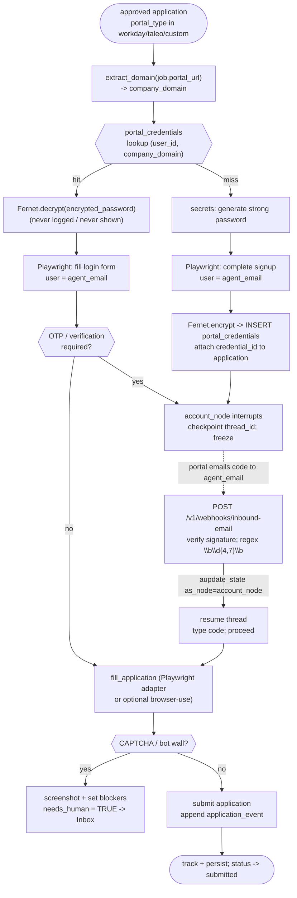

# Account Creation & Browser Automation

> **Purpose:** How AeroApply reaches a DOM/browser portal, finds-or-creates an encrypted portal login, drives the application with Playwright, resumes on an email OTP, and stays inside the secure-by-default / anti-ban guardrails — and why every byte of this path is Tier B (always human-gated) in v1.

This document is subordinate to `PROJECT_BRIEF.md`. Where it touches the data model it follows `scripts/bootstrap.sql`; where it touches operator config it follows `config/profile.example.yaml`. It covers the `submit` node's browser branch and the `account_node` it depends on — not the clean-API connectors (Greenhouse / Lever / Ashby), which are Tier A and documented in `CONNECTORS.md`.

---

## 1. Where this fits in the graph

The execution graph (LangGraph, frontier models) ends with a routing decision. `evaluate_submission_route(state)` decides per-application whether we may auto-submit. For **any** browser/DOM portal — `workday`, `taleo`, custom company sites, LinkedIn Easy Apply — the **source gate fires first and unconditionally**: the route is `escalate_to_human_review`. So everything below happens *after* a human has approved the application in the Streamlit Inbox. The automation here is the execution arm of an already-approved action, never an autonomous submit.

The two relevant nodes:

- **`account_node`** — domain extraction, credential lookup, login-vs-signup, OTP wait/resume.
- **`submit` (browser branch)** — drives the portal DOM with Playwright once authenticated.

Both run only when `job.portal_type ∈ {workday, taleo, custom}` (the `portal_type` column in `job`) and the operator has clicked **Approve**.

---

## 2. Domain extraction from `portal_url`

The credential vault is keyed on `company_domain` (see `portal_credentials.company_domain` — e.g. `company.wd5.myworkdayjobs.com`). We derive that key from `job.portal_url`, the column that records *where the application is actually filed* (distinct from `job.url`, the posting). We key on the **full registrable host**, not the eTLD+1, because a Workday tenant lives at a per-company subdomain and that subdomain *is* the identity boundary — `acme.wd5.myworkdayjobs.com` and `globex.wd5.myworkdayjobs.com` are different accounts.

```python
from urllib.parse import urlparse

def extract_domain(portal_url: str) -> str:
    """Normalize portal_url -> the company_domain key used in portal_credentials.

    Keep the full host (incl. Workday tenant subdomain); lowercase; strip 'www.'.
    """
    host = (urlparse(portal_url).hostname or "").lower().strip()
    if host.startswith("www."):
        host = host[4:]
    if not host:
        raise ValueError(f"portal_url has no host: {portal_url!r}")
    return host
```

`extract_domain("https://acme.wd5.myworkdayjobs.com/en-US/careers/job/123")` → `acme.wd5.myworkdayjobs.com`. This string is the lookup key in the next step and the value we persist if we create a new account.

---

## 3. `portal_credentials` lookup → login-vs-signup branching

We query the vault by `(user_id, company_domain)` — the table's UNIQUE constraint guarantees at most one row per operator per domain:

```sql
SELECT id, username, encrypted_password
FROM portal_credentials
WHERE user_id = %(user_id)s AND company_domain = %(domain)s;
```

Two outcomes:

- **Hit → LOGIN.** Decrypt `encrypted_password` (Fernet, Section 5), fill the portal's login form, authenticate. Touch `last_used_at = now()`. The application's `credential_id` FK is set to this row.
- **Miss → SIGNUP.** Generate a strong password (Section 4), drive the portal's account-creation form using `app_user.agent_email` (the dedicated `<name>.agents@domain` address) and the generated secret, then `INSERT` a new `portal_credentials` row and attach its `credential_id` to the `application`.

```sql
INSERT INTO portal_credentials (user_id, company_domain, username, encrypted_password)
VALUES (%(user_id)s, %(domain)s, %(agent_email)s, %(fernet_ciphertext)s)
RETURNING id;  -- becomes application.credential_id
```

Using `agent_email` as the portal username is deliberate: every verification/OTP mail then lands in the one inbox the email-event service watches, which is what makes the OTP handshake in Section 6 work. The signup path is exactly why account creation is the highest-ban-risk action and is Tier B by definition (Section 8).

---

## 4. Strong password generation via `secrets`

New accounts get a high-entropy random password from Python's `secrets` (CSPRNG) — never `random`, never a derived/guessable scheme. We target a length and character mix that clears typical enterprise portal policies on the first try (so we don't trip a "password too weak" reject that forces a retry loop and looks bot-like).

```python
import secrets, string

def generate_password(length: int = 24) -> str:
    """CSPRNG password: >=1 lower/upper/digit/symbol, no ambiguous chars."""
    alphabet = string.ascii_letters + string.digits + "!@#$%^&*-_=+"
    while True:
        pw = "".join(secrets.choice(alphabet) for _ in range(length))
        if (any(c.islower() for c in pw) and any(c.isupper() for c in pw)
                and any(c.isdigit() for c in pw)
                and any(c in "!@#$%^&*-_=+" for c in pw)):
            return pw
```

The plaintext exists only in process memory long enough to (a) type it into the signup form and (b) hand it to Fernet for encryption. It is never written to logs, never returned to the Streamlit UI, and never persisted in plaintext anywhere.

---

## 5. Fernet encryption at rest (key from env in dev, KMS in prod)

`portal_credentials.encrypted_password` is **Fernet ciphertext** (AES-128-CBC + HMAC-SHA256, authenticated, with a timestamp). The encryption key is environment-scoped per the canonical decision:

- **Dev:** key in `AEROAPPLY_FERNET_KEY` (a 32-byte urlsafe-base64 value), sourced from `.env` / `infra/.env.example`, never committed.
- **Prod:** key material managed by **KMS** on Railway; the same `Fernet(key)` interface, only the key provenance changes.

```python
import os
from cryptography.fernet import Fernet

def _fernet() -> Fernet:
    key = os.environ["AEROAPPLY_FERNET_KEY"]  # prod: resolved from KMS, not a literal
    return Fernet(key.encode())

def encrypt_password(plaintext: str) -> str:
    return _fernet().encrypt(plaintext.encode()).decode()  # -> store in encrypted_password

def decrypt_password(ciphertext: str) -> str:
    return _fernet().decrypt(ciphertext.encode()).decode()  # used ONLY to fill a login form
```

**Never-log / never-display rules (non-negotiable, per `PROJECT_BRIEF.md` §7 and §13.5):**

1. Decrypted passwords are used only to fill a portal login field, then go out of scope. They are never logged, never echoed to the Streamlit UI in plaintext, never put in `application_event.payload`, and never returned by any API.
2. The generated plaintext (Section 4) is likewise never logged. Loggers redact any field named `password`/`encrypted_password`; the audit log (`application_event`) records *that* a credential was created/used (event type + `credential_id`), never the secret.
3. `AEROAPPLY_FERNET_KEY` and the KMS key are secrets-manager material, never in git (private repo; `.gitignore`).
4. Key rotation = decrypt-with-old, re-encrypt-with-new across the `portal_credentials` rows; Fernet supports `MultiFernet` for staged rotation.

### 5.1 Key rotation runbook

Rotation re-encrypts every `portal_credentials.encrypted_password` from the old key to a new one. Fernet's `MultiFernet([new, old])` makes this staged and safe: it **encrypts with the first key** and **decrypts with any key in the list**, so ciphertext written under the old key keeps decrypting throughout the migration while new writes use the new key. The decrypted plaintext is held only in process memory long enough to re-encrypt — same never-log / never-persist rules as Section 5.

Run it as a one-shot maintenance script (`scripts/rotate_fernet_key.py`), not inside the live graph. The migration shape:

```python
import os
from cryptography.fernet import Fernet, MultiFernet, InvalidToken

old = Fernet(os.environ["AEROAPPLY_FERNET_KEY_OLD"].encode())
new = Fernet(os.environ["AEROAPPLY_FERNET_KEY_NEW"].encode())
mf  = MultiFernet([new, old])   # encrypt with NEW; decrypt with NEW or OLD

# One row at a time, inside a transaction; rotate() = decrypt-then-encrypt-with-primary.
# SELECT id, encrypted_password FROM portal_credentials FOR UPDATE  (batch/cursor)
for row_id, ct in rows:
    try:
        new_ct = mf.rotate(ct.encode()).decode()   # re-encrypts under NEW key
    except InvalidToken:
        # ciphertext that decrypts under neither key -> STOP, do not overwrite (see rollback)
        raise
    # UPDATE portal_credentials SET encrypted_password = %(new_ct)s WHERE id = %(row_id)s
```

Numbered procedure:

1. **Drain / park active Playwright threads first.** Pause the Supervisor (stop promoting Icebox → queued) and let in-flight `account_node` / `submit` threads reach their next checkpoint, then **park** them (`wip_status = 'parked'`). No browser thread may be mid-login or holding a decrypted password while the vault is being re-encrypted — a thread that decrypts under the old key mid-rotation can race a row already rewritten under the new key. Confirm zero `wip_status = 'active'` rows before proceeding.
2. **Stage both keys.** Provision the new 32-byte urlsafe-base64 key and expose **both** old and new to the rotation script as `AEROAPPLY_FERNET_KEY_OLD` / `AEROAPPLY_FERNET_KEY_NEW`.
   - **Dev:** both in `.env` (never committed).
   - **Prod (Railway / KMS):** create a **new key version** in KMS, grant the rotation job read access to *both* the current and new versions, and inject them as the two env vars for the run. Do **not** retire/disable the old version yet.
3. **Back up the column.** Snapshot `portal_credentials` (or at least `id, encrypted_password`) so a partial run can be restored exactly. The audit log (`application_event`) records *that* rotation ran (event type + `credential_id`), never the secret.
4. **Run the migration transactionally, in batches.** Iterate rows under `SELECT … FOR UPDATE`, call `MultiFernet.rotate(...)`, and `UPDATE` in place; commit per batch so progress is durable and resumable. `rotate()` is idempotent under the new primary key, so re-running over already-rotated rows is safe.
5. **Verify.** After the run, assert every row decrypts under the **new key alone** (instantiate `Fernet(new)` and decrypt a sample / full sweep). Only once 100% verify should you promote the new key to primary.
6. **Promote, then retire the old key.** Set `AEROAPPLY_FERNET_KEY` to the new key for the app (Railway env var / KMS primary version). Keep the old key version available but unused for one safety window, then disable/destroy it in KMS.
7. **Unpark and resume.** Flip parked threads back to `queued` and re-enable the Supervisor. The just-rotated rows decrypt cleanly under the new key on the next login.

**Rollback if a partial migration fails.** Rotation is fail-safe by construction: rows are only ever overwritten with a value that already decrypted, and the old key stays valid for the whole run.

- **If the script aborts mid-run** (crash, an `InvalidToken`, KMS hiccup): do **not** promote the new key. Already-rotated rows still decrypt under the new key *and* untouched rows still decrypt under the old key, so `MultiFernet([new, old])` continues to serve every row. Either **re-run** the script (idempotent — it skips/rewrites cleanly) or **restore** the column from the Step 3 backup, then start over. Keep the app on the old primary key until a full sweep verifies.
- **If an `InvalidToken` surfaces a row that decrypts under neither key** (pre-existing corruption), STOP — never overwrite it. Quarantine that `credential_id`, set `needs_human = TRUE`, surface it to the Inbox, and treat it as a credential to regenerate via the normal Section 3 signup path. The remaining rows can still be rotated.
- **Never** disable the old KMS key version until Step 5 verification passes against the new key alone; that retirement is the point of no return.

---

## 6. Playwright automation patterns for DOM portals

For DOM-only portals we drive a real browser with **Playwright** (async API, headless in prod, headful when an operator is debugging). Patterns that keep these flows robust against the portals we actually target (Workday, Taleo, custom sites):

- **Prefer role/label/text locators over brittle CSS/XPath.** `page.get_by_label("Email")`, `get_by_role("button", name="Sign In")`. Workday and Taleo regenerate class names; accessible names are far more stable.
- **Auto-waiting, not `sleep`.** Playwright auto-waits for actionability; add explicit `expect(locator).to_be_visible()` / `page.wait_for_url(...)` at navigation seams. Foreground blocking sleeps are banned (they're also slow and bot-obvious).
- **One browser context per portal session**, storage state scoped to that company domain. Don't share cookies across tenants.
- **Tight, observable failure.** Wrap each step; on a missing selector or unexpected page, screenshot to an artifact store, set `application.blockers` with the reason, flip `needs_human = TRUE`, and re-surface to the Inbox. We fail loud, never guess.
- **Portal adapters.** Each `portal_type` (`workday`, `taleo`, `custom`) gets an adapter under `src/aeroapply/connectors/` exposing a common shape (`login`, `signup`, `fill_application`, `await_otp`, `submit`). The `submit` node dispatches on `portal_type`.

**Optional `browser-use` for resilience.** For long-tail *custom* company sites whose DOM defies a hand-written adapter, we may fall back to an LLM-driven agent loop (`browser-use` / Stagehand, per the brief) that reasons over the accessibility tree and decides the next action. This is an opt-in resilience layer, not the default: deterministic adapters are cheaper, faster, and auditable; the LLM-driven path is reserved for portals where a static adapter would be unmaintainable. It changes none of the gates — still Tier B, still human-approved, still no CAPTCHA defeat.

```python
async def login(page, username: str, plaintext_pw: str) -> None:
    await page.get_by_label("Email Address").fill(username)
    await page.get_by_label("Password").fill(plaintext_pw)   # never logged
    await page.get_by_role("button", name="Sign In").click()
    await page.wait_for_load_state("networkidle")
```

---

## 7. OTP wait/resume handshake with the email webhook

Most portal signups (and many logins) send a one-time verification code by email. The agent cannot read the operator's inbox synchronously, so we use a **freeze/resume handshake** built on the LangGraph checkpointer and the FastAPI inbound-email service.

Sequence:

1. After signup/login, the Playwright thread reaches the "enter verification code" screen. It **interrupts** — `account_node` parks the thread; the checkpointer persists state keyed by `thread_id` (= the `application` id). No CPU is burned waiting.
2. The portal emails the code to `agent_email`. Mailgun/SendGrid POSTs the inbound message (**multipart form**, not JSON) to `POST /v1/webhooks/inbound-email` in `services/email_webhook/app.py`.
3. The webhook **verifies the provider signature**, matches the sender domain to the active `application`, extracts the code with `\b\d{4,7}\b`, writes an `email_event` row (`classification='otp'`, `otp=<code>`), and **wakes the paused thread**:

```python
# services/email_webhook/app.py  (illustrative; aupdate_state is on the COMPILED graph)
form = await request.form()                     # Mailgun posts multipart form fields
verify_provider_signature(form)                 # reject unsigned/forged posts
code = re.search(r"\b\d{4,7}\b", form["body-plain"]).group(0)

config = {"configurable": {"thread_id": application_id}}
await graph.aupdate_state(config, {"verification_code": code}, as_node="account_node")
# resume the run; account_node continues from the checkpoint
```

4. `account_node` reads `state["verification_code"]`, types it into the portal, and proceeds — **unsupervised**, because entering a code the operator's own account received is mechanical, not a judgment call. A bounded timeout (no code within N minutes) flips `needs_human = TRUE` with a blocker rather than hanging forever.

This is the only place a browser thread resumes itself without a fresh human click, and it's safe precisely because the human already approved the submission upstream and the code is a possession-factor the operator legitimately controls.

---

## 8. Anti-ban hygiene (and the bright line we don't cross)

Portals actively fingerprint and rate-limit automation. Our posture is **be a well-behaved, slow, human-paced client — and when blocked, stop and escalate.** We do **not** evade. Per `PROJECT_BRIEF.md` §13.3 and the v1 non-goals, *no CAPTCHA defeat, no anti-bot evasion.*

- **Human-like pacing.** Randomized think-time between actions, realistic typing cadence, no burst-clicking. Per-source pacing comes from `source.rate_limit` (the JSONB column reserved for "pacing / anti-ban hygiene"); LinkedIn especially gets conservative limits.
- **Stable, honest fingerprints.** A consistent, real user-agent and viewport per domain; persisted storage state so we look like a returning user, not a fresh bot each visit. We don't rotate through spoofed fingerprints to dodge detection — that's evasion.
- **No CAPTCHA solving.** Hitting a CAPTCHA / "verify you're human" / bot wall → screenshot, set `blockers`, `needs_human = TRUE`, route to the Inbox. The operator finishes that step by hand. We never call a solver and never try to slip past.
- **Respect ToS & robots.** LinkedIn auto-apply and scraping are ban-prone and ToS-restricted → Tier B/C, conservative pacing, human-gated. Sources whose ToS forbid automation outright are Tier C (blocked).
- **Full audit trail.** Every login, account creation, OTP injection, submit, and escalation appends an `application_event` (actor ∈ {`agent`,`human`,`system`}) — minus the secret values.

---

## 9. Why account creation is Tier B (always HITL in v1)

The brief's autonomy tiers (§6) make this explicit and locked:

- **Tier A (auto-submit eligible):** clean-API ATS — Greenhouse, Lever, Ashby. Structured payloads, no DOM, low ban risk.
- **Tier B (HITL required):** DOM/browser portals — Workday, Taleo, custom sites, LinkedIn. Fragile selectors + ban-prone. **Account creation lives here by definition** and is called out as *the highest-risk action for bans*.
- **Tier C (blocked):** anything requiring fabrication, or sources whose ToS prohibit automation.

The config makes it concrete: `autonomy.always_human_sources: [workday, taleo, linkedin, custom]` and `auto_submit_sources: [greenhouse, lever, ashby]` in `profile.example.yaml`. Even if an operator set `auto_submit = TRUE` on a browser application, the **source gate in `evaluate_submission_route` overrides it** and escalates — auto-submit is earned only by Tier-A sources that *also* clear the quality (`ats_score ≥ 0.90`), confidence (`agent_confidence ≥ 0.95`), preference, and honesty gates. Creating an account commits a durable artifact (a real login at a real employer) under the operator's professional identity, on the most ban-prone surface; that is squarely a judgment-10% action, so v1 keeps a human in the loop, full stop.

---

## 10. End-to-end branch diagram



---

## 11. Cross-references

- Submission gate & tier logic: `PROJECT_BRIEF.md` §6, `src/aeroapply/graph/routing.py`.
- Inbound webhook / OTP injection & IMAP lifecycle: `LIFECYCLE_AND_EMAIL.md`, `services/email_webhook/app.py`.
- Data model (`portal_credentials`, `job.portal_type`, `application.credential_id`/`blockers`/`needs_human`, `source.rate_limit`, `email_event`): `scripts/bootstrap.sql`.
- Operator autonomy config (`always_human_sources`, `auto_submit_sources`): `config/profile.example.yaml`.
- Security non-negotiables (no CAPTCHA defeat, encrypt-at-rest, audit log, never fabricate): `PROJECT_BRIEF.md` §13, `SECURITY_COMPLIANCE.md`.
