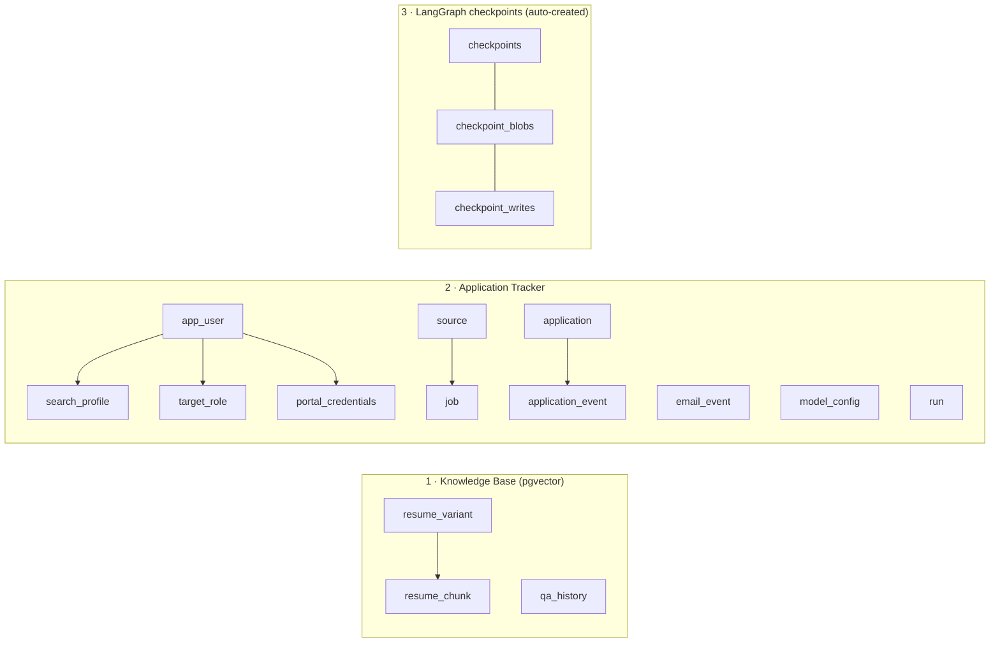
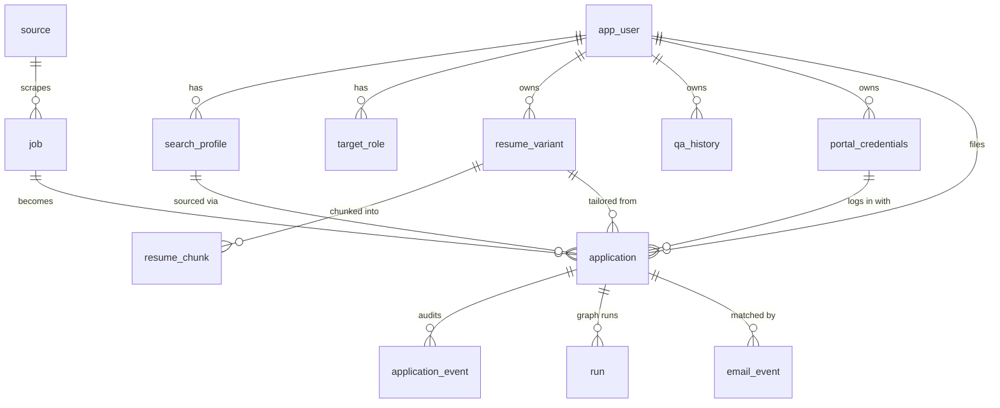
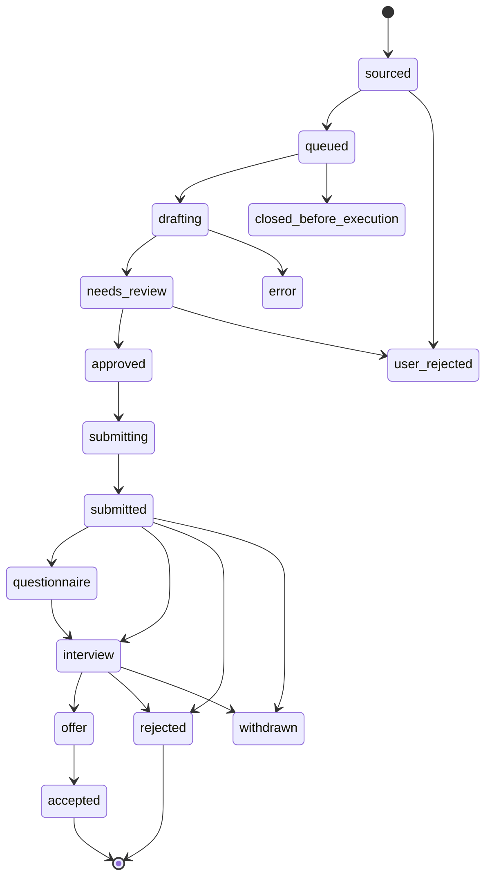

# AeroApply — Data Model

> **Purpose:** Document the canonical Postgres schema (`scripts/bootstrap.sql`) faithfully — every table, the `status`/`wip_status` state machines, the `v_icebox_ranked` ranking view, pgvector indexing, and how LangGraph checkpoint tables come into existence — so engineers and migrations stay aligned with the source of truth.

This document describes the schema exactly as it exists in `scripts/bootstrap.sql`. That file is the canonical schema; `DATA_MODEL.md` (this file) explains it but never overrides it. Where the two ever disagree, `bootstrap.sql` (and behind it, `PROJECT_BRIEF.md`) wins. No columns are described here that do not exist in `bootstrap.sql`.

## Where the schema lives and how it ships

One Postgres instance backs all of AeroApply. In **dev** it is a local Docker Postgres (`infra/docker-compose.yml`) with the `vector` and `uuid-ossp` extensions — zero cost, instant checkpoint writes, fastest loop. In **prod** it is **Railway** (co-located with the FastAPI engine for low checkpoint latency and 24/7 inbound-email webhooks) — explicitly *not* Supabase. `bootstrap.sql` is the canonical DDL; Alembic migrations are generated to match it. The two `CREATE EXTENSION` statements (`vector`, `uuid-ossp`) run first; everything else assumes pgvector is present.

## The three domains

The schema partitions cleanly into three cooperating domains over the one database:

1. **Knowledge Base (pgvector):** the operator's resumes and Q&A memory, embedded for AITL retrieval — `resume_variant`, `resume_chunk`, `qa_history`. This is what the agent searches before bothering the human.
2. **Application Tracker:** the operational core — operator/profile config, sourced jobs (the Icebox), encrypted portal logins, the pipeline `application` record, and its audit/email/run satellites.
3. **LangGraph checkpoints:** durable graph state (`checkpoints`, `checkpoint_blobs`, `checkpoint_writes`) — **not in `bootstrap.sql`**; auto-created at runtime (see the final section).



## ER overview (Application Tracker + Knowledge Base)



Every UUID PK defaults via `gen_random_uuid()`. User-owned tables cascade-delete from `app_user`; references into the more volatile `job`/`source`/`search_profile`/`resume_variant`/`portal_credentials` use `ON DELETE SET NULL` where losing the parent should not destroy an `application`, and `ON DELETE CASCADE` where the child has no meaning without its parent (`resume_chunk`→`resume_variant`, `application_event`→`application`).

## Domain 1 — Operator & profile

**`app_user`** — the operator (single-tenant in v1, but every owned table carries `user_id`, so the schema is tenant-ready). Key columns: `primary_email` (where high-priority items are forwarded), `agent_email` (the dedicated `<name>.agents@domain` inbound address), `home_lat`/`home_lon` (the commute anchor that powers the geo-fence bouncer gate), and `work_auth` (drives the clearance/visa bouncer gate — e.g. `US Citizen`).

**`search_profile`** — *the filters* the daemon sources against. `locations TEXT[]`, `distance_miles` (default 40), `remote_modes TEXT[]` (subset of `remote|hybrid|onsite`), `languages`, `salary_floor INTEGER` (default 0 = no floor; evaluated against the **max** of a posted band), `currency`, `include_linkedin`, `exclude_companies TEXT[]`, `weights JSONB` (per-operator overrides of the `execution_priority` weights), `extra JSONB`, and `active`. These columns mirror `config/profile.example.yaml` field-for-field.

**`target_role`** — target titles plus the **alignment multiplier** the ranking formula consumes. `title`, `seniority`, `alignment NUMERIC(3,2)` (1.0 core, 0.6 adjacent), `keywords TEXT[]`, `priority`, `active`.

## Domain 2 — Knowledge Base (pgvector, AITL retrieval)

**`resume_variant`** — one row per tailorable base resume (one per target track, e.g. `Core track - base`, `Adjacent track - base`). `profile_name`, `role_focus`, `raw_text` (the full document), `structured_json JSONB` (parsed sections for targeted edits), `is_default`, and `created_at`/`updated_at`.

**`resume_chunk`** — `resume_variant` split into embeddable sections for retrieval during tailoring. `resume_id` (cascade), `section_name` (`Experience | Skills | Education | Summary`), `chunk_text`, and `embedding vector(1536)`.

**`qa_history`** — historical answers to screening questions; the AITL loop searches **this table first** before escalating to the human. `question_text`, `answer_text`, `field_type` (`free_text | boolean | eeo | visa | clearance | ...`), `sensitive BOOLEAN` (EEO/visa/clearance → always HITL, never fabricate), `confidence NUMERIC(4,3)`, and `embedding vector(1536)`. Crucially, the embedding encodes the **question**, not the answer — retrieval matches a new prompt against questions the operator has truthfully answered before. This is the data-layer enforcement of the "never fabricate" non-negotiable: a sensitive or low-similarity question yields no confident match, and the honesty gate escalates.

## Domain 2 — Sources, jobs (Icebox), credentials

**`source`** — a connector definition. `key` (unique, e.g. `greenhouse`/`lever`/`workday`/`linkedin`), `name`, `kind` (`CHECK IN ('api','browser')`), `autonomy_tier` (`CHAR(1)`, `CHECK IN ('A','B','C')`, default `'B'`), `enabled`, `config JSONB`, `rate_limit JSONB` (pacing / anti-ban hygiene). The tier here is the data-side anchor for the source gate: Tier A = clean-API ATS (auto-submit eligible), Tier B = DOM/browser portals (HITL), Tier C = blocked.

**`job`** — a raw scraped posting that survived the `SourcingBouncer` (junk is dropped *before* any write, so this table is already filtered). Key columns: `company`, `title`, `location`, `remote_mode` (`CHECK IN ('remote','hybrid','onsite')`), `lat`/`lon`, `salary_min`/`salary_max` (the bouncer evaluates `salary_max` vs the floor), `description`, `requirements JSONB`, `url`, `portal_url` (where the application is actually filed — pinged by `verify_open`), `portal_type` (`greenhouse | lever | workday | taleo | custom`), `posted_at`, `closing_date`, `applicant_count`, `raw JSONB`, and `fingerprint VARCHAR(64) NOT NULL UNIQUE` (a hash of company+title+location used as the dedupe key so re-scrapes don't duplicate).

**`portal_credentials`** — persistent, encrypted portal logins, one per company domain. `company_domain` (e.g. `company.wd5.myworkdayjobs.com`), `username`, `encrypted_password TEXT` (Fernet ciphertext; key from `AEROAPPLY_FERNET_KEY` in dev / KMS in prod — never logged, never returned to the UI in plaintext), `last_used_at`, and a `UNIQUE (user_id, company_domain)` constraint that makes "look up creds for this domain, else create" a clean upsert.

## Domain 2 — Applications, audit, email, models, runs

**`application`** — the pipeline record, the heart of the tracker. One row per `(user_id, job_id)` (enforced `UNIQUE`). It carries:

- **Foreign keys:** `job_id` (cascade), and `search_profile_id` / `resume_variant_id` / `credential_id` (each `SET NULL` so the application survives parent deletion).
- **AI artifacts:** `tailored_resume_json`, `tailored_resume_text`, `cover_letter`, `answers JSONB` (`{question: {answer, source, confidence}}`).
- **Scores:** `ats_score NUMERIC(5,4)` (ATS-Critic keyword coverage, 0–1 scale project-wide — widened from `NUMERIC(5,2)`), `agent_confidence NUMERIC(5,4)` (0–1; gates auto-submit), `match_score NUMERIC(5,2)`.
- **Routing/state:** `wip_status` and `status` (both `CHECK`-constrained — see below), `auto_submit BOOLEAN` (operator opt-in for this app/source), `manual_override BOOLEAN` ("Promote" → absolute top priority), `needs_human BOOLEAN`, `blockers JSONB` (why it's paused).
- **LangGraph linkage:** `thread_id VARCHAR(255)` — set equal to the application id and used as the checkpoint thread key, the join between this table and the auto-created `checkpoints` tables.
- **Timestamps:** `submitted_at TIMESTAMPTZ` (set when the application is actually filed; powers the time-to-apply metric), plus `created_at`/`updated_at`.

Note `execution_priority` is **not a column** — it is computed live by `src/aeroapply/sourcing/ranking.py` (reading `profile.ranking_weights`), so weight tuning needs no migration. The `v_icebox_ranked` view (below) computes the same formula with **frozen** weights for ad-hoc SQL inspection.

**`application_event`** — append-only audit log of *every* action. `event_type`, `actor` (`CHECK IN ('agent','human','system')`), `payload JSONB`. This satisfies the "full audit log for every agent/human/system action" non-negotiable.

**`email_event`** — inbound email traceability for both OTP and lifecycle flows. `matched_application_id` (`SET NULL`), `from_addr`/`to_addr`, `subject`, `body`, `classification` (`otp | interview | questionnaire | rejection | offer | none`), `otp VARCHAR(12)`, `forwarded BOOLEAN`. The webhook path records the `otp` it injected; the IMAP poller records the `classification` it routed.

**`model_config`** — per-node model routing, read as `model_config[node] → {provider, model_id, params, fallback}`. `node_name` (unique, e.g. `tailor.generator`, `tailor.critic`, `sourcing.parser`), `provider` (`anthropic | deepseek | openai | ollama`), `model_id` (current IDs only: `claude-opus-4-8`, `claude-sonnet-4-6`, `claude-haiku-4-5`), `params JSONB` (`{temperature, max_tokens, context, fast_mode, ...}`), `fallback JSONB`. A representative seed:

```json
{
  "node_name": "tailor.generator",
  "provider": "anthropic",
  "model_id": "claude-opus-4-8",
  "params": {"context": "1M", "fast_mode": true, "temperature": 0.6, "max_tokens": 8000},
  "fallback": {"provider": "anthropic", "model_id": "claude-sonnet-4-6"}
}
```

Drafting routes to `claude-opus-4-8` (1M context, fast mode); the ATS-Critic and validators to `claude-sonnet-4-6` at `temperature=0`; high-volume extraction/sourcing and the hourly email classifier to `claude-haiku-4-5` (or local Llama via Ollama). Model + settings are config, never hard-coded.

**`run`** — maps a LangGraph execution to an application for observability. `thread_id`, `application_id` (cascade), `status`, `started_at`/`ended_at`, `meta JSONB`. One application can have many runs (each freeze/resume cycle).

## State machines

Two orthogonal lifecycles live on `application`, each enforced by a `CHECK` constraint so an out-of-range token is rejected at write time.

**`wip_status`** — the *scheduler's* view (`icebox | queued | active | parked | done`). New survivors land in `icebox` and wait indefinitely; the Supervisor promotes the top-N to `queued`; the execution graph moves them through `active`, `parked` (paused on HITL), and `done`.

**`status`** — the *business* lifecycle:



The happy path is `sourced → queued → drafting → needs_review → approved → submitting → submitted → questionnaire → interview → offer → accepted`. Branch/terminal tokens: `rejected`, `user_rejected` (operator dropped it from the Kanban — reachable from any non-terminal status; `sourced` and `needs_review` are drawn as representative arcs), `closed_before_execution` (the `verify_open` node found the posting gone — no frontier tokens wasted), `withdrawn` (operator retracts after submission, from `submitted` or `interview`), and `error`. The two machines are independent: e.g. a posting in `needs_review` (business) is `parked` (scheduler) while it sits in the HITL Inbox.

## The `v_icebox_ranked` view (frozen-weight debug/fallback)

The **canonical** ordering is Python (`ranking.py`, reading `profile.ranking_weights`); this view mirrors the formula with **frozen** weights for ad-hoc SQL inspection — a `profile.yaml` weight change takes effect in Python, not here. The view selects from `application a JOIN job j`, filtered to the Icebox waiting room (`WHERE a.wip_status = 'icebox' AND a.status = 'sourced'`), and orders by the score descending.

The weighted `CASE` expression encodes the canonical formula:

```sql
  (CASE WHEN a.manual_override THEN 100.0 ELSE 0.0 END)        -- absolute trump
  + 0.35 * (CASE WHEN j.title ILIKE '%Product Manager%'
                  OR j.title ILIKE '%Solutions Architect%' THEN 1.0
                 WHEN j.title ILIKE '%Business Analyst%'
                  OR j.title ILIKE '%Project Manager%' THEN 0.6
                 ELSE 0.3 END)                                  -- title alignment (35%)
  + 0.25 * (CASE WHEN j.remote_mode = 'remote' THEN 1.0
                 WHEN j.location ILIKE '%Springfield%' THEN 0.8
                 ELSE 0.0 END)                                  -- location & flexibility (25%)
  + 0.20 * (CASE WHEN j.posted_at >= now() - INTERVAL '2 days' THEN 1.0
                 WHEN j.posted_at >= now() - INTERVAL '7 days' THEN 0.5
                 ELSE 0.1 END)                                  -- recency (20%)
  + 0.10 * (CASE WHEN j.applicant_count < 50  THEN 1.0
                 WHEN j.applicant_count < 150 THEN 0.5
                 ELSE 0.0 END)                                  -- competition (10%)
  + 0.10 * (CASE WHEN j.closing_date IS NOT NULL
                  AND j.closing_date <= now() + INTERVAL '3 days' THEN 1.0
                 ELSE 0.0 END)                                  -- urgency (10%)
```

The four non-trump weights (0.35 + 0.25 + 0.20 + 0.10 + 0.10) intentionally sum to 1.0, so a non-promoted application scores in `[0, 1]` and a manually promoted one lands at `100 + [0,1]` — guaranteeing `manual_override = TRUE` always outranks any organically-scored job. `ILIKE` keeps matching case-insensitive against scraped titles/locations. The weights in this view are **frozen** (debug/fallback); the live, operator-tunable weights live in `profile.ranking_weights` and are applied in `ranking.py` (`RankingWeights` validates the 1.0-sum invariant).

## pgvector HNSW indexes + the dimension caveat

Two HNSW indexes back AITL similarity search, both using cosine distance:

```sql
CREATE INDEX idx_resume_chunk_embed ON resume_chunk USING hnsw (embedding vector_cosine_ops);
CREATE INDEX idx_qa_history_embed   ON qa_history   USING hnsw (embedding vector_cosine_ops);
```

HNSW is chosen over IVFFlat because the corpus (one operator's resume chunks + answered questions) is small and read-heavy: HNSW needs no training step, tolerates incremental inserts, and gives strong recall at low latency. `vector_cosine_ops` pairs with cosine-normalized OpenAI embeddings.

**Dimension caveat:** both embedding columns are hard-typed `vector(1536)` to match the default embedder, OpenAI `text-embedding-3-small` (1536-d). This dimension is **not** dynamic. If you swap to a local embedder with a different width, you must `ALTER` *both* columns to the new `vector(N)`, re-embed all existing rows, and re-index — a query mixing 1536-d index entries with, say, 768-d vectors will error or silently mis-rank. The header comment in `bootstrap.sql` flags this explicitly; treat an embedder change as a data migration, not a config tweak.

Supporting B-tree indexes serve the hot tracker queries: `idx_application_status`, `idx_application_wip`, `idx_application_thread`, `idx_job_company_title`, `idx_job_posted`, `idx_portal_domain`, and `idx_event_application`.

## How LangGraph checkpoint tables are auto-created

The `checkpoints`, `checkpoint_blobs`, and `checkpoint_writes` tables are **deliberately absent** from `bootstrap.sql`. They are owned by `langgraph-checkpoint-postgres` and created (idempotently) by a one-time call to the checkpointer's setup at startup — never hand-written, so the schema always matches the installed library version:

```python
from langgraph.checkpoint.postgres.aio import AsyncPostgresSaver

async with AsyncPostgresSaver.from_conn_string(DATABASE_URL) as checkpointer:
    await checkpointer.setup()   # CREATEs checkpoints* tables IF NOT EXISTS
    graph = builder.compile(checkpointer=checkpointer)
```

At runtime the graph is invoked with `config={"configurable": {"thread_id": application.thread_id}}`, where `thread_id` equals the `application.id`. That is the join: `application.thread_id` (and `run.thread_id`) point into the checkpointer's keyspace, letting any application be frozen and resumed — exactly the mechanism OTP injection relies on (`await graph.aupdate_state(config, {"verification_code": code}, as_node="account_node")` wakes a parked thread). Migrations generated by Alembic from `bootstrap.sql` should **exclude** the `checkpoints*` tables to avoid fighting `setup()` for ownership.
