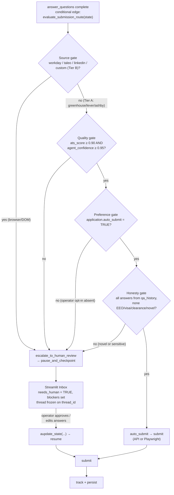

# HITL, AITL & the Submission Gate

> Purpose: define how AeroApply decides — per application, at runtime — when an agent answers on its own (AITL), when it freezes and surfaces to the operator's Inbox (HITL), and the exact `evaluate_submission_route(state)` logic that gates every submission secure-by-default.

This document is subordinate to `docs/PROJECT_BRIEF.md`. Where the brief and this file appear to disagree, the brief wins. Reference implementation: `src/aeroapply/graph/routing.py`.

---

## 1. Two loops, one principle

AeroApply automates the mechanical 90% of an application and reserves the operator's attention for the judgment 10%. That split is enforced by two distinct loops:

- **AITL (Agent-in-the-loop):** an agent resolves a sub-task *without* waking the human. The canonical case is the `answer_questions` node answering a screening question from the operator's own history. It embeds the incoming question, runs a cosine-similarity search over `qa_history` (pgvector HNSW), and — only if the match is close enough and the recalled answer is confident enough — reuses that prior answer. No interrupt, no Inbox item.
- **HITL (Human-in-the-loop):** a **LangGraph interrupt** that checkpoints the thread, sets `application.needs_human = TRUE`, writes a `blockers` payload explaining *why*, and surfaces the application in the Streamlit **Inbox**. The thread stays frozen on its `thread_id` (= `application.id`) until the operator acts. Because the checkpointer is Postgres-backed, a freeze can survive a daemon restart and resume hours later.

The principle linking them: **escalate on uncertainty, never on convenience.** AITL handles only what the operator has demonstrably answered before; everything novel, sensitive, or low-confidence becomes HITL.

### 1.1 AITL: the qa_history match

`qa_history` embeds the **question** (not the answer) into `vector(1536)`, so a paraphrased screening question still retrieves the right prior answer. The `sensitive` flag is set on any EEO / visa / clearance / self-ID row, and those rows are **never** auto-reused regardless of similarity (see the honesty gate, §3.4).

```sql
-- AITL retrieval: nearest prior answer to an incoming screening question.
-- :q_embed is the 1536-d embedding of the new question; cosine distance via HNSW.
SELECT question_text, answer_text, field_type, sensitive, confidence,
       1 - (embedding <=> :q_embed) AS similarity
FROM qa_history
WHERE user_id = :user_id
ORDER BY embedding <=> :q_embed     -- '<=>' = cosine distance; ASC = closest first
LIMIT 1;
```

The node reuses the answer only when **all** hold: `similarity >= 0.92`, `sensitive = FALSE`, and the stored `confidence` is high. The resolved answer is written to `application.answers` as a structured record carrying its provenance, e.g.:

```json
{
  "Are you authorized to work in the US?": {
    "answer": "Yes",
    "source": "qa_history",
    "qa_id": "b2c4...",
    "similarity": 0.97,
    "confidence": 0.99
  }
}
```

A **novel** question (no row clears the similarity bar) is *not* fabricated. It is recorded as a blocker and the thread escalates. After the operator answers it once in the Inbox, that answer is embedded and written back to `qa_history`, so the next occurrence resolves via AITL — the system gets quieter over time.

---

## 2. Tiered autonomy, secure-by-default

Auto-submission is **earned**, not assumed. The default operator posture is **review-before-submit**; auto-submit fires only when every gate passes *and* the operator has opted in for that role/source. Tiering is keyed on the source's `kind` (`api` vs `browser`) and `autonomy_tier` column in the `source` table:

| Tier | Sources | Why | Default behavior |
|---|---|---|---|
| **A — auto-submit eligible** | Clean-API ATS: Greenhouse, Lever, Ashby | Predictable structured payloads; no fragile DOM | May auto-submit if gates + opt-in pass |
| **B — HITL required** | DOM/browser portals: Workday, Taleo, LinkedIn Easy Apply, custom company sites | Fragile selectors, ban-prone, ToS-restricted | **Always** escalate to human review |
| **C — blocked** | Anything requiring fabrication, or ToS that prohibits automation outright | Out of scope by policy | Never attempted |

These map directly onto `config/profile.yaml`:

```yaml
autonomy:
  default_mode: "review"                                   # review | auto
  auto_submit_sources: ["greenhouse", "lever", "ashby"]    # Tier A only
  always_human_sources: ["workday", "taleo", "linkedin", "custom"]  # Tier B
  min_ats_score: 0.90
  min_agent_confidence: 0.95
```

**Account creation is Tier B by definition.** Creating a portal login is the single highest-risk action for bans, so it is always HITL-gated in v1 even on an otherwise Tier-A domain.

---

## 3. `evaluate_submission_route(state)` — canonical logic

This is the heart of the gate. The execution graph does **not** use a static `interrupt_before=["submit"]`; that would force a human into *every* application. Instead, a **conditional edge** runs `evaluate_submission_route(state)` after `answer_questions` and returns one of two route labels, deciding mode *per application at runtime*. The function is a pure, side-effect-free predicate over graph state (the routing implementation lives in `src/aeroapply/graph/routing.py`).

The gates are evaluated as an **AND** chain — secure-by-default means the route falls to `escalate_to_human_review` the instant any single gate fails.

```python
# src/aeroapply/graph/routing.py  (canonical; abbreviated)

AUTO_SUBMIT = "auto_submit"
ESCALATE    = "escalate_to_human_review"

def evaluate_submission_route(state: AppState) -> str:
    """Decide submission mode for ONE application. Secure-by-default:
    any failing gate => escalate. Returns a route label for the conditional edge."""

    # --- Gate 1: SOURCE.  Browser/DOM portals are never auto-submitted. ---
    if state.portal_type in {"workday", "taleo", "custom"} \
            or state.source_key in ALWAYS_HUMAN_SOURCES:   # incl. linkedin
        return ESCALATE

    # --- Gate 2: QUALITY.  Earned by the ATS-Critic loop + agent self-rating. ---
    if state.ats_score < 0.90 or state.agent_confidence < 0.95:
        return ESCALATE

    # --- Gate 3: PREFERENCE.  Operator must have opted this app in. ---
    if not state.auto_submit:                              # application.auto_submit
        return ESCALATE

    # --- Gate 4: HONESTY.  Any novel / sensitive question => human. ---
    if not _all_answers_truthful_and_known(state):
        return ESCALATE

    # All gates cleared: a Tier-A, opted-in, high-confidence, fully-known application.
    return AUTO_SUBMIT


def _all_answers_truthful_and_known(state: AppState) -> bool:
    """No fabrication, ever. Every answer must be sourced from qa_history with a
    confident match; nothing EEO/visa/clearance/self-ID may be auto-answered."""
    for q, rec in state.answers.items():
        if rec.get("source") != "qa_history":     # generated/guessed => not allowed to auto-submit
            return False
        if rec.get("similarity", 0.0) < 0.92:
            return False
        if rec.get("field_type") in SENSITIVE_FIELDS:   # eeo | visa | clearance | self_id
            return False                                 # these are ALWAYS human-confirmed
        if rec.get("confidence", 0.0) < 0.95:
            return False
    return True
```

### 3.1 Source gate
Browser/DOM portals (`workday`, `taleo`, LinkedIn Easy Apply, custom company sites) **always** escalate. This gate fires first because no quality score can compensate for a fragile, ban-prone DOM submission path — it is a hard ceiling, not a weighting.

### 3.2 Quality gate
`ats_score >= 0.90` **and** `agent_confidence >= 0.95`. `ats_score` is produced by the Generator ⇄ ATS-Critic loop (Generator on `claude-opus-4-8` in fast mode; the strict ATS-Critic on `claude-sonnet-4-6` at `temperature=0`); `agent_confidence` is the deterministic composite defined by the `compute_agent_confidence` formula in `TAILORING_AND_ATS.md` §8 (not redefined here). Both thresholds are deliberately high — auto-submit reflects the operator's professional reputation, so the bar sits well above "probably fine."

### 3.3 Preference gate
`application.auto_submit = TRUE` must be set (operator opt-in, per role/source). Even a flawless Tier-A application escalates if the operator never opted it in. This is what makes `default_mode: "review"` truly the default: silence from the operator means review, not auto-fire.

### 3.4 Honesty gate
The non-negotiable. Any **novel** question (no confident `qa_history` match), any **generated** answer, or any **EEO / visa / clearance / self-ID** field — matched or not — forces escalation. AeroApply will surface the question and wait rather than guess on a legal or self-identification field. This gate is why AITL and the submission gate share the same `qa_history`-provenance check: an answer the agent had to invent can never ride an auto-submission.

---

## 4. The truthful-answers guardrail

Goal #2 in the brief is absolute: **never fabricate** — truthful answers on every legal/EEO/visa/clearance field, always. This is enforced in three places so no single bug can defeat it:

1. **At the data layer:** `qa_history.sensitive = TRUE` on every EEO/visa/clearance/self-ID row, and those rows are excluded from AITL auto-reuse by query construction.
2. **In the answer node:** a generated (non-`qa_history`) answer is allowed into the *draft* for human review, but is flagged and can never satisfy `_all_answers_truthful_and_known`.
3. **At the gate:** `_all_answers_truthful_and_known` re-checks provenance and `field_type` independently of how the answer node behaved.

The system is permitted to say "I don't know — ask the operator." It is never permitted to assert something the operator has not actually said. A misclassified sensitive field therefore fails *closed* (escalates), never *open*.

---

## 5. The conditional edge & the pause

```python
# Wiring (abbreviated). NOT interrupt_before — a runtime conditional edge.
graph.add_conditional_edges(
    "answer_questions",
    evaluate_submission_route,
    {
        "auto_submit":                "submit",                 # Tier-A happy path
        "escalate_to_human_review":   "pause_and_checkpoint",   # HITL
    },
)
graph.add_edge("pause_and_checkpoint", "submit")  # resumes here after operator approves
```

`pause_and_checkpoint` records the reason, marks the row, and interrupts. The `blockers` payload is what the Inbox renders, so it must be specific:

```json
{
  "reason": "honesty_gate",
  "detail": "Novel EEO self-ID question with no confident qa_history match.",
  "ats_score": 0.94,
  "agent_confidence": 0.97,
  "unmatched_questions": ["Describe a time you navigated an ethical conflict."]
}
```

### 5.1 Decision tree



---

## 6. Resume handshake

When the operator acts in the Inbox, the daemon resumes the frozen thread through the **compiled graph** (per the brief's correctness note, `update_state` / `aupdate_state` is a method on the compiled graph, *not* on the checkpointer). The `thread_id` in `config` is the application id. Because the graph is compiled with `AsyncPostgresSaver`, every state call must use the **async API** (`aget_state` / `aupdate_state` / `ainvoke`); from a synchronous Streamlit callback, drive them through one event loop (e.g. `asyncio.run(...)` or a shared loop via `loop.run_until_complete(...)`).

```python
config = {"configurable": {"thread_id": str(application_id)}}

# 1. Inspect what the paused thread is waiting on (drives the Inbox detail view).
snapshot = await graph.aget_state(config)
pending  = snapshot.values["blockers"]

# 2. Operator approves / edits answers in Streamlit → patch state, then resume.
await graph.aupdate_state(
    config,
    {"answers": edited_answers, "needs_human": False, "human_decision": "approved"},
)
await graph.ainvoke(None, config)   # None input + same thread_id => continue from the checkpoint
```

The new answers the operator typed are persisted back into `qa_history` (embedded) so future runs resolve them via AITL.

### 6.1 OTP injection (async, webhook-driven)
A separate resume path handles portal verification codes during a Tier-B account/login flow. The FastAPI inbound-email webhook (`POST /v1/webhooks/inbound-email`) verifies the provider signature, parses the **multipart form** (`await request.form()`, not JSON), extracts the OTP (`\b\d{4,7}\b`), matches the sender domain to an active application, and wakes the paused Playwright thread **asynchronously**:

```python
# Inside the webhook handler (async context) — note aupdate_state, as_node:
await graph.aupdate_state(
    config,
    {"verification_code": code},
    as_node="account_node",   # inject as if the account node produced it
)
# The paused Playwright thread reads verification_code, types it, and proceeds unsupervised.
```

This is the one place the human is bypassed mid-pause: the operator never sees the OTP — the webhook injects it and the agent continues on its own. Every such injection is written to `email_event` and `application_event` for audit.

---

## 7. Invariants (for reviewers)

- The submission decision is a **runtime conditional edge**, never `interrupt_before`.
- Gates are **AND-chained**; failure routes to `escalate_to_human_review` (fail-closed).
- **No answer the agent generated** (source ≠ `qa_history`) may ride an auto-submission.
- **EEO / visa / clearance / self-ID** fields are *always* human-confirmed; misclassification fails closed.
- Tier-B sources and **account creation** are always HITL in v1.
- Resume goes through the **compiled graph** via the async API (`aget_state` / `aupdate_state` / `ainvoke(None, …)`); OTP uses `aupdate_state(..., as_node=…)`.
- Every escalation, approval, and OTP injection lands in `application_event` (`actor IN ('agent','human','system')`).
