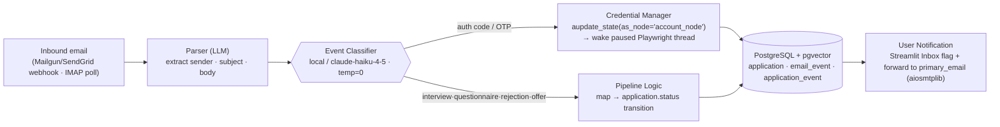
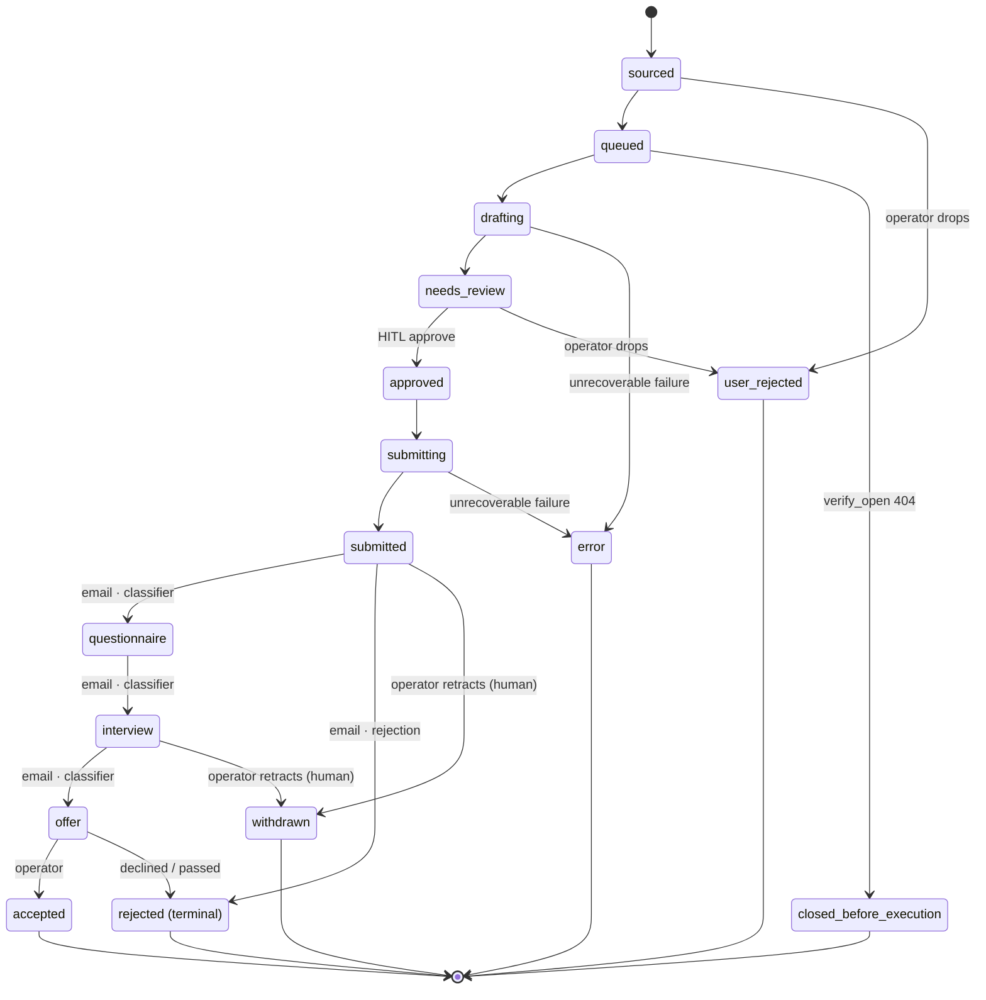

# Lifecycle & Email Automation

> How AeroApply runs as a persistent daemon and uses a dedicated agent inbox to inject login OTPs into paused browser threads and to classify, persist, and forward lifecycle email — turning the application-tracking problem into zero manual data entry.

This document is subordinate to `docs/PROJECT_BRIEF.md`. Where they disagree, the brief wins. Reference implementation: `services/email_webhook/app.py`. Schema: `scripts/bootstrap.sql` (`application`, `email_event`, `app_user`, `portal_credentials`).

---

## 1. Why this is a persistent daemon, not a one-shot script

A naive "apply bot" is a script you run, that drafts and submits, and that exits. AeroApply cannot be that, because the lifecycle it owns is **fundamentally asynchronous and unbounded in time**, and two of its critical events are *initiated by third parties*, not by us:

1. **Portal OTPs arrive seconds-to-minutes after we trigger them.** When the execution graph reaches `account_node` and submits an email/SMS verification on a Workday or Taleo signup, the verification code lands in the agent inbox on the provider's schedule, not ours. The Playwright thread must **freeze mid-flow** and be **woken from outside** when the code arrives. A process that has exited cannot be woken. This is the single hardest constraint and it forces an always-on HTTP endpoint.

2. **Lifecycle events arrive over days and weeks.** A `submitted` application becomes `questionnaire`, then `interview`, then `offer` or `rejection` on the employer's timeline. Tracking that with zero manual entry (Goal 4 in the brief) means *something must be listening continuously* — an hourly IMAP poll that reads the agent inbox and advances `application.status`.

3. **Sourcing runs 24/7 at WIP-limited cadence.** The supervisor pulls the top-N from `v_icebox_ranked` every `cycle_minutes` (default 180), indefinitely. There is no "done."

So the runtime shape (locked in the brief, §4) is a **persistent always-on daemon** made of three cooperating subsystems over one Postgres: the sourcing daemon, the WIP-limited LangGraph execution graph, and the **email-event service** described here. LangGraph's Postgres checkpointer is what makes "freeze a thread, exit the request, resume hours later from a different process" actually work: the paused thread's full state lives in the `checkpoints*` tables (auto-created by `await checkpointer.setup()`), keyed by `thread_id` (which equals the `application.id`). The webhook process and the graph runner can be different OS processes — they rendezvous through Postgres.

In dev this is a local Docker Postgres + pgvector stack; in prod it is **Railway** (co-located FastAPI engine + Postgres), chosen specifically because the inbound webhook needs a stable public URL reachable by Mailgun/SendGrid 24/7. (Not Supabase — the brief is explicit: local Docker dev → Railway prod.)

---

## 2. The dedicated agent email address

Every operator gets one dedicated, machine-owned inbox — `<operator>.agents@<domain>` (e.g. the `agent_email` column on `app_user`; the operator's real primary inbox is `primary_email`). This separation is deliberate:

- **Blast radius.** All portal signups use the agent address, so the inevitable recruiter spam, marketing, and account email never touches the operator's real inbox until we *choose* to forward it.
- **Deterministic routing.** Mailgun/SendGrid is configured with an inbound route on this domain that POSTs every received message to our webhook. The operator's personal mail provider is untouched.
- **Auditability.** Because one address receives 100% of application-related mail, the `email_event` table is a complete, queryable record of every OTP and every status signal the system ever saw.

The address is provisioned in `config/profile.yaml` (`operator.agent_email`) and persisted to `app_user.agent_email`. Per the PII boundary, the real address lives only in `profile.yaml` / `.env`; `config/profile.example.yaml` ships the illustrative `you.agents@example.com`.

---

## 3. Inbound webhook flow — OTP injection into a paused thread

This is the synchronous-interruption path: the agent has just triggered a verification email during signup and is **paused** at `account_node`, waiting for a code it cannot read itself.

```
Mailgun/SendGrid  ──POST multipart form──▶  /v1/webhooks/inbound-email
                                              │
                                    1. verify provider signature (HMAC)
                                    2. reject stale timestamp (15-min replay window)
                                    3. match sender domain → active application
                                    4. regex OTP  \b\d{4,7}\b
                                    5. await graph.aupdate_state(...) → wake thread (idempotent)
```

Step by step, as implemented in `services/email_webhook/app.py`:

**1. Parse the form, not JSON.** Mailgun delivers inbound mail as **`multipart/form-data` fields** (`sender`, `recipient`, `subject`, `body-plain`, `timestamp`, `token`, `signature`, ...), **not a JSON body**. Parse with `await request.form()`. (Corrected fact — see §6.)

**2. Verify the provider signature first.** Reject anything unsigned before touching the database. For Mailgun this is an HMAC-SHA256 over `timestamp + token` keyed by the signing secret:

```python
import hashlib, hmac

def verify_mailgun(token: str, timestamp: str, signature: str, key: str) -> bool:
    expected = hmac.new(
        key.encode(), msg=f"{timestamp}{token}".encode(), digestmod=hashlib.sha256
    ).hexdigest()
    return hmac.compare_digest(expected, signature)
```

Verifying inbound webhook signatures is a security non-negotiable (brief §13.5). An unverified payload could spoof an OTP into a live login flow.

**3. Reject stale timestamps (replay window).** A valid signature alone does not stop a *replay* of a previously-captured request. Mirroring `SECURITY_COMPLIANCE.md` §5, after the HMAC check we reject any request whose `timestamp` is outside a **15-minute replay window** — `abs(now - timestamp) > 900s → 401`, before any DB touch or state mutation:

```python
import time

REPLAY_WINDOW_SECONDS = 900  # 15 minutes

def fresh_timestamp(timestamp: str) -> bool:
    return abs(time.time() - int(timestamp)) <= REPLAY_WINDOW_SECONDS
```

**4. Match the sender domain to an active application.** Extract the base domain from `sender` and look for an application currently parked at the account step (`wip_status = 'parked'`, awaiting verification) whose portal domain matches. This is what scopes a stray code to the *right* thread; no match → log to `email_event` and stop.

**5. Extract the OTP.** A deliberately tight regex `\b\d{4,7}\b` covers the common 4–7 digit portal codes. On ambiguity (multiple matches) prefer the one nearest a keyword like *code* / *verification*, and record the raw body in `email_event.body` for audit.

**6. Wake the paused thread (idempotently).** `aupdate_state` / `update_state` is a method on the **compiled graph**, *not* on the checkpointer (corrected fact, §6). We write the code into graph state *as if the `account_node` had produced it*, which resumes the frozen thread:

```python
config = {"configurable": {"thread_id": str(application_id)}}
await graph.aupdate_state(
    config,
    {"verification_code": code},
    as_node="account_node",   # state lands as this node's output → execution continues
)
```

The `as_node="account_node"` argument is the crux: it injects the value at the exact pause point so LangGraph continues from the next edge. The Playwright worker, which has been awaiting that state key, reads the code, types it into the portal, and proceeds unsupervised. The whole round-trip — *agent triggers code → exits the await → external email → webhook → `aupdate_state` → browser resumes* — is what lets account creation complete without a human, even though account creation itself remains **Tier B / HITL-gated** for the *submit* decision (brief §6–7).

**Idempotent injection.** Providers can (and do) re-POST the same inbound message, so the wake step must be safe to run more than once. Mirroring `SECURITY_COMPLIANCE.md` §5, we inject into **exactly the one thread whose application matched** — never broadcast — and guard on the matched application already being parked at `account_node`: if the target thread is no longer awaiting verification (already resumed, or no longer at `wip_status = 'parked'`), the duplicate is recorded to `email_event` and dropped without a second `aupdate_state`. A provider retry of an already-consumed OTP is therefore a no-op, not a double-wake.

We also write an `email_event` row (`classification = 'otp'`, `otp = <code>`, `matched_application_id`) for traceability, and an `application_event` (`actor = 'system'`, `event_type = 'otp_injected'`).

---

## 4. IMAP hourly poller — lifecycle classification & forwarding

This is the asynchronous path. A scheduled hourly job logs into the agent inbox over IMAP and processes everything new.

```
IMAP (hourly) ─▶ fast classifier (local / claude-haiku-4-5, temp=0, JSON)
                    │
                    ├─ interview      ─┐
                    ├─ questionnaire   ├─▶ UPDATE application.status
                    ├─ rejection       │   (+ flag high-priority for Inbox)
                    └─ offer          ─┘
                    │
                    └─▶ forward full message → primary_email
                        (aiosmtplib via BackgroundTasks;
                         3 retries w/ exponential backoff,
                         else dead-letter Inbox item)
```

- **Classifier.** Each message goes to a **fast, cheap classifier** — local Llama via Ollama or `claude-haiku-4-5` at `temperature=0` with structured/JSON output (brief §10). It is high-volume and runs hourly, so frontier models are wrong here on cost. It maps each message to exactly one of `interview | questionnaire | rejection | offer` (or `none`).
- **Status update.** The classification drives `UPDATE application SET status = ... ` for the matched application, transitioning along the state machine in §5. `interview` and `offer` are flagged high-priority so the Streamlit Inbox surfaces them immediately.
- **Forwarding.** The full original message is forwarded to the operator's `primary_email` via SMTP using **`aiosmtplib`**, dispatched through FastAPI **`BackgroundTasks`** so the poll loop never blocks on the SMTP handshake. Forwarding is **not** fire-and-forget: the background task retries on transient SMTP failure up to **3 times with exponential backoff** (e.g. ~1s, 2s, 4s). `email_event.forwarded` stays **FALSE** until a forward actually succeeds; it is flipped to TRUE only on a confirmed send. If all retries are exhausted (permanent failure), the task creates a **dead-letter Inbox item** flagging the un-forwarded message for the operator, and `forwarded` remains FALSE so a later sweep can retry.
- **Idempotency.** The poller tracks the last-seen IMAP UID; every processed message is written to `email_event` so re-runs never double-forward or double-transition.

```python
from fastapi import BackgroundTasks

async def forward_email(event_id: str, raw_msg: bytes, to_addr: str) -> None:
    # Runs after the response is returned. NOT fire-and-forget:
    # 3 attempts with exponential backoff; email_event.forwarded
    # stays FALSE until a send actually succeeds.
    for attempt in range(3):
        try:
            await aiosmtplib_send(raw_msg, to_addr)
            await mark_forwarded(event_id)          # forwarded = TRUE only here
            return
        except SMTPTransientError:
            await asyncio.sleep(2 ** attempt)       # ~1s, 2s, 4s
    await create_dead_letter_inbox_item(event_id)   # permanent failure; forwarded stays FALSE

@app.post("/v1/internal/poll-imap")
async def poll(background: BackgroundTasks):
    for msg in fetch_unseen_imap():
        label = classify(msg)                       # local/haiku, temp=0
        if label != "none":
            await update_application_status(msg, label)
        background.add_task(forward_email, msg.event_id, msg.raw, operator_primary_email)
```

A classifier mislabel only mis-files a *forwarded copy the operator still receives* and at worst sets a wrong `status` the operator can correct in the Ledger — it never causes a fabricated answer or an unwanted submission, so a cheap model is the right call.

---

## 5. The email-event pipeline (diagram)

This mirrors the operator's mockups: inbound mail is parsed, classified, and then **branches** by whether it carries an auth code (→ credential manager / OTP injection) or a lifecycle update (→ pipeline logic), with everything landing in Postgres and a notification fanned out to the operator.



The left branch is *synchronous* (a paused thread is blocking on it); the right branch is *asynchronous* (it advances a record and notifies). Both write to the same three tables, which is what keeps the audit trail single-sourced.

---

## 6. Corrected facts (vs. the pasted reference code)

The original reference snippet the operator pasted had two errors that `services/email_webhook/app.py` corrects, and which every downstream doc must respect:

1. **`update_state` / `aupdate_state` is a method on the *compiled graph*, not on the checkpointer.** You call `graph.aupdate_state(config, values, as_node=...)`. The checkpointer is the persistence backend; it does not expose state-mutation. Calling it on the checkpointer is the most common LangGraph footgun and silently fails to wake the thread.

2. **Mailgun inbound posts *multipart form fields*, not a JSON body.** Use `await request.form()` and read `sender` / `body-plain` / `signature` etc. Calling `await request.json()` raises on the real payload. (SendGrid's Inbound Parse is likewise multipart.)

The starter in `services/email_webhook/app.py` reflects both corrections and is **illustrative, not production-hardened**: it does not yet implement the §4 SMTP retry/backoff + dead-letter policy, and carries a minimal error taxonomy and single-tenant assumptions.

---

## 7. Application status state machine (canonical)

`application.status` is a `CHECK`-constrained column (`scripts/bootstrap.sql`). The happy path:

```
sourced → queued → drafting → needs_review → approved → submitting → submitted
        → questionnaire → interview → offer → accepted → rejected
```

plus terminal/branch states: `user_rejected`, `closed_before_execution`, `withdrawn`, `error`.



Two distinct lifecycles live on the same row and must not be conflated:

- **`status`** — the *application's* outward lifecycle (above). The right-hand transitions (`submitted` → `questionnaire` → `interview` → `offer`, and the `rejected` terminal) are driven **entirely by the §4 email poller** — that is the "zero manual data entry" promise made concrete.
- **`wip_status`** — the *scheduler's* internal state: `icebox | queued | active | parked | done`. The webhook's OTP injection operates on a row at `wip_status = 'parked'` (paused awaiting verification) and returns it to `active` once resumed.

The branch states are reached by operator action or failure, not the classifier: `user_rejected` is reachable from **any non-terminal status** via an operator **Drop** (in the Inbox/Kanban) — the diagram draws it from `sourced` and `needs_review` as the two representative entry points, but the transition is allowed wherever the application has not yet reached a terminal state. `withdrawn` is an operator **retraction after submission** (from `submitted` or `interview`, `actor = human`). `error` is an unrecoverable failure reachable from `drafting` or `submitting`; `error` and parked items surface in the Inbox.

The relevant transition is a single guarded write the poller performs after classification:

```sql
UPDATE application
   SET status = 'interview',          -- mapped from the classifier label
       updated_at = now()
 WHERE id = $1
   AND status IN ('submitted','questionnaire');   -- guard: don't regress a terminal state
```

Every such write is mirrored to `application_event` (`actor = 'system'`, `event_type = 'status_change'`, `payload` carrying the source `email_event` id), so the Ledger can show exactly which inbound message moved an application and when.

---

## 8. Where the pieces live

| Concern | Location |
|---|---|
| FastAPI inbound webhook + IMAP poller | `services/email_webhook/app.py` |
| Tables `application`, `email_event`, `application_event`, `app_user.agent_email`, `portal_credentials` | `scripts/bootstrap.sql` |
| Agent address, primary forwarding address | `config/profile.yaml` (`operator.agent_email`, `operator.primary_email`) |
| Classifier model routing (local / `claude-haiku-4-5`) | `model_config` table + `MODEL_ROUTING.md` |
| Credential decrypt/login resumed after OTP | `src/aeroapply/db/` vault + `CREDENTIALS_AND_AUTOMATION.md` |
| Provider signing secrets, IMAP/SMTP creds | `.env` / secret manager (never committed) |
