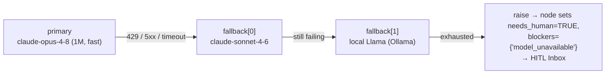

# Model Routing & Configuration

> **Purpose:** define how AeroApply binds each LangGraph node to a concrete provider + model + settings via the `model_config` registry and `src/aeroapply/models/router.py`, the routing policy and per-node overrides, the provider abstraction, current model IDs, and fallback behavior.

This document is subordinate to `docs/PROJECT_BRIEF.md` (the source of truth) and to the `model_config` table in `scripts/bootstrap.sql`. Goal 5 of the brief — *"Explicit, per-node control over which model + settings does each job"* — is the entire reason this layer exists. Model + settings are **config, never hard-coded**.

---

## 1. Why a router at all

AeroApply runs two cost regimes against one Postgres. The **Sourcing Daemon** scrapes 24/7 and must stay cheap (local/Haiku); the **Execution Graph** spends frontier tokens only on the WIP-limited top-N pulled from `v_icebox_ranked`. A node that drafts a cover letter and a node that classifies an inbound rejection email have wildly different cost/latency/quality needs. Hard-coding `ChatAnthropic(model=...)` inside each node would scatter that decision across the tree and make it impossible to retune without a redeploy.

Instead, **every node reads `model_config[node]` → `{provider, model_id, params, fallback}`** at call time. The router is the single choke point that turns that row into a live, provider-agnostic chat client.

```mermaid
flowchart LR
  NODE["LangGraph node\n(e.g. tailor.generator)"] -->|node_name| ROUTER["router.get_client(node_name)"]
  POLICY["Routing policy\n(task-class defaults)"] --> ROUTER
  REG[("model_config registry\nPostgres table + YAML seed")] -->|explicit override\n(wins)| ROUTER
  ROUTER --> RESOLVE["resolve provider+model_id+params"]
  RESOLVE --> PROV{"provider?"}
  PROV -->|anthropic| A["AnthropicProvider"]
  PROV -->|deepseek| D["DeepSeekProvider"]
  PROV -->|openai| O["OpenAIProvider (Codex)"]
  PROV -->|ollama| L["OllamaProvider (local)"]
  A & D & O & L --> CLIENT["chat client\n(.ainvoke / structured output)"]
  CLIENT -.on error/timeout.-> FB["walk fallback chain"]
  FB --> RESOLVE
```

---

## 2. The `model_config` registry

The canonical shape is the `model_config` table in `scripts/bootstrap.sql`:

```sql
CREATE TABLE model_config (
    id          UUID PRIMARY KEY DEFAULT gen_random_uuid(),
    node_name   VARCHAR(120) NOT NULL UNIQUE,       -- 'tailor.generator', 'tailor.critic', 'sourcing.parser'
    provider    VARCHAR(40) NOT NULL,               -- anthropic | deepseek | openai | ollama
    model_id    VARCHAR(120) NOT NULL,              -- claude-opus-4-8 | claude-sonnet-4-6 | ...
    params      JSONB DEFAULT '{}',                 -- {temperature, max_tokens, context, fast_mode, ...}
    fallback    JSONB DEFAULT '{}',
    updated_at  TIMESTAMPTZ NOT NULL DEFAULT now()
);
```

- **`node_name`** is the dotted node key (`UNIQUE`), e.g. `tailor.generator`, `tailor.critic`, `sourcing.parser`, `email.classifier`, `answer.aitl`.
- **`provider`** is one of the four abstracted vendors.
- **`model_id`** uses **current IDs only** — `claude-opus-4-8`, `claude-sonnet-4-6`, `claude-haiku-4-5`. Never legacy IDs like `claude-3-opus-*`.
- **`params`** carries everything provider-specific: `temperature`, `max_tokens`, `context`, `fast_mode`, `json_mode`, `top_p`.
- **`fallback`** is the ordered degradation chain (see §7).

The DB row is authoritative at runtime; `config/profile.yaml` seeds it and the operator retunes live without a redeploy (the brief: weights and roster are operator-tunable config). The Streamlit UI can edit a row; the next node call picks it up because the router reads per-invocation (with a short TTL cache).

Seed rows for the canonical roster:

```sql
INSERT INTO model_config (node_name, provider, model_id, params, fallback) VALUES
('tailor.generator', 'anthropic', 'claude-opus-4-8',
   '{"context":"1m","fast_mode":true,"temperature":0.6,"max_tokens":8000}',
   '{"chain":[{"provider":"anthropic","model_id":"claude-sonnet-4-6","params":{"temperature":0.6}}]}'),
('tailor.critic', 'anthropic', 'claude-sonnet-4-6',
   '{"temperature":0,"max_tokens":2000}',
   '{"chain":[{"provider":"deepseek","model_id":"deepseek-reasoner","params":{"temperature":0}}]}'),
('sourcing.parser', 'ollama', 'llama3.1:8b',
   '{"temperature":0,"json_mode":true}',
   '{"chain":[{"provider":"anthropic","model_id":"claude-haiku-4-5","params":{"temperature":0}}]}'),
('email.classifier', 'anthropic', 'claude-haiku-4-5',
   '{"temperature":0,"max_tokens":512,"json_mode":true}',
   '{"chain":[{"provider":"ollama","model_id":"llama3.1:8b","params":{"temperature":0}}]}');
```

---

## 3. Routing policy by task class + per-node overrides

Resolution is two-layer, and **the explicit per-node override always wins**:

1. **Task-class policy (default):** the node is mapped to one of four task classes, each with a default `(provider, model_id, params)`. This keeps a new node sane without a hand-written row.
2. **Per-node override (authoritative):** a `model_config` row for that exact `node_name` overrides the class default field-by-field. This is how you pin one node to a specific model+settings while leaving the rest on policy.

```python
# src/aeroapply/models/router.py  (illustrative — not production-hardened)

class TaskClass(StrEnum):
    DRAFTING       = "drafting"        # human-sounding prose
    CRITIQUE       = "critique"        # strict, deterministic review
    EXTRACTION     = "extraction"      # high-volume parse/classify
    CODE_REVIEW    = "code_review"     # build-time only (different vendor)

# Task-class defaults. Per-node rows override these.
POLICY: dict[TaskClass, ModelSpec] = {
    TaskClass.DRAFTING:    ModelSpec("anthropic", "claude-opus-4-8",
                                     {"context": "1m", "fast_mode": True,
                                      "temperature": 0.6, "max_tokens": 8000}),
    TaskClass.CRITIQUE:    ModelSpec("anthropic", "claude-sonnet-4-6",
                                     {"temperature": 0}),
    TaskClass.EXTRACTION:  ModelSpec("ollama", "llama3.1:8b",
                                     {"temperature": 0, "json_mode": True}),
}

# node_name -> task class, when no explicit row pins the node.
NODE_CLASS: dict[str, TaskClass] = {
    "tailor.generator":  TaskClass.DRAFTING,
    "cover_letter":      TaskClass.DRAFTING,
    "tailor.critic":     TaskClass.CRITIQUE,
    "answer.validator":  TaskClass.CRITIQUE,
    "sourcing.parser":   TaskClass.EXTRACTION,
    "email.classifier":  TaskClass.EXTRACTION,
}

def resolve(node_name: str) -> ModelSpec:
    row = registry.get(node_name)            # model_config row (DB), may be None
    base = POLICY[NODE_CLASS.get(node_name, TaskClass.EXTRACTION)]
    if row is None:
        return base
    # explicit row wins, but inherits any param the row leaves unset
    return base.merged_with(row)

def get_client(node_name: str) -> ChatClient:
    spec = resolve(node_name)
    return PROVIDERS[spec.provider].build(spec.model_id, spec.params)
```

Mapping to the brief's roster: **Drafting** = Generator / cover letters / summaries; **Critique** = ATS-Critic and validators; **Extraction** = sourcing parser, classifiers, and the email lifecycle classifier. **Code review** is build-time only (§6) and never touches the application runtime.

---

## 4. The provider abstraction

Four providers sit behind one interface so a node never imports a vendor SDK directly. Each implements `build(model_id, params) -> ChatClient` and a uniform `.ainvoke(messages)` / structured-output path, normalizing each vendor's quirks (Anthropic `max_tokens` is required; OpenAI JSON mode vs. Anthropic tool-forced JSON; Ollama's local `base_url`).

| Provider key | Vendor / runtime | Used for | Notes |
|---|---|---|---|
| `anthropic` | Anthropic API | Drafting (Opus 4.8), critique (Sonnet 4.6), cheap classify (Haiku 4.5) | Primary path for all in-app reasoning. `fast_mode` + `context: 1m` map to Anthropic request options. |
| `deepseek` | DeepSeek API | Alternative strict critic / cheap reasoning | Drop-in critic at `temperature=0`; first fallback for `tailor.critic`. |
| `openai` | OpenAI / Codex | Embeddings (`text-embedding-3-small`, 1536-d) + build-time code review | Embedding dim **must** match `vector(1536)` in the schema. |
| `ollama` | Local Ollama on the operator's Mac | High-volume sourcing parse + classification | Zero marginal cost; keeps the 24/7 daemon free. Local Llama. |

> Secrets (`ANTHROPIC_API_KEY`, `DEEPSEEK_API_KEY`, `OPENAI_API_KEY`, `OLLAMA_BASE_URL`) live in `.env` / the prod secret manager — **never committed**, consistent with the brief's PII/security boundary.

---

## 5. Current models & settings (canonical roster)

Mirrors §10 of `PROJECT_BRIEF.md`. **Current IDs only.**

| Node class | Default model | Settings | Provider |
|---|---|---|---|
| Drafting — `tailor.generator`, `cover_letter`, summaries | `claude-opus-4-8` | **1M context, fast mode**, `temperature≈0.6`, high `max_tokens` (~8k) | `anthropic` |
| Critique — `tailor.critic` (ATS-Critic), `answer.validator` | `claude-sonnet-4-6` (or DeepSeek) | `temperature=0` | `anthropic` / `deepseek` |
| Extraction / classification / sourcing — `sourcing.parser` | `claude-haiku-4-5` **or local Llama via Ollama** | `temperature=0`, JSON-mode | `ollama` / `anthropic` |
| Email lifecycle classifier — `email.classifier` | local / `claude-haiku-4-5` | `temperature=0`, structured output | `ollama` / `anthropic` |
| Build-time code review | a *different* vendor than the author | n/a | `openai` / other |

### 5.1 Cost / latency / why

| Node | Model + settings | Relative cost | Latency profile | Why this choice |
|---|---|---|---|---|
| `tailor.generator` | `claude-opus-4-8`, 1M ctx, fast, `temp 0.6` | Highest per token | Low (fast mode) on long context | Most nuanced, human-sounding prose; 1M context fits resume variant + full JD + `qa_history` retrieval; reputation is on the line. |
| `tailor.critic` | `claude-sonnet-4-6`, `temp 0` | Medium | Low | Strict, deterministic ATS keyword scoring; `temp 0` makes `ats_score` reproducible across the cyclic loop. Cheaper than running Opus twice. |
| `sourcing.parser` | local Llama (Ollama), `temp 0`, JSON | ~Zero (local) | Variable, but free | Runs continuously in the 24/7 daemon on the operator's Mac; volume makes any per-token price prohibitive. |
| `email.classifier` | Haiku 4.5 / local, `temp 0`, structured | Lowest hosted | Very low | Hourly IMAP poll → `otp \| interview \| questionnaire \| rejection \| offer`; high volume, trivial task. |

The economic invariant: **only WIP-queued applications ever reach the Opus/Sonnet nodes.** The Icebox and the email firehose stay on local/Haiku. That is what keeps an always-on daemon affordable.

---

## 6. Build-time code review (do not conflate with runtime)

Per the brief's *two peer-review systems*: the runtime **Generator ⇄ ATS-Critic** loop (§5) is separate from **build-time** review, where one model writes AeroApply's code and a *different* vendor reviews it via the `cross-review` tool, enforced as a CI gate. The only routing rule here is **vendor diversity** — the reviewer must not be the author (e.g. Claude Code authors → Codex/Gemini reviews, or vice-versa) — to get a genuine second pair of eyes. This never runs in the application graph and consumes no `model_config` runtime rows.

---

## 7. Pinning a node + fallback chains

### 7.1 Pin a node to a specific model + settings

To pin a node — e.g. force `tailor.generator` onto **Opus 4.8 Max with 1M context and fast mode** — upsert its `model_config` row. The explicit row beats the task-class default, and the next node call uses it:

```sql
INSERT INTO model_config (node_name, provider, model_id, params, fallback)
VALUES (
  'tailor.generator', 'anthropic', 'claude-opus-4-8',
  '{"tier":"max","context":"1m","fast_mode":true,"temperature":0.6,"max_tokens":12000}',
  '{"chain":[{"provider":"anthropic","model_id":"claude-sonnet-4-6","params":{"temperature":0.6}}]}'
)
ON CONFLICT (node_name) DO UPDATE
  SET provider = EXCLUDED.provider,
      model_id = EXCLUDED.model_id,
      params   = EXCLUDED.params,
      fallback = EXCLUDED.fallback,
      updated_at = now();
```

Because `node_name` is `UNIQUE`, `ON CONFLICT` makes this an idempotent live retune. Equivalently, seed it from `config/profile.yaml` so a fresh `bootstrap` reproduces the pin.

### 7.2 Fallback chains

`fallback.chain` is an ordered list of `{provider, model_id, params}`. The router walks it on a **retryable failure** — provider 5xx, rate-limit (429), timeout, or content-filter refusal — never silently for a normal completion. It is degrade-in-place, not load balancing:



```python
async def ainvoke_with_fallback(node_name: str, messages: list[Message]):
    spec = resolve(node_name)
    for candidate in [spec, *spec.fallback_chain]:
        try:
            client = PROVIDERS[candidate.provider].build(candidate.model_id, candidate.params)
            return await client.ainvoke(messages)
        except RetryableModelError:
            continue   # try next link
    raise ModelChainExhausted(node_name)   # surfaces as a blocker, not a fabricated answer
```

Design rules for chains:
- **Stay in task class.** A drafting node falls back to another capable drafter (Opus → Sonnet), never to a tiny classifier — a degraded resume is worse than a paused one.
- **Critique chains hold `temperature=0`** through every link so determinism survives a failover (Sonnet 4.6 → DeepSeek reasoner).
- **Extraction chains may fail *up*** from local Llama to hosted Haiku 4.5 when Ollama is down, trading a little cost for liveness on the 24/7 daemon.
- **Exhaustion is honest.** When the whole chain fails the node does **not** improvise — it sets `needs_human = TRUE` with a `model_unavailable` blocker and escalates to the HITL Inbox. This respects the brief's non-negotiables: *secure-by-default* and *never fabricate*. A model outage must never become a fabricated EEO/visa/clearance answer or an unreviewed auto-submit; the submission gate (`evaluate_submission_route`) still governs, and a blocked node simply parks the thread.
