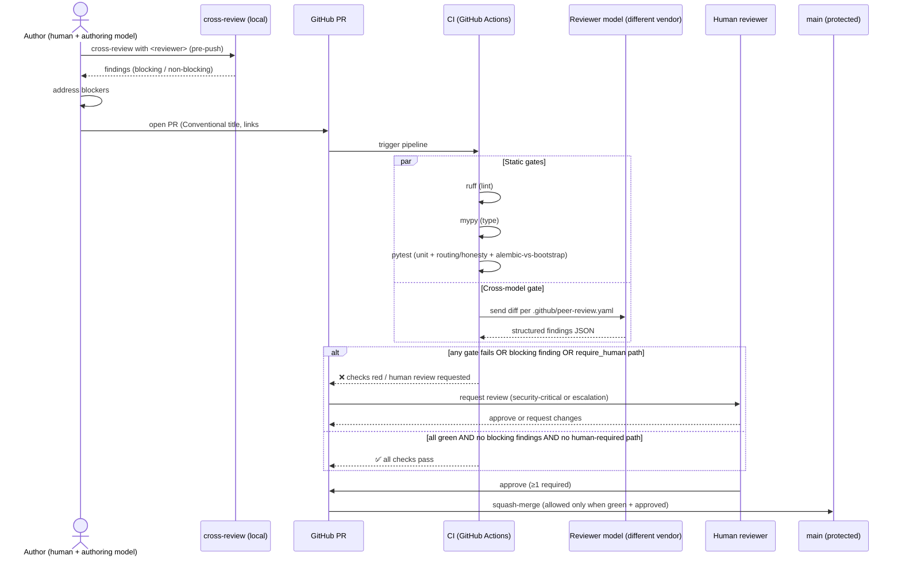

# AeroApply — Build-Time Multi-Model Peer Review

> **Purpose:** Define how we *build* AeroApply — one model authors code, a different vendor reviews it via the `cross-review` tool, enforced as a CI gate before any merge. This is a development-process doc, not a runtime-behavior doc.

---

## 0. Scope — and what this is *not*

AeroApply has **two distinct peer-review systems** (`PROJECT_BRIEF.md` §9). Conflating them is the single most common mistake, so state it up front:

| | **Runtime** Generator ⇄ ATS-Critic | **Build-time** cross-model review (this doc) |
|---|---|---|
| What it reviews | A tailored *resume / cover letter* for one job | A *pull request* of AeroApply's own source |
| Who runs it | The LangGraph execution graph, per application | A human author + CI, per PR |
| Models | Generator `claude-opus-4-8`, Critic `claude-sonnet-4-6`/DeepSeek | Author vendor ⇄ a *different* reviewer vendor |
| Where it lives | `src/aeroapply/nodes/tailor.py`, `TAILORING_AND_ATS.md` | `.github/workflows/`, the `cross-review` tool, this doc |
| Pass condition | `ats_score ≥ 0.90` | lint + type + test + cross-model review all green |

The runtime loop ships *inside* the product and is documented in `TAILORING_AND_ATS.md`. **Everything below is about the development pipeline only.** Nothing here changes how the daemon behaves in production.

The same secure-by-default ethos that governs the *runtime* submission gate (`PROJECT_BRIEF.md` §6) governs the *build* gate: review-before-merge is the default; an unreviewed merge is *earned*, not assumed.

## 1. Why cross-vendor, not same-vendor

A model reviewing its own family's output shares its blind spots: the same hallucinated API, the same plausible-but-wrong async pattern, the same security oversight survives both passes. AeroApply touches things where a missed bug is expensive in a way unit tests rarely catch:

- **Fernet credential handling** (`portal_credentials.encrypted_password`) — a plaintext leak into a log or the Streamlit UI is a real-world breach, not a flaky test.
- **The honesty gate** in `evaluate_submission_route` — a routing regression that lets an EEO/visa/clearance field auto-submit violates the project's first non-negotiable ("**never fabricate**", §13.1).
- **Inbound-webhook signature verification** in `services/email_webhook/app.py` — skip it and anyone can inject an OTP into a paused Playwright thread.
- **Model-ID drift** — a legacy ID like `claude-3-opus-*` sneaking into `model_config` rows or fixtures (banned by §16).

So: **the reviewer must be a different vendor than the author.** Claude Code authors → Codex or Gemini reviews; Codex/Gemini authors → Claude Code reviews. This is a genuine second pair of eyes (`PROJECT_BRIEF.md` §10, "Build-time code review → a *different* vendor than the author").

## 2. Routing policy (settings-driven, override-able)

Mirror the product's own philosophy: a **policy assigns by task class; explicit per-PR overrides always win** — exactly how `model_config[node]` works for runtime nodes (§10). Routing config lives in `.github/peer-review.yaml`, committed and reviewable:

```yaml
# .github/peer-review.yaml — build-time review routing
default_reviewer: codex          # if author is Claude, review with Codex
pairs:
  claude:  { reviewer: codex,  model: gpt-5-codex }
  codex:   { reviewer: claude, model: claude-opus-4-8 }
  gemini:  { reviewer: claude, model: claude-sonnet-4-6 }

# Task-class routing: high-stakes areas get the strongest reviewer + a human.
routes:
  - paths: ["src/aeroapply/graph/routing.py", "src/aeroapply/db/credentials*.py",
            "services/email_webhook/**"]
    reviewer_model: claude-opus-4-8     # 1M context, fast mode
    require_human: true                 # security-critical → always escalate
  - paths: ["src/aeroapply/nodes/**", "src/aeroapply/models/**"]
    reviewer_model: claude-sonnet-4-6   # strict, deterministic, cheaper
  - paths: ["docs/**", "backlog/**", "scripts/*.sh"]
    reviewer_model: claude-haiku-4-5    # cheap pass for prose/glue
    require_human: false

override_label: "review:override"       # PR label forces a manual reviewer choice
```

Routing rationale tracks the runtime roster (§10): **`claude-opus-4-8`** (1M context, fast mode) for the highest-stakes diffs where reasoning depth pays off; **`claude-sonnet-4-6`** (`temperature=0`-equivalent, strict and cheaper) for the bulk of node/model code; **`claude-haiku-4-5`** for high-volume, low-risk prose and shell glue. When *Claude* is the author, the reviewer flips to Codex/Gemini per `pairs` — vendor independence is non-negotiable even when it costs the stronger model.

Overrides: applying the `review:override` label, or a `Reviewer:` trailer in the PR body, pins a specific vendor/model and bypasses path routing — the per-PR analog of a per-node override winning over policy.

The author *invokes* the reviewer locally with the `cross-review` skill before pushing (fast feedback), and CI re-runs it authoritatively on the PR (trust boundary). The root agent reconstructs the diff from its own session history — no git surgery — and hands the changed hunks to the chosen reviewer model.

## 3. The merge gate (CI)

Four checks are **required** on the protected `main` branch; none is skippable. Branch protection enforces "all four green + ≥1 human approval" before the merge button lights up.



The four gates, concretely:

1. **`ruff`** — lint + format. Fast, deterministic, no model.
2. **`mypy`** — strict typing across `src/aeroapply` (Pydantic v2 models, psycopg3 row types). Catches the class of `None`-handling bugs that the runtime daemon would otherwise hit at 3 a.m.
3. **`pytest`** — unit tests **plus** two AeroApply-specific suites that *must* exist for any PR touching them:
   - `tests/test_routing.py` — asserts `evaluate_submission_route` still escalates browser/DOM sources, sub-threshold `ats_score`/`agent_confidence`, and every sensitive `qa_history` field. A green here is the structural guarantee of §6.
   - `tests/test_schema_parity.py` — asserts the Alembic head matches `scripts/bootstrap.sql` (the canonical schema, §11) so migrations never drift from source-of-truth.
4. **Cross-model review** — the differentiator. CI posts the diff to the routed reviewer and parses structured findings.

### Findings contract

The reviewer returns machine-checkable JSON so CI can decide pass/fail without a human reading prose:

```json
{
  "reviewer": "codex",
  "model": "gpt-5-codex",
  "verdict": "changes_requested",
  "findings": [
    {
      "severity": "blocking",
      "path": "services/email_webhook/app.py",
      "line": 42,
      "category": "security",
      "message": "Inbound handler parses request.json(); Mailgun posts multipart form fields. Use await request.form(). Also: provider signature is never verified before matching an application.",
      "suggested_fix": "verify_signature(form); code = extract_otp(form['body-plain'])"
    },
    {
      "severity": "nit",
      "path": "src/aeroapply/nodes/tailor.py",
      "line": 88,
      "category": "style",
      "message": "Generator max_tokens hard-coded; should read model_config['tailor.generator'].params."
    }
  ]
}
```

CI rule: **any `severity: "blocking"` finding fails the gate.** `nit`/`suggestion` annotate the PR but do not block. A tiny adjudicator step enforces this:

```python
# .github/scripts/gate_review.py — exit nonzero if the reviewer blocks.
import json, sys, pathlib

report = json.loads(pathlib.Path(sys.argv[1]).read_text())
blocking = [f for f in report["findings"] if f["severity"] == "blocking"]
for f in blocking:
    print(f"::error file={f['path']},line={f.get('line', 0)}::{f['message']}")
print(f"cross-model review by {report['reviewer']}/{report['model']}: "
      f"{len(blocking)} blocking, verdict={report['verdict']}")
sys.exit(1 if blocking or report["verdict"] == "changes_requested" else 0)
```

Every CI review is appended to the PR thread and the run is retained as a build artifact — the build-pipeline analog of AeroApply's own `application_event` append-only audit log (§13.6). We keep a record of *which model said what* about every merged line.

## 4. When to escalate to a human

The cross-model gate is necessary but **not sufficient**. A human reviewer is *mandatory* (not advisory) when any of these holds — the build-time mirror of the runtime honesty/source gates:

- **Security-critical paths** flagged `require_human: true`: `graph/routing.py`, the Fernet credential vault, the email webhook. Two models agreeing is not enough to ship a credential-handling change unreviewed.
- **The autonomy contract changes** — any edit to gate thresholds, `auto_submit`/`manual_override` semantics, or the `application` status/`wip_status` CHECK constraints in `bootstrap.sql`. These encode product-judgment decisions that are the operator's to make, not an LLM's.
- **Schema or migration changes** — a new Alembic revision, a column type change, or anything that could corrupt `application`/`portal_credentials` data.
- **Reviewer disagreement or low confidence** — if the reviewer's verdict is `needs_human`, or author and reviewer models conflict on whether something is a real bug, a human breaks the tie. We **never fabricate** a resolution to make CI green (§13.1, applied to our own process).
- **New external surface** — a new connector (`src/aeroapply/connectors/`) or a ToS-sensitive change to LinkedIn/Workday pacing, where a bad call risks an account ban (§13.4).

Everything else — a Haiku-reviewed docs typo fix, a green Sonnet pass on an isolated node refactor with no blocking findings — may merge on the automated gate plus the standing ≥1 human approval. We are not pretending the human approval is optional; we are scoping *deep* human review to where judgment actually matters, exactly as the product scopes operator attention to the "judgment 10%" (§3).

## 5. PR conventions

- **Branch from `main`; never commit to `main` directly.** Naming: `feat/sourcing-bouncer-geo`, `fix/webhook-otp-multipart`, `chore/bump-langgraph`.
- **Conventional-Commits titles** (`feat:`, `fix:`, `refactor:`, `docs:`, `test:`, `chore:`) — drives changelog generation and signals which path routes apply.
- **Every PR links a backlog issue.** AeroApply runs a two-tier **Icebox / WIP** backlog (§5.1) and the WIP discipline applies to *us* too: a PR maps to a `WIP` issue pulled from the Icebox, not to ad-hoc work. Body uses `Closes #NN`.
- **PR body template:**

  ```markdown
  ## What & why
  Closes #NN. <one-paragraph intent>

  ## Author / Reviewer
  Authored-by: claude-opus-4-8 (fast mode)
  Reviewer:    codex            # cross-vendor; overrides .github/peer-review.yaml routing

  ## Risk
  - [ ] Touches routing/credentials/webhook (→ require_human)
  - [ ] Schema or Alembic migration (→ test_schema_parity + human)
  - [ ] New connector / ToS-sensitive pacing

  ## Verification
  ruff ✓  mypy ✓  pytest ✓ (routing+schema suites included)
  ```

- **Squash-merge only**, so `main` history is one commit per reviewed unit of work — matching the `application_event` "one row per meaningful action" mental model.
- **No real PII, resumes, or credentials in any diff or fixture** (§13.7). Tests use the illustrative defaults from `config/profile.example.yaml`; real values live only in the gitignored `config/profile.yaml` and `.env`. The cross-model reviewer is explicitly instructed to flag any concrete personal value (real email, address, salary floor, credential) that leaks into committed code as a **blocking** finding.

## 6. Dev environment parity

Build-time review runs against the same stack the daemon runs on (§4 canonical decisions): **local Docker Postgres + pgvector** for dev and CI (`infra/docker-compose.yml`), promoting to **Railway** in prod (**not** Supabase). CI spins up the Docker Postgres, applies `scripts/bootstrap.sql`, and runs `test_schema_parity` against it — so the schema a reviewer reasons about is byte-for-byte the schema that ships. Packaging is **uv / Python 3.12**; `ruff`, `mypy`, and `pytest` are invoked exactly as a developer runs them locally, so "green in CI" and "green on my Mac" mean the same thing.
