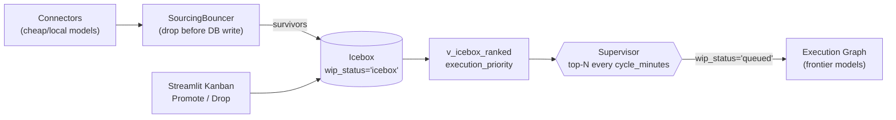

# AeroApply — Product Requirements Document

> Purpose: define what AeroApply v1 must do, for whom, and the success bar — every requirement traces back to a canonical decision in `PROJECT_BRIEF.md`, the schema in `scripts/bootstrap.sql`, and the filters in `config/profile.example.yaml`.

---

## 1. Overview & vision

AeroApply is a **persistent, always-on multi-agent daemon** that runs a single operator's job hunt end-to-end: it sources relevant roles 24/7, tailors a chosen resume variant per posting through a `Generator ⇄ ATS-Critic` cyclic loop, writes cover letters, answers screening questions from the operator's own history, creates portal accounts, submits through the right channel (clean ATS API or Playwright on DOM portals), and tracks the full lifecycle through a dedicated email inbox. The product thesis: automate the **mechanical 90%** of every application and reserve the operator's attention for the **judgment 10%** — which roles to chase, ambiguous or legal questions, and final sign-off on reach roles.

Two non-negotiables shape every feature: **never fabricate** an answer (truthful EEO/visa/clearance/self-ID always), and **secure-by-default autonomy** (review-before-submit unless a strict gate ladder is cleared). v1 is explicitly a single-operator personal tool; the schema carries `user_id` everywhere so multi-tenant is *reachable* later, but it is a non-goal now.

## 2. Operator persona

One persona, referenced at role/region level only (concrete PII lives in `config/profile.yaml`, never in this doc):

- **Role pivot:** a Senior Business Analyst / Project Manager moving into an **AI Product Manager** track.
- **Region:** **Jupiter, FL**; open to **remote** or **South-Florida hybrid** (Jupiter / West Palm corridor), 40-mi commute fence for anything onsite/hybrid.
- **Floor:** drop a role if the **max** of its salary band is below the **$115k** floor; unlisted bands pass through to the Icebox.
- **Target titles:** AI Product Manager and AI Solutions Architect are core (alignment `1.0`); Senior Business Analyst and Technical Project Manager are adjacent fallbacks (alignment `0.6`).

These values are read from `search_profile`, `target_role`, and the `bouncer` block of the profile YAML — never hard-coded.

## 3. Problem & goals

A job seeker burns hours per application on repetitive, low-judgment work: re-tailoring a resume, stuffing ATS keywords, rewriting a cover letter, re-answering identical screening questions, creating yet another portal account, then chasing status across inboxes. That volume is exactly where a careless autopilot torches a professional reputation. AeroApply's goals, in priority order:

1. Maximize **relevant** applications per week without sacrificing accuracy or reputation.
2. **Never fabricate** — truthful on every legal/EEO/visa/clearance field, always.
3. **Secure-by-default** autonomy — auto-submit only where it is both safe and high-confidence.
4. Full-lifecycle tracking (sourced → applied → interview/offer/rejection) with **zero manual data entry**.
5. Explicit, **per-node** control over which model + settings does each job.

Non-goals (v1): multi-tenant SaaS; mobile app; recruiter auto-reply / interview scheduling; CAPTCHA defeat or anti-bot evasion; any action requiring dishonesty.

## 4. In-scope feature set

Every feature below maps to a canonical mechanism and a concrete table/view.

| # | Feature | Canonical mechanism | Backing store |
|---|---|---|---|
| F1 | **Multi-resume intake** | Operator loads N variants ("AI Product Manager — base", "Senior BA — base"); chunked + embedded for AITL retrieval | `resume_variant`, `resume_chunk(embedding vector(1536))` |
| F2 | **Target roles** | Titles + alignment multiplier feed the ranking formula | `target_role(title, alignment)` |
| F3 | **Filters** (locations / distance / remote-hybrid-onsite / language / salary / LinkedIn on-off) | The "search profile"; salary evaluated vs band **max** | `search_profile` |
| F4 | **24/7 sourcing** | Sourcing Daemon on cheap/local models; `SourcingBouncer` drops junk **before** any DB write | `source`, `job` |
| F5 | **Two-tier Icebox + WIP backlog** | Tier-1 Icebox = raw survivors; Tier-2 = WIP-limited execution queue, top-N promoted on a schedule | `application.wip_status`, `v_icebox_ranked` |
| F6 | **Tailoring + ATS** | `Generator ⇄ ATS-Critic` cyclic subgraph until `ats_score` clears threshold or max-iter cap | `application.tailored_resume_*`, `ats_score` |
| F7 | **Cover letters** | Generated only when the posting requires one | `application.cover_letter` |
| F8 | **AITL question answering** | Vector-match each question against `qa_history`; resolve autonomously only at high confidence | `qa_history(embedding)`, `application.answers` |
| F9 | **Account creation** | Domain-keyed credential vault; generate strong password, store Fernet ciphertext | `portal_credentials` |
| F10 | **Tiered auto / HITL submit** | Per-application conditional edge `evaluate_submission_route(state)`; gate ladder, secure-by-default | `auto_submit`, `agent_confidence`, `source.autonomy_tier` |
| F11 | **Email lifecycle tracking** | Inbound webhook injects OTP into paused thread; hourly IMAP poller classifies + forwards | `email_event`, `application.status` |

### 4.1 Filters → schema (F3)

The "filters" the operator described are columns on `search_profile`, with the salary floor evaluated against the band **max** exactly as the bouncer does:

```sql
-- search_profile carries every filter the operator configures
locations        TEXT[]    -- {'Remote','Jupiter, FL','West Palm Beach, FL'}
distance_miles   INTEGER   -- 40-mi geo fence for hybrid/onsite
remote_modes     TEXT[]    -- subset of remote|hybrid|onsite
languages        TEXT[]    -- {'English'}
salary_floor     INTEGER   -- 115000, compared to band MAX (drop if 0 < max < floor)
include_linkedin BOOLEAN   -- "on linkedin / not on linkedin"
```

### 4.2 Sourcing + two-tier backlog (F4, F5)

The Sourcing Daemon scrapes continuously; the `SourcingBouncer` (`src/aeroapply/sourcing/bouncer.py`) applies five edge filters — geo fence, seniority/industry regex drop, salary-floor (band max), clearance/visa gate, and 45-day ghost-job cutoff — **before** anything is written. Survivors land in the Icebox (`wip_status = 'icebox'`). The Supervisor wakes every `cycle_minutes` (default 180), reads `v_icebox_ranked`, and promotes the top `wip_limit` (default 5) into the WIP queue. Only queued jobs ever spend frontier-model tokens. The execution graph's **first** node HTTP-pings `portal_url`; a dead posting flips to `closed_before_execution` and the Supervisor pulls the next job — no wasted drafting.



The two-tier split is the cost-control spine: cheap models do unbounded volume, expensive models do bounded, ranked work. `execution_priority` is computed live in `v_icebox_ranked` (never cached, never stale): `manual_override` is an absolute `+100` trump, then title alignment (35%), location/flexibility (25%), recency (20%), competition (10%), urgency (10%), with weights operator-tunable via `search_profile.weights`.

### 4.3 Tiered submission gate (F10)

Mode is decided **per application at runtime** via a conditional edge, not a static `interrupt_before`. The gate ladder is secure-by-default: failing any single gate routes to human review.

```python
# src/aeroapply/graph/routing.py — canonical gate ladder (illustrative)
def evaluate_submission_route(state) -> str:
    # Gate 1 — Source: DOM/browser portals are always human-gated (Tier B).
    if state["source_key"] in {"workday", "taleo", "linkedin", "custom"}:
        return "escalate_to_human_review"
    # Gate 2 — Quality: ATS coverage AND agent confidence (one combined bar).
    if not (state["ats_score"] >= 0.90 and state["agent_confidence"] >= 0.95):
        return "escalate_to_human_review"
    # Gate 3 — Preference: operator must have opted in for this application.
    if not state["auto_submit"]:
        return "escalate_to_human_review"
    # Gate 4 — Honesty: any novel question, or any EEO/visa/clearance/self-ID
    # field not matched in qa_history at high confidence → escalate.
    if state["has_unmatched_question"] or state["has_sensitive_unverified"]:
        return "escalate_to_human_review"
    return "auto_submit"  # cleared all four gates
```

Autonomy tiers, sourced from `source.autonomy_tier` and the profile's `auto_submit_sources` / `always_human_sources`:

- **Tier A (auto-eligible):** clean-API ATS — Greenhouse, Lever, Ashby — predictable structured payloads.
- **Tier B (HITL required):** DOM/browser portals (Workday, Taleo, company sites) and LinkedIn — fragile and ban-prone. **Account creation is Tier B by definition** (highest ban risk).
- **Tier C (blocked):** anything requiring fabrication, or sources whose ToS prohibit automation outright.

### 4.4 Email lifecycle (F11)

A dedicated `agent_email` (`<operator>.agents@<domain>`) drives two flows. The **inbound webhook** (`POST /v1/webhooks/inbound-email`) verifies the provider signature, parses Mailgun's **multipart form** (`await request.form()`, not JSON), extracts an OTP (`\b\d{4,7}\b`), matches the sender domain to an active application, and wakes the paused Playwright thread with `await graph.aupdate_state(config, {"verification_code": code}, as_node="account_node")` — `aupdate_state` is a method on the **compiled graph**, not the checkpointer. The **hourly IMAP poller** routes each message through a fast classifier (local/`claude-haiku-4-5`) into `interview | questionnaire | rejection | offer`, updates `application.status`, flags high-priority items for the Inbox, and forwards the full message to the operator's primary inbox (`aiosmtplib`, fire-and-forget via FastAPI `BackgroundTasks`). Every inbound message is persisted to `email_event` for traceability.

## 5. Out-of-scope / non-goals

- **Multi-tenant SaaS, billing, auth/SSO.** Schema is tenant-ready (`user_id` FKs) but v1 serves one operator.
- **Mobile app.** UI is **Streamlit** (Inbox + Ledger + Kanban); FastAPI + Next.js is a documented *future* path.
- **Recruiter auto-reply, interview scheduling, salary negotiation.** Lifecycle tracking forwards and classifies; it does not converse.
- **CAPTCHA defeat / anti-bot evasion.** If a portal blocks automation, escalate — do not fight it.
- **Any dishonest action.** Unknown or unmatched sensitive field → escalate, never guess.
- **Managed cloud DB (Supabase et al.).** Backend is **local Docker Postgres + pgvector** in dev → **Railway** (co-located FastAPI engine + Postgres) in prod. One Postgres holds rows *and* vectors — no separate Pinecone/Redis.
- **Celery / heavyweight queues** in v1. Async work runs on `asyncio` task workers; Celery only if/when needed.

## 6. User stories

- **As the operator, I want** to upload several resume variants and have AeroApply pick the right one per role, **so that** an AI-PM posting gets my AI-PM resume and a BA posting gets my BA resume — F1, F6 (`resume_variant.is_default`, `select_resume` node).
- **As the operator, I want** to set my filters once (remote + South-FL hybrid, 40 mi, English, $115k floor, LinkedIn on), **so that** sourcing only surfaces roles I'd actually take — F3 (`search_profile`).
- **As the operator, I want** the daemon to scrape 24/7 and drop obvious junk before it ever hits my board, **so that** my Icebox is signal, not noise — F4 (`SourcingBouncer`).
- **As the operator, I want** a ranked Icebox and a small WIP queue, **so that** expensive tailoring only runs on the top handful of roles — F5 (`v_icebox_ranked`, `wip_limit`).
- **As the operator, I want** tailored resumes scored for ATS keyword coverage before submission, **so that** I clear the resume screener — F6 (`Generator ⇄ ATS-Critic`, `ats_score ≥ 0.90`).
- **As the operator, I want** screening questions answered from my own past answers, **so that** I'm not retyping the same responses — F8 (`qa_history` vector match).
- **As the operator, I want** anything legal/EEO/visa/clearance or any never-seen question routed to me, **so that** nothing is ever fabricated under my name — F8, F10 (honesty gate; `qa_history.sensitive`).
- **As the operator, I want** clean-API ATS applications to auto-submit only when ATS ≥ 0.90, confidence ≥ 0.95, and I've opted in, while every Workday/Taleo/LinkedIn app waits for my click — F10 (`evaluate_submission_route`).
- **As the operator, I want** portal accounts created and their passwords stored encrypted, **so that** I'm not managing dozens of logins — F9 (`portal_credentials`, Fernet).
- **As the operator, I want** OTP/verification emails handled automatically so a paused application resumes itself — F11 (inbound webhook → `aupdate_state`).
- **As the operator, I want** interview/offer/rejection emails classified, my pipeline updated, and the original forwarded to my main inbox — F11 (IMAP poller, `email_event`).
- **As the operator, I want** one screen showing my HITL queue, full ledger, and Kanban — UI (Streamlit Inbox · Ledger · Kanban).

## 7. Success metrics

| Metric | Definition | Target (v1) | Source |
|---|---|---|---|
| **Relevant apps / week** | Submitted apps on roles with title alignment ≥ 0.6 | ≥ 25/wk sustained | `application` + `v_icebox_ranked` |
| **Answer accuracy** | AITL answers later confirmed correct by operator (no edits) | ≥ 98% | `operator_confirmed` boolean on each per-answer object in `application.answers` (set on operator review; equivalently an `application_event` of type `answer_confirmed`) |
| **% auto vs HITL** | Share of submissions auto-submitted vs human-approved | 20–40% auto (rest HITL) — *secure-by-default, not a maximization target* | route outcomes in `application_event` |
| **Time-to-apply** | Median wall-clock from `queued` → `submitted`/`needs_review` | ≤ 10 min/app | `application` timestamps, `run` |
| **Interview rate** | Submitted → `interview` | ≥ 8% (vs ~2–4% manual baseline) | `application.status` |
| **Fabrication incidents** | Sensitive fields auto-answered without a high-confidence `qa_history` match | **0 — hard gate** | honesty gate, audit log |

The auto-vs-HITL share is deliberately **not** "maximize auto." A rising auto rate paired with falling answer accuracy is a regression, not progress.

## 8. Risks

| Risk | Impact | Mitigation (canonical) |
|---|---|---|
| **Account ban** (LinkedIn / Workday automation tripped) | Loss of operator's real account + reputation | Tier B/C: human-gated, conservative pacing (`source.rate_limit`), no anti-bot evasion; account creation always HITL |
| **Fabricated sensitive answer** | Legal/ethical exposure under operator's name | Honesty gate + `qa_history.sensitive` → unconditional escalation; success metric tracks zero incidents |
| **ToS / legal violation** | Takedown, account loss | Respect ToS & rate limits; LinkedIn scraping/auto-apply restricted to Tier B/C |
| **Brittle DOM portals** | Failed/partial submissions | Playwright (+ optional browser-use/Stagehand); `verify_open` first node; failures → `error` + escalate |
| **Stale / ghost jobs** | Wasted frontier tokens | 45-day ghost-job bouncer drop; live `verify_open` HTTP ping → `closed_before_execution` |
| **Credential leakage** | Exposed portal logins | Fernet-at-rest (env key dev, KMS prod); never logged, never shown plaintext in UI; secrets in `.env`, not git |
| **Webhook spoofing** | Forged OTP injection into a paused thread | Verify provider signature before parsing inbound multipart form |
| **Model cost blowout** | Budget overrun from over-eager drafting | Two-tier WIP cap (top-N only); cheap/local models for sourcing + email classification (`claude-haiku-4-5`/Ollama); frontier (`claude-opus-4-8`) only on queued work |
| **Embedding dimension drift** | Broken AITL retrieval after swapping embedder | Schema pins `vector(1536)`; swapping the embedder requires matching the dimension and re-indexing the HNSW indexes |
