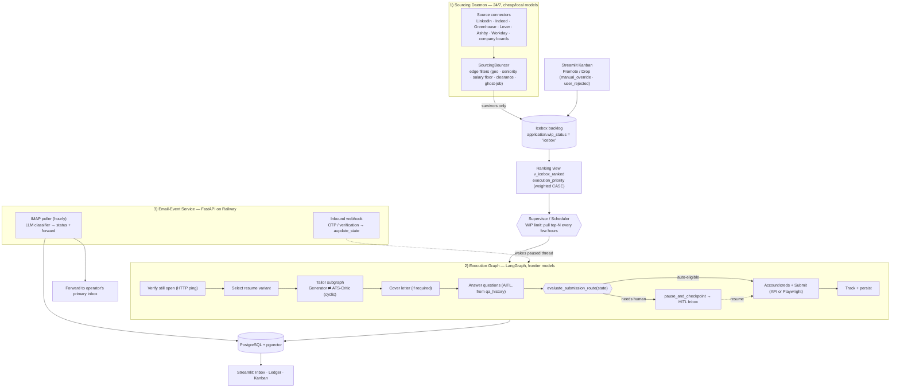

# AeroApply — Project Brief & Canonical Decisions

> **This document is the single source of truth.** Every other doc, the schema, the
> backlog, and the code must agree with it. If something here conflicts with another
> doc, this file wins. Last updated: 2026-05-31.

---

## 1. Identity

- **Name:** AeroApply
- **Tagline:** *Your autonomous job-application co-pilot — sources, tailors, applies, and tracks, with you in the loop only when it matters.*
- **One-liner:** A persistent, always-on multi-agent daemon that sources relevant roles 24/7, tailors a chosen resume variant for each one (with ATS-keyword optimization via a writer↔critic loop), writes cover letters, answers screening questions from your history, applies through the right channel (API or browser), and tracks the full lifecycle through email — pausing for you only on genuine product/judgment decisions.
- **Repo slug:** `aeroapply` · **Python package:** `aeroapply` · **Visibility:** public (public-safe scaffold; no real operator data committed).

## 2. Operator persona & configuration

AeroApply is a **single-operator personal tool** (multi-tenant is explicitly out of scope for v1, though the schema is tenant-ready).

- **Primary operator:** a Senior Business Analyst / Project Manager **pivoting into an AI Product Manager** track. Based in **Jupiter, FL** (commute anchor configured in `config/profile.yaml`), open to **remote** or **South-Florida hybrid** (Jupiter / West Palm corridor).
- **Target titles (priority order):** AI Product Manager, AI Solutions Architect (core, alignment `1.0`); Senior Business Analyst, Technical Project Manager (adjacent fallback, alignment `0.6`).
- **Hard salary floor:** evaluate the **max** of a posted band; drop if max `< $115,000`. Unlisted salary passes through to the Icebox.

> **PII boundary:** concrete personal values (name, exact address/coords, salary floor, target titles, scoring weights, credentials, email addresses) live in `config/profile.yaml` and `.env` — **never hard-coded into committed docs or source.** `config/profile.example.yaml` ships illustrative defaults. Docs refer to the persona at the role/region level only.

## 3. Problem & goals

Job seekers waste hours per application on repetitive, low-judgment work: re-tailoring resumes, stuffing ATS keywords, rewriting cover letters, re-answering the same screening questions, creating yet another portal account, and chasing status updates across inboxes. AeroApply automates the **mechanical 90%** and reserves the operator's attention for the **judgment 10%** (which roles to pursue, ambiguous/legal questions, final sign-off on reach roles).

**Goals**
1. Maximize *relevant* applications per week without sacrificing accuracy or the operator's professional reputation.
2. Never fabricate. Truthful answers on every legal/EEO/visa/clearance field — always.
3. Secure-by-default autonomy: auto-submit only where it is both safe and high-confidence.
4. Full-lifecycle tracking (sourced → applied → interview/offer/rejection) with zero manual data entry.
5. Explicit, per-node control over which model + settings does each job.

**Non-goals (v1):** multi-tenant SaaS; mobile app; interview scheduling/auto-reply to recruiters; defeating CAPTCHAs or anti-bot systems; any action requiring dishonesty.

## 4. Canonical decisions (locked)

| Decision | Choice | Notes |
|---|---|---|
| Orchestration | **LangGraph** (supervisor + nested subgraphs; cyclic critic loops) | Stateful, durable, per-node model control, interrupt/resume HITL. |
| Runtime shape | **Persistent always-on daemon**, not a one-shot script | Sourcing daemon + WIP-limited execution graph + email-event service. |
| Autonomy | **Tiered by confidence/source, secure-by-default** | Review-before-submit is the default; auto-submit is *earned* per strict gates. |
| Backend (dev) | **Local Postgres + pgvector via Docker** | Fastest loop; zero cost; instant checkpoint writes. |
| Backend (prod) | **Railway** (co-located FastAPI engine + Postgres) | Low checkpoint latency; receives inbound email webhooks 24/7. |
| Vector store | **pgvector in the same Postgres** | One backend; no separate Pinecone/Redis. |
| Internal UI | **Streamlit** (dual-view: Inbox + Ledger + Kanban) | FastAPI + Next.js is a documented future path, not v1. |
| Inbound email | **FastAPI webhook service** (Mailgun/SendGrid inbound) | Promoted into v1 — OTP injection requires an always-on endpoint. |
| Async work | **`asyncio` task workers** (Celery only if/when needed) | Avoid premature infra. |
| Browser automation | **Playwright** (+ optional `browser-use`/Stagehand for resilient DOM) | For DOM-only portals (Workday, Taleo, company sites). |
| Credentials | **Fernet-encrypted at rest**, domain-keyed vault | Env key in dev; KMS-backed key in prod. |
| Migrations | **Alembic**; `scripts/bootstrap.sql` is the canonical schema | LangGraph checkpoint tables auto-created via `checkpointer.setup()`. |
| Packaging | **uv**, Python **3.12**, Pydantic v2, ruff + mypy + pytest | System Python 3.9 is not used. |

## 5. Architecture overview

AeroApply is three cooperating subsystems sharing one Postgres:



### 5.1 Two-tier backlog + WIP limits
- **Tier 1 — Icebox (`wip_status = 'icebox'`):** raw volume. Cheap/local models scrape continuously; the `SourcingBouncer` drops junk *before* any DB write. Survivors land here and wait indefinitely.
- **Tier 2 — Execution Queue (WIP-limited):** the Supervisor runs on a schedule (e.g., every few hours), reads `v_icebox_ranked`, and promotes the **top-N** (default 5) to `wip_status = 'queued'`. Only queued jobs ever consume frontier-model tokens.
- **Stale-queue guard:** the execution graph's **first** node (`verify_open`) HTTP-pings `portal_url`. On 404 / "no longer accepting", it sets status `closed_before_execution` and pulls the next job — no expensive drafting wasted.

### 5.2 Execution-priority scoring (canonical formula)
Computed in **Python** by `src/aeroapply/sourcing/ranking.py` from `profile.ranking_weights` (tunable live — see docs/CALIBRATION.md). The `v_icebox_ranked` SQL view mirrors the same formula with **frozen** weights as a debug/fallback only. `manual_override` is an absolute trump (+100).

| Factor | Weight | Rule |
|---|---|---|
| Manual promote | trump | `manual_override = TRUE` → `+100.0` |
| Title alignment | 35% | AI Product Manager/Solutions Architect `1.0`; Business Analyst/Tech PM `0.6`; else `0.3` |
| Location & flexibility | 25% | Remote `1.0`; Jupiter/West Palm hybrid `0.8`; else `0.0` |
| Recency | 20% | ≤2 days `1.0`; ≤7 days `0.5`; else `0.1` |
| Competition (applicants) | 10% | `<50` → `1.0`; `<150` → `0.5`; else `0.0` |
| Urgency (closing soon) | 10% | closes ≤3 days → `1.0`; else `0.0` |

Weights are operator-tunable in `config/profile.yaml`.

### 5.3 SourcingBouncer edge filters (drop *before* DB write)
1. **Geo fence:** Remote → keep; Hybrid/Onsite → keep only within 40 mi of Jupiter (geopy); else drop.
2. **Seniority/industry:** regex-drop titles with `junior|associate|entry-level|intern|grad|construction|civil|healthcare|clinical|mechanical`.
3. **Salary floor:** parse band **max**; drop if max > 0 **and** < `$115k`. Unlisted (0) passes.
4. **Clearance/visa gates:** drop on `active ts/sci|top secret|polygraph|clearance required|no c2c|w2 only|us citizens only` (per operator's actual work authorization).
5. **Ghost-job:** drop if `posted_at` older than 45 days.

Reference implementation: `src/aeroapply/sourcing/bouncer.py`.

## 6. Tiered autonomy & the submission gate (secure-by-default)

The graph uses a **conditional edge** before submission — *not* a static `interrupt_before` — so mode is decided per-application at runtime.

`evaluate_submission_route(state)` (canonical logic — see `src/aeroapply/graph/routing.py`):
- **Source gate:** browser/DOM portals (`workday`, `taleo`, LinkedIn Easy Apply, custom company sites) → **always** `escalate_to_human_review`.
- **Quality gate:** require `ats_score ≥ 0.90` **and** `agent_confidence ≥ 0.95`.
- **Preference gate:** require `auto_submit = TRUE` on the application (operator opt-in).
- **Honesty gate:** any unseen/novel question, or any EEO/visa/clearance/self-ID field not matched to `qa_history` with high confidence → escalate.
- **Default:** anything not clearing **all** gates → `escalate_to_human_review`.

**Autonomy tiers by source:**
- **Tier A (auto-submit eligible):** clean-API ATS (Greenhouse, Lever, Ashby) — predictable structured payloads.
- **Tier B (HITL required):** DOM/browser portals (Workday, Taleo, company sites), LinkedIn — fragile + ban-prone.
- **Tier C (blocked):** anything requiring fabrication, or sources whose ToS prohibit automation outright.

Default operator posture: **review-before-submit**. Auto-submit is opt-in per role/source and only fires when every gate passes.

## 7. Account creation & credential vault
- On reaching a portal, extract the base domain (e.g., `company.wd5.myworkdayjobs.com`).
- Look up `portal_credentials` by `company_domain`:
  - **Found** → decrypt password (Fernet) → log in.
  - **Missing** → generate a strong random password (`secrets`), complete signup, store a new `portal_credentials` row, attach `credential_id` to the application.
- Passwords are **Fernet-encrypted at rest**; key from `AEROAPPLY_FERNET_KEY` (dev) or KMS (prod). Never logged, never returned to the UI in plaintext.
- Account creation is **Tier B by definition** (always HITL-gated in v1) — it's the highest-risk action for bans.

## 8. Email-event service (lifecycle automation)
A dedicated application email (e.g., `<operator>.agents@<domain>`) drives two flows:

1. **Inbound webhook (synchronous interruption):** Mailgun/SendGrid posts inbound mail (multipart form) to `POST /v1/webhooks/inbound-email`. Verify the provider signature, match the sender domain to an active application, extract an OTP (`\b\d{4,7}\b`), and **wake the paused Playwright thread** with `await graph.aupdate_state(config, {"verification_code": code}, as_node="account_node")`. The agent types the code and proceeds unsupervised.
2. **IMAP polling (asynchronous lifecycle):** hourly job logs in via IMAP, routes each message to a fast classifier (local/Haiku), maps it to `interview | questionnaire | rejection | offer`, updates `application.status`, flags high-priority items for the Inbox, and forwards the full message to the operator's primary inbox via SMTP (`aiosmtplib`, fire-and-forget via FastAPI `BackgroundTasks`).

Email-event pipeline (matches the operator's mockups): `Inbound → Parser (LLM) → Event Classifier → {Auth Code → Credential Manager | Update → Pipeline Logic} → PostgreSQL → User Notification`.

> **Correctness note (vs. pasted reference code):** `update_state`/`aupdate_state` is a method on the **compiled graph**, not on the checkpointer. Mailgun inbound posts **multipart form fields**, not a JSON body — parse with `await request.form()`. The starter code in `services/email_webhook/app.py` is corrected accordingly and is illustrative, not production-hardened.

### Application status state machine (canonical)
`sourced → queued → drafting → needs_review → approved → submitting → submitted → questionnaire → interview → offer → accepted → rejected`
plus terminals/branches: `user_rejected`, `closed_before_execution`, `withdrawn`, `error`. Internal scheduler state is tracked separately in `wip_status` (`icebox | queued | active | parked | done`).

Branch triggers (canonical): `user_rejected` = operator **Drop** from the Inbox/Kanban (reachable from any non-terminal status); `closed_before_execution` = `verify_open` found the posting gone; `withdrawn` = operator **retracts after submission** (from `submitted`/`interview`, actor = human); `error` = unrecoverable failure (from `drafting` or `submitting`). `error` and parked items surface in the Inbox.

## 9. The two peer-review systems (do not conflate)
1. **Runtime peer review (inside the app):** the **Generator ⇄ ATS-Critic** cyclic subgraph. Generator (Opus 4.8) drafts the tailored resume/cover letter; ATS-Critic (a strict reasoner at `temperature=0`, e.g. Sonnet 4.6 or DeepSeek) scores keyword coverage and flags gaps; loop until the critic's `ats_score` clears threshold or a max-iteration cap is hit. See `TAILORING_AND_ATS.md`.
2. **Build-time peer review (how we develop AeroApply):** one model writes code, a *different* model reviews it (e.g., Claude Code authors, Codex/Gemini reviews, or vice-versa) via the `cross-review` tool, enforced as a CI gate. Who-does-what is configurable. See `PEER_REVIEW.md`.

## 10. Model roster & routing
Every node reads `model_config[node]` → `{provider, model_id, params, fallback}`. A routing **policy** assigns by task class; explicit per-node **overrides** always win. Current IDs (Jan 2026):

| Role / node class | Default model | Settings | Why |
|---|---|---|---|
| Drafting (Generator, cover letters, summaries) | `claude-opus-4-8` | 1M context, **fast mode**, `temperature≈0.6`, high `max_tokens` | Most nuanced, human-sounding prose. |
| Critique / review (ATS-Critic, validators) | `claude-sonnet-4-6` (or DeepSeek) | `temperature=0` | Strict, deterministic, cheaper. |
| Extraction / classification / sourcing | `claude-haiku-4-5` or **local Llama via Ollama** | `temperature=0`, JSON-mode | High-volume, cheap, runs on the operator's Mac. |
| Email lifecycle classifier | local/Haiku | `temperature=0`, structured output | Hourly, high volume. |
| Build-time code review | a *different* vendor than the author | n/a | Genuine second pair of eyes. |

Providers abstracted behind one interface: Anthropic, DeepSeek, OpenAI/Codex, Ollama (local). Model + settings are **config, never hard-coded**. See `MODEL_ROUTING.md`.

## 11. Data entities
Canonical schema lives in **`scripts/bootstrap.sql`** (read it for exact columns). Core tables:
`app_user`, `search_profile` (the filters), `resume_variant`, `resume_chunk` (vec), `qa_history` (vec), `target_role`, `source`, `job` (raw Icebox posting), `portal_credentials` (encrypted), `application` (the pipeline record — carries `wip_status`, `status`, `auto_submit`, `manual_override`, `ats_score`, `agent_confidence`, `execution_priority` via view, `thread_id`, etc.), `application_event` (audit log), `email_event`, `model_config`, `run`. Plus pgvector HNSW indexes and the `v_icebox_ranked` ranking view. LangGraph `checkpoints*` tables are auto-created.

## 12. Tech stack
Python 3.12 (uv) · LangGraph + `langgraph-checkpoint-postgres` · psycopg3 + `AsyncConnectionPool` · pgvector · Pydantic v2 · Streamlit (UI v1) · FastAPI + `aiosmtplib` (email service) · Playwright (+ optional browser-use) · httpx · Alembic · `cryptography` (Fernet) · `secrets` · geopy · pytest + ruff + mypy · Docker / docker-compose (dev) · Railway (prod) · Ollama (optional local models) · embeddings: OpenAI `text-embedding-3-small` (1536-d) by default, swappable to a local embedder (note: **vector dimension must match the schema**).

## 13. Security & compliance non-negotiables
1. **Never fabricate** any answer — especially EEO, visa/sponsorship, clearance, self-ID. Unknown/unmatched → escalate to human.
2. **Secure-by-default:** review-before-submit unless every auto gate passes.
3. **No CAPTCHA defeat, no anti-bot evasion.** If a portal blocks automation, escalate; don't fight it.
4. **Respect ToS & rate limits.** LinkedIn auto-apply and scraping are ban-prone and ToS-restricted → Tier B/C, conservative pacing, human-gated.
5. **Credentials & PII encrypted at rest** (Fernet/KMS); secrets in `.env`/secret manager, never committed; verify inbound-webhook signatures.
6. **Full audit log** (`application_event`) for every agent/human/system action.
7. **Public-safe repo.** Public scaffold; no real résumés, credentials, or personal data in git — real values live only in `.env` and `config/profile.yaml` (both gitignored).

## 14. Repository map (docs & code must match this)
```
aeroapply/
├─ README.md  CONTRIBUTING.md  .gitignore  pyproject.toml
├─ docs/
│  ├─ PROJECT_BRIEF.md            ← this file (source of truth)
│  ├─ PRD.md  ARCHITECTURE.md  DATA_MODEL.md
│  ├─ SOURCING_AND_RANKING.md  TAILORING_AND_ATS.md
│  ├─ LIFECYCLE_AND_EMAIL.md  CREDENTIALS_AND_AUTOMATION.md
│  ├─ CONNECTORS.md  MODEL_ROUTING.md  HITL_AITL.md  UI_UX.md
│  ├─ SECURITY_COMPLIANCE.md  PEER_REVIEW.md  ROADMAP.md  SPRINTS.md
│  └─ adr/ADR-0xx-*.md
├─ backlog/ (epics.md · issues.md · issues.json)
├─ project/github-project.md
├─ config/profile.example.yaml
├─ infra/ (docker-compose.yml · .env.example)
├─ scripts/ (bootstrap.sql · setup_repo.sh · setup_labels.sh · create_issues.sh · setup_github_project.sh)
├─ services/email_webhook/app.py        ← FastAPI inbound-email service
├─ src/aeroapply/
│  ├─ graph/ (supervisor, execution graph, routing.py)
│  ├─ nodes/ (verify_open, select_resume, tailor, cover_letter, answer_questions, submit, track)
│  ├─ sourcing/ (bouncer.py, connectors glue, ranking)
│  ├─ connectors/ (greenhouse, lever, ashby, workday, linkedin, ...)
│  ├─ models/ (router.py, registry, providers)
│  ├─ db/ (schema access, credentials vault)
│  └─ ui/ (streamlit app: inbox, ledger, kanban)
└─ tests/
```

## 15. Glossary
- **HITL** — Human-in-the-loop: a graph interrupt that surfaces an item to the operator's Inbox and resumes on their input.
- **AITL** — Agent-in-the-loop: an agent autonomously resolves a sub-task (e.g., answering a known screening question from `qa_history`) without bothering the human.
- **Icebox** — Tier-1 backlog of raw sourced jobs awaiting capacity.
- **Execution Queue / WIP limit** — the bounded set of jobs actively worked by the heavy graph.
- **SourcingBouncer** — edge filter that drops junk jobs before any DB write.
- **Generator ⇄ ATS-Critic** — the cyclic resume-tailoring peer-review loop.
- **Checkpointer** — LangGraph Postgres persistence enabling freeze/resume of a `thread_id`.
- **OTP injection** — webhook-driven `aupdate_state` that feeds a verification code into a paused thread.
- **execution_priority** — the weighted score that ranks the Icebox.

## 16. Conventions
- Status/`wip_status` tokens are lowercase snake_case in the DB.
- Use current model IDs only (`claude-opus-4-8`, `claude-sonnet-4-6`, `claude-haiku-4-5`); never legacy IDs like `claude-3-opus-*`.
- Mermaid for diagrams; concrete code/SQL/JSON snippets over prose where it clarifies.
- Sprints are 2 weeks; Sprint 1 begins the week of 2026-06-08. Six sprints → ~2026-08-28.
