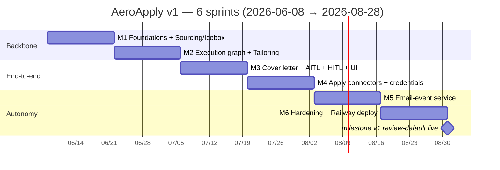

# AeroApply — Roadmap & Milestones

*Purpose: map the six 2-week sprints (M1–M6) from foundations to a Railway-deployed, review-default daemon — with goals, scope, exit criteria, risks, and demos for each.*

> This roadmap is downstream of `docs/PROJECT_BRIEF.md` (source of truth). Dates, milestone names, and exit criteria are kept consistent with `docs/SPRINTS.md` and the `backlog/`. Sprint 1 begins the week of **2026-06-08**; six 2-week sprints land the v1 daemon by **2026-08-28**. Each milestone Mn corresponds 1:1 to Sprint n.

---

## Timeline



The dependency spine is strict: ranked Icebox (M1) feeds the execution graph (M2), which must exist before a human can approve a draft (M3), which must exist before there is anything worth submitting (M4). Email-event autonomy (M5) only matters once real submissions generate OTPs and lifecycle mail (M4). Hardening and deploy (M6) ride on all of it.

---

## M1 — Foundations + Sourcing & Icebox · `06/08–06/19`

**Goal.** Stand up the repo, the dev backend, and a continuously-fed, ranked Icebox. By milestone end, sourced jobs flow through the `SourcingBouncer` and land as `application` rows with `wip_status = 'icebox'`, rankable via the Python ranker (`ranking.rank_jobs`).

**Scope.**
- Repo scaffold per the brief's repository map; CI with `ruff + mypy + pytest`; `uv`/Python 3.12, Pydantic v2; the `cross-review` build-time gate (author ≠ reviewer vendor).
- `infra/docker-compose.yml`: local Postgres + `pgvector`; `bootstrap.sql` loaded through an **Alembic** baseline migration (not raw `psql`), so dev and Railway prod share one migration history.
- Config loader: parse `config/profile.yaml` (operator, `search_profile`, `target_roles`, `bouncer`, `ranking_weights`, `scheduler`, `autonomy`) into typed Pydantic settings. PII stays in the gitignored profile + `.env`.
- Model-router skeleton: `model_config` lookup → `{provider, model_id, params, fallback}`, with the Ollama/`claude-haiku-4-5` sourcing class wired (drafting/critic classes are stubs until M2).
- **Tier-A API connectors** — Greenhouse, Lever, Ashby (`source.kind = 'api'`, `autonomy_tier = 'A'`); `SourcingBouncer` (`src/aeroapply/sourcing/bouncer.py`); dedupe via `job.fingerprint` (hash of company+title+location, `UNIQUE`); Icebox writes; **Python ranking** (`ranking.rank_jobs`) with the `v_icebox_ranked` view as a debug fallback.

**Exit criteria.** Ranked jobs flow into the Icebox: the three API connectors pull live postings, the bouncer drops out-of-fence/under-floor/ghost/clearance-gated rows **before** any DB write, survivors persist deduped, and `uv run aeroapply rank` returns jobs ordered by `execution_priority` (Python `rank_jobs`, not the SQL view) with `manual_override` trumping at `+100`.

**Key risks.**
- *Bouncer over-drops.* The salary gate must drop only when `salary_max > 0 AND < 115000`; unlisted (`0`/NULL) must pass to the Icebox. Snapshot-test the five filters against fixtures.
- *Connector drift / pagination.* Greenhouse/Lever/Ashby JSON shapes differ; isolate per-connector mapping and pin contract tests so a schema change fails CI, not prod.
- *Alembic ↔ bootstrap drift.* The autogenerated baseline must match `bootstrap.sql` byte-for-intent (HNSW indexes, CHECK constraints, the view). Diff-test on every CI run.

**Demo.** Run the sourcing daemon for one cycle against the live Tier-A APIs; show the console drop-log (reason per rejected job) and `uv run aeroapply rank` proving real AI-PM roles rank above adjacent BA/PM roles.

---

## M2 — Execution graph core + Tailoring loop · `06/22–07/03`

**Goal.** A queued job, pulled from the Icebox by the WIP scheduler, runs through the LangGraph supervisor and emerges with a tailored resume and an `ats_score`.

**Scope.**
- LangGraph **supervisor + WIP scheduler**: every `scheduler.cycle_minutes` (180), rank via `ranking.rank_jobs(profile.ranking_weights)`, promote top-N (`wip_limit = 5`) to `wip_status = 'queued'`, `status = 'queued'`.
- Execution graph head: `verify_open` (HTTP-ping `portal_url`; on 404/closed → `status = 'closed_before_execution'`, pull next) → `select_resume` (pick `resume_variant` by `role_focus`).
- **Generator ⇄ ATS-Critic** cyclic subgraph: Generator (`claude-opus-4-8`, 1M context, fast mode, `temperature≈0.6`) drafts; ATS-Critic (`claude-sonnet-4-6`, `temperature=0`) scores keyword coverage and flags gaps; loop until `ats_score ≥ threshold` or a max-iteration cap.
- **Postgres checkpointer** via `langgraph-checkpoint-postgres`; `await checkpointer.setup()` auto-creates the `checkpoints*` tables; `thread_id = application.id`.
- Resume + QA **embeddings & retrieval**: chunk resumes into `resume_chunk`, embed (`text-embedding-3-small`, 1536-d) into the HNSW cosine indexes for grounded tailoring.

```python
# tailor subgraph: loop until the critic clears threshold or we hit the cap
def critic_route(state: TailorState) -> str:
    if state["ats_score"] >= THRESHOLD or state["iterations"] >= MAX_ITERS:
        return "accept"
    return "revise"
```

**Exit criteria.** A queued job yields a tailored resume + `ats_score`: pick one Icebox row, let the scheduler promote it, and watch the graph produce `application.tailored_resume_text` plus a populated `ats_score`, with checkpoints written so the run survives a process kill and resumes mid-loop.

**Key risks.**
- *Critic loop non-termination / cost.* Opus drafting at high `max_tokens` per iteration is the token-burn hotspot. The max-iteration cap and the WIP limit are the cost circuit-breakers; assert both in tests.
- *Embedding-dimension mismatch.* Schema is hard-`vector(1536)`; swapping embedders without re-indexing silently corrupts retrieval. Validate dimension at startup.
- *Checkpoint setup ordering.* `checkpointer.setup()` must run before the first graph invocation; cold-start a fresh DB in CI to prove it.

**Demo.** Promote a single job end-to-end through `verify_open → select_resume → tailor`; show the Generator/ATS-Critic iterations climbing toward threshold, then `kill -9` the worker mid-loop and restart to demonstrate checkpoint resume from the last critic iteration.

---

## M3 — Cover letter + AITL + HITL gate + Streamlit · `07/06–07/17`

**Goal.** Close the loop from a queued job to a **human-approved draft**, surfaced in a real UI, with known questions answered autonomously (AITL) and the submission router pausing on anything that needs judgment.

**Scope.**
- `cover_letter` node (Opus, gated on "cover letter required").
- `answer_questions` (AITL): embed each question, cosine-search `qa_history`; high-confidence match → fill; **sensitive** (`eeo|visa|clearance|self-ID`) or novel/low-confidence → never fabricate, flag into `application.blockers`.
- `evaluate_submission_route(state)` (`src/aeroapply/graph/routing.py`) as a **conditional edge**, plus `pause_and_checkpoint` → HITL Inbox (`needs_human = TRUE`, `status = 'needs_review'`, `wip_status = 'parked'`).
- **Streamlit** dual-view: **Inbox** (review/approve drafts), **Ledger** (every `application` + `application_event` audit trail), **Kanban** (Icebox curation: Promote → `manual_override`, Drop → `user_rejected`).

```python
def evaluate_submission_route(state) -> str:
    if state["source_tier"] != "A":                      # Workday/Taleo/LinkedIn/custom
        return "escalate_to_human_review"
    if state["ats_score"] < 0.90 or state["agent_confidence"] < 0.95:
        return "escalate_to_human_review"
    if not state["auto_submit"]:                          # operator opt-in absent
        return "escalate_to_human_review"
    if state["has_unmatched_sensitive_field"]:            # honesty gate
        return "escalate_to_human_review"
    return "auto_submit"
```

**Exit criteria.** End-to-end to a human-approved draft: a queued job produces resume + cover letter + answered questions, the router parks it as `needs_review`, it appears in the Streamlit Inbox, and an operator **Approve** flips it to `approved` and resumes the thread.

**Key risks.**
- *Honesty-gate leakage.* A mis-tagged sensitive field could be auto-answered. Treat `qa_history.sensitive = TRUE` and any unmatched EEO/visa/clearance field as a **hard** escalate; red-team with adversarial question fixtures.
- *Stale HITL resume.* Approving must `aupdate_state` the correct paused `thread_id`; mismatches resume the wrong application. Key strictly on `application.id`.
- *Kanban write-back races.* Promote/Drop mutate `manual_override`/`status` that the supervisor reads each cycle; guard against a promote landing mid-promotion.

**Demo.** In Streamlit: drop a junk Icebox card (→ `user_rejected`), promote a strong one (jumps the rank via `+100`), watch it draft, land in the Inbox with a novel screening question flagged unanswered, then Approve and see the Ledger audit row appear.

---

## M4 — Apply connectors + credentials · `07/20–07/31`

**Goal.** Actually submit. Wire the Playwright hosted-form submitter for Tier-A ATS forms (ADR-008 — candidate-side apply APIs don't exist) plus one Tier-B login portal, backed by the Fernet credential vault, and file a **real operator-approved submission through a Greenhouse-hosted form**.

**Scope.**
- **Hosted-form submit (Tier A):** Playwright form-fillers for the Greenhouse hosted form first (Lever/Ashby next) — structured fields, no login; operator approves the send; on success set `status = 'submitted'`, `submitted_at`, `wip_status = 'done'`.
- **Playwright submit** for one login portal (Tier B, always HITL-gated): proves the account/OTP path without fighting anti-bot — no CAPTCHA defeat.
- **Account creation + Fernet credential vault:** on a portal, derive `company_domain`, look up `portal_credentials`; found → decrypt + log in; missing → generate a strong `secrets` password, sign up, store an encrypted row, attach `credential_id`. Account creation is **Tier B by definition** (HITL). Key from `AEROAPPLY_FERNET_KEY` (dev).

**Exit criteria.** A real operator-approved submission: an approved application is filed end-to-end through a Greenhouse-hosted application form via Playwright (test/consented posting), the confirmation is persisted, `status → submitted`, and the action is recorded in `application_event` (`actor='agent'`).

**Key risks.**
- *Credential-vault correctness.* A Fernet key rotation or env/KMS mismatch bricks every stored login; passwords must never hit logs or the UI in plaintext. Encrypt-at-rest tests + an explicit "no plaintext in logs" assertion.
- *Premature unattended submission.* M4 makes submission real, so the M3 gate now has teeth. v1 posture is review-and-approve everywhere (`auto_submit_sources: []` — ADR-008); verify the form-filler against a test/consented posting before any live target.
- *DOM fragility / ban risk.* The Playwright portal will shift selectors; keep pacing conservative (`source.rate_limit`), and on automation blocks escalate rather than evade.

**Demo.** Approve a tailored application in the Inbox and watch Playwright file it through a Greenhouse-hosted form end-to-end; then run the path on the chosen login portal up to the final confirm, pausing for HITL, and show a freshly-created `portal_credentials` row with the password stored as Fernet ciphertext.

---

## M5 — Email-event service · `08/03–08/14`

**Goal.** Make the daemon self-driving on email: OTPs auto-inject into paused threads, and lifecycle mail advances `application.status` with zero manual entry.

**Scope.**
- **FastAPI inbound webhook** `POST /v1/webhooks/inbound-email` (`services/email_webhook/app.py`): verify provider signature, parse Mailgun **multipart form** (`await request.form()`), match sender domain to an active application, extract OTP (`\b\d{4,7}\b`), and wake the paused Playwright thread:

```python
await graph.aupdate_state(
    config, {"verification_code": code}, as_node="account_node"
)  # aupdate_state is a method on the COMPILED GRAPH, not the checkpointer
```

- **IMAP poller (hourly) + classifier + forward:** log in via IMAP, route each message through a fast classifier (`claude-haiku-4-5`/local, `temperature=0`, structured output) → `otp | interview | questionnaire | rejection | offer | none`, update `application.status`, flag high-priority items to the Inbox, persist `email_event`, and forward the full message to the operator's `primary_email` via `aiosmtplib` (fire-and-forget through FastAPI `BackgroundTasks`).
- Drive the canonical **status state machine** end-to-end (`submitted → questionnaire → interview → offer → accepted/rejected`).

**Exit criteria.** OTP auto-injected; lifecycle emails update status: a webhook OTP wakes a paused account thread and the agent proceeds unsupervised, and a simulated rejection/interview email flips `application.status` and lands forwarded in the operator's primary inbox.

**Key risks.**
- *Webhook spoofing.* Inbound endpoints are public; unverified mail could inject a forged OTP into a real thread. Provider-signature verification is mandatory; reject on failure.
- *Misclassification.* A wrongly-typed "rejection" corrupts the Ledger. Keep `email_event` append-only as the source of truth and make status transitions reversible by the operator.
- *Domain-match ambiguity.* Multiple applications to one company can collide on sender domain; disambiguate by recency/`thread_id` and fall back to HITL rather than guess.

**Demo.** `curl` a signed multipart OTP payload at the webhook and watch a parked Playwright thread resume and enter the typed code; then drop a sample "Unfortunately…" email into the test mailbox and watch the poller classify it, set `status = 'rejected'`, write `email_event`, and forward it.

---

## M6 — Hardening + deploy · `08/17–08/28`

**Goal.** Ship v1: the full daemon running on **Railway**, review-and-approve on every submission (ADR-008), observable and rate-limit-disciplined.

**Scope.**
- **Autonomy calibration:** tune `min_ats_score (0.90)` / `min_agent_confidence (0.95)` against M2–M5 real runs; confirm secure-by-default holds — `auto_submit_sources` stays `[]` in v1, and the gate telemetry establishes the evidence base for any post-v1 opt-in.
- **Audit / observability:** ensure every agent/human/system action writes `application_event`; per-`run` timing/cost surfaced; structured logs.
- **Rate-limiting / anti-ban hygiene:** enforce `source.rate_limit` pacing; conservative LinkedIn/DOM posture; escalate on blocks.
- **Railway deploy:** co-located FastAPI engine + Postgres (the Brief's prod target — **not** Supabase); migrate via Alembic; **secrets/KMS**-backed `AEROAPPLY_FERNET_KEY`; verify the always-on inbound webhook receives 24/7.

**Exit criteria.** Running on Railway, review-and-approve on every submission: the sourcing daemon, WIP-limited execution graph, Streamlit UI, and FastAPI email service all run in prod against Railway Postgres; the inbound webhook is reachable; an operator-approved application files end-to-end through a hosted form; nothing leaves unattended (ADR-008).

**Key risks.**
- *Dev→prod parity.* Local Docker Postgres vs Railway can diverge on `pgvector`/extension versions and checkpoint latency. Run the M2 checkpoint and M1 vector tests in the prod environment as a gate.
- *Secret handling in prod.* The Fernet key moves from `.env` to KMS; a botched migration loses every credential. Stage the key migration with a rollback path.
- *Submission blast radius.* Even operator-approved, the first prod submissions must be watched; cap volume, alert on each, and keep an operator kill-switch. (Unattended auto-submit is deferred post-v1 — ADR-008.)

**Demo.** On Railway: source → rank → promote → tailor → approve → hosted-form submit, live; send a real inbound OTP webhook and watch a thread resume in prod; open the Streamlit Ledger to show the full audit trail and per-run cost.

---

## Cross-milestone definition of done

Every milestone additionally requires: green CI (`ruff + mypy + pytest`); cross-vendor review satisfied (author and reviewer are different vendors — manual until the CI gate lands under #17, binding thereafter); model IDs are config-driven and current (`claude-opus-4-8`, `claude-sonnet-4-6`, `claude-haiku-4-5` — never legacy); no real PII/credentials/resumes in git; and the canonical `status`/`wip_status` tokens unchanged. The non-negotiable invariant across all six: **never fabricate** — any unknown or unmatched legal/EEO/visa/clearance field escalates to the human, and review-before-submit is the default until every auto gate passes.
