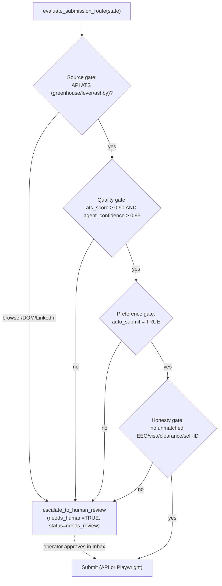

# AeroApply — Security & Compliance

> Purpose: the binding security, honesty, and legal posture for an autonomous daemon that creates accounts, encrypts credentials, and can auto-submit job applications on the operator's behalf — and an honest accounting of the residual risk that remains.

This document is subordinate to `PROJECT_BRIEF.md` §13 (Security & compliance non-negotiables). Where this expands on the brief it must never contradict it.

---

## 1. The honesty mandate (non-negotiable)

AeroApply applies under the operator's real name and real work authorization. A single fabricated EEO, visa/sponsorship, security-clearance, or self-identification answer is an integrity failure with real-world consequences (rescinded offers, blacklisting, in regulated roles potential fraud). Therefore the rule is absolute and is enforced in *code*, not policy:

**Any EEO / visa / clearance / self-ID field that is not matched to `qa_history` with high confidence is escalated to a human. The agent never guesses, never infers, never defaults.**

The data model makes the dangerous fields impossible to miss. `qa_history.field_type` tags each remembered answer (`free_text | boolean | eeo | visa | clearance | ...`) and `qa_history.sensitive` is a hard boolean: when true, the answer is *retrievable for the human's reference* but is **never auto-filled**.

```sql
-- A sensitive answer can be surfaced to the operator, but never used to auto-submit.
SELECT answer_text, confidence
FROM   qa_history
WHERE  user_id = $1
  AND  field_type IN ('eeo','visa','clearance')
  AND  sensitive = TRUE;
-- The router treats every row here as HITL-only regardless of confidence.
```

The honesty gate lives inside `evaluate_submission_route(state)` (`src/aeroapply/graph/routing.py`). The decision table:

```python
def honesty_clear(question, match) -> bool:
    # Hard stop on protected/legal field classes — never auto-answer.
    if question.field_type in {"eeo", "visa", "clearance", "self_id"}:
        return False
    # Any novel/unseen question, or a weak semantic match, escalates.
    if match is None or match.similarity < 0.92 or match.confidence < 0.95:
        return False
    return True
```

A miss here costs the operator ten seconds in the HITL Inbox. A false positive costs them a job. We bias entirely toward escalation.

---

## 2. Secure-by-default autonomy

Autonomy is *earned per application at runtime*, not granted statically. The graph uses a **conditional edge** (`evaluate_submission_route`) before the submit node — deliberately not LangGraph's static `interrupt_before` — so a clean Greenhouse API submission can fly through while the same operator's Workday application is force-parked, in the same run.

Four independent gates must **all** pass for `submit`; failing any one routes to `escalate_to_human_review`:



These thresholds are not magic numbers buried in code; they are operator-tunable in `config/profile.yaml` (`autonomy.min_ats_score: 0.90`, `autonomy.min_agent_confidence: 0.95`, `autonomy.default_mode: "review"`). Shipping default is `review` — auto-submit is strictly opt-in, per role/source.

This maps onto the three source tiers:

| Tier | Sources | Posture |
|---|---|---|
| **A** — auto-submit eligible | Greenhouse, Lever, Ashby (clean API, structured payloads) | May auto-submit when all four gates pass. |
| **B** — HITL required | Workday, Taleo, LinkedIn, custom company sites (fragile DOM, ban-prone) | Always escalated. Account creation is Tier B *by definition*. |
| **C** — blocked | Anything requiring fabrication, or whose ToS prohibits automation outright | Never automated. |

The tier is data, not a guess: `source.autonomy_tier CHAR(1) CHECK (autonomy_tier IN ('A','B','C'))` defaults to `'B'` — i.e. *unknown sources are conservatively HITL until explicitly promoted*.

---

## 3. ToS & legal posture

AeroApply automates a legitimate task a human is permitted to do (apply to jobs) but does so at machine speed, which collides with platform terms. We are candid about this rather than pretending otherwise.

- **LinkedIn & Workday auto-apply carry real account-ban and ToS risk.** LinkedIn's User Agreement broadly prohibits automated scraping and access; Easy Apply automation is squarely in that zone. Workday/Taleo are DOM portals that fingerprint automation. Both are classified **Tier B (always human-gated)** precisely for this reason — `config/profile.yaml: autonomy.always_human_sources: ["workday","taleo","linkedin","custom"]`. The operator is the one clicking submit; AeroApply prepares the application.
- **No CAPTCHA defeat. No anti-bot evasion.** This is a stated non-goal in the brief (§3, §13). If a portal presents a CAPTCHA, a device challenge, or an automation block, the agent **escalates and stops** — it does not solve, relay, or fingerprint-spoof its way past. A blocked portal becomes a HITL item, full stop.
- **Respect robots, rate limits, and pacing.** `source.rate_limit JSONB` carries per-source pacing/anti-ban hygiene. Sourcing prefers official APIs (Greenhouse, Lever, Ashby) over scraping; the `SourcingBouncer` drops junk *before any DB write*, which also minimizes request volume against sources. Conservative, human-paced cadence is a feature, not a limitation.

The honest summary: we operate inside the spirit of "a person applying to jobs," we never defeat protective controls, and we accept that on Tier B sources the only safe automation is *preparation*, with a human at the trigger.

---

## 4. Credential & PII encryption at rest

Portal passwords are the crown jewels — they unlock real accounts on third-party sites. They are **Fernet-encrypted at rest**, domain-keyed, and never logged or returned to the UI in plaintext (brief §7).

```python
from cryptography.fernet import Fernet
from aeroapply.db.credentials import generate_password  # see CREDENTIALS_AND_AUTOMATION.md §4
import os

def _fernet() -> Fernet:
    # Dev: AEROAPPLY_FERNET_KEY from .env. Prod: key delivered via KMS, never on disk.
    return Fernet(os.environ["AEROAPPLY_FERNET_KEY"].encode())

def store_credential(conn, user_id, domain, username, password):
    ct = _fernet().encrypt(password.encode())              # bytes ciphertext
    conn.execute(
        "INSERT INTO portal_credentials "
        "(user_id, company_domain, username, encrypted_password) VALUES (%s,%s,%s,%s)",
        (user_id, domain, username, ct.decode()),
    )

# New-account flow generates a strong password we never reuse or display.
# Use generate_password() from CREDENTIALS_AND_AUTOMATION.md §4 — mixed
# lower+upper+digit+symbol. (secrets.token_urlsafe lacks symbols and fails
# portal password-complexity rules.)
new_password = generate_password()
```

The schema stores only ciphertext: `portal_credentials.encrypted_password TEXT NOT NULL  -- Fernet ciphertext; key from env/KMS`. The plaintext exists transiently in memory only at login/signup time.

**Key management.** Dev uses a Fernet key from `.env` (`AEROAPPLY_FERNET_KEY`); **production (Railway) uses a KMS-backed key** injected as an environment secret, never committed and never written to the image. Rotation re-encrypts `portal_credentials` rows under a new key; because the key is keyed per-deployment and the column is the only consumer, rotation is a contained migration.

**Secrets management & `.env` hygiene.** Provider API keys (Anthropic, DeepSeek, OpenAI, Ollama), the Fernet key, the inbound-webhook signing key, IMAP/SMTP credentials, and `DATABASE_URL` all live in `.env` (dev) or Railway secrets (prod) — `infra/.env.example` ships placeholders only. `.env`, `config/profile.yaml`, and any real resume are **git-ignored**; only `infra/.env.example` and `config/profile.example.yaml` are committed. No secret is ever interpolated into a committed doc, a log line, or a model prompt.

---

## 5. Inbound webhook signature verification

The email-event service exposes `POST /v1/webhooks/inbound-email`, which can **wake a paused Playwright thread and inject an OTP** via `graph.aupdate_state(...)`. That makes it the single most security-sensitive surface in the system: an attacker who can forge a request to it could feed a code into a live browser session. Every request is therefore signature-verified *before* any parsing or state mutation.

Mailgun signs inbound mail with `timestamp`, `token`, and `signature` (HMAC-SHA256 over `timestamp+token` keyed by the signing key). Critically, Mailgun inbound posts **multipart form fields, not JSON** — parse with `await request.form()`, per the correctness note in the brief.

```python
import hmac, hashlib, os

def verify_mailgun(timestamp: str, token: str, signature: str) -> bool:
    expected = hmac.new(
        key=os.environ["MAILGUN_SIGNING_KEY"].encode(),
        msg=f"{timestamp}{token}".encode(),
        digestmod=hashlib.sha256,
    ).hexdigest()
    return hmac.compare_digest(expected, signature)   # constant-time compare

@app.post("/v1/webhooks/inbound-email")
async def inbound_email(request: Request):
    form = await request.form()                        # multipart, NOT request.json()
    if not verify_mailgun(form["timestamp"], form["token"], form["signature"]):
        raise HTTPException(status_code=401)           # reject before any side effect
    # ...only now: match sender→application, extract OTP \b\d{4,7}\b, aupdate_state(...)
```

Defense-in-depth beyond the signature: reject stale timestamps outside a **15-minute replay window** (any `timestamp` older than 15 minutes is rejected even if the signature is valid), match the sender domain to an *active* application before acting, extract only a short numeric OTP (`\b\d{4,7}\b`), and persist every inbound to `email_event` for traceability. The OTP is injected only into the thread whose application matched — never broadcast. OTP injection must be **idempotent**: a duplicate or retried delivery of the same code (providers retry on non-2xx) must not double-inject or otherwise corrupt the paused thread's state — the second `aupdate_state` for an already-satisfied verification is a no-op.

> **Streamlit UI exposure.** The internal Streamlit UI (Inbox · Ledger · Kanban) renders the operator's PII and pipeline state and has no built-in auth. In production it **must not be exposed to the public internet** — gate it behind access control (private networking, an authenticating reverse proxy / HTTP basic auth, or a VPN). Treat it as a privileged internal surface, not a public endpoint.

---

## 6. Account-safety / anti-ban

Bans are the most likely way this project hurts the operator's real prospects. Mitigations, in priority order:

1. **Account creation is always Tier B / HITL** (brief §7) — the highest-risk action never runs unattended in v1.
2. **No evasion** (§3 above) — we don't fingerprint-spoof or defeat challenges; on a block we stop.
3. **Pacing & WIP limits.** The Supervisor pulls only the top-N (`scheduler.wip_limit: 5`) from the Icebox every `cycle_minutes: 180`. Frontier-model work — and therefore portal submission traffic — is bounded by construction; we are never hammering a portal.
4. **Per-source rate limits** in `source.rate_limit` enforce conservative cadence.
5. **Stale-queue guard.** `verify_open` HTTP-pings `portal_url` first; dead postings short-circuit to `closed_before_execution` rather than generating doomed login/submit traffic.
6. **One persistent credential per domain** (`UNIQUE (user_id, company_domain)`) avoids churning duplicate signups that trip abuse heuristics.

---

## 7. Data retention & audit log

Every action — agent, human, or system — is appended to `application_event`, an immutable ledger. There is no UPDATE/DELETE path in normal operation; it is the forensic record of who did what and why a submission was (or wasn't) auto-approved.

```sql
CREATE TABLE application_event (
    id             UUID PRIMARY KEY DEFAULT gen_random_uuid(),
    application_id UUID NOT NULL REFERENCES application(id) ON DELETE CASCADE,
    event_type     VARCHAR(80) NOT NULL,
    actor          VARCHAR(20) NOT NULL CHECK (actor IN ('agent','human','system')),
    payload        JSONB DEFAULT '{}',
    created_at     TIMESTAMPTZ NOT NULL DEFAULT now()
);
```

The `actor` CHECK constraint guarantees provenance can never be ambiguous. A representative trail for one auto-submitted application:

```json
[
  {"event_type": "gate_evaluated", "actor": "system",
   "payload": {"ats_score": 0.93, "agent_confidence": 0.97, "source_tier": "A", "decision": "auto_eligible"}},
  {"event_type": "submitted",      "actor": "agent",
   "payload": {"portal_type": "greenhouse", "credential_id": "…"}},
  {"event_type": "status_changed", "actor": "system",
   "payload": {"from": "submitting", "to": "submitted"}}
]
```

Retention: the audit log and `application`/`job` rows are retained for the operator's own tracking. `email_event` stores raw inbound bodies for OTP/lifecycle traceability — these may contain PII and live only in the operator's own Postgres (local Docker in dev, Railway in prod), never in a shared store. `ON DELETE CASCADE` from `application` ensures purging an application cleanly removes its events. **Production runs on Railway Postgres — not Supabase** (per the canonical backend decision); the same single Postgres also holds pgvector embeddings, so PII-bearing vectors never leave the operator's database.

---

## 8. Public-safe repo / no real data in git

The repository is **public**, so it is treated as a **public-safe scaffold** (brief §1, §13): no real résumé, credential, salary floor, address, or email may be committed. Real operator data lives only in `.env` and `config/profile.yaml` (both gitignored). The PII boundary is structural:

- Concrete personal values live in `config/profile.yaml` (git-ignored) and `.env` — the committed `config/profile.example.yaml` ships only illustrative defaults (`"Your Name"`, `you@example.com`, placeholder coordinates).
- Docs refer to the operator persona in the **abstract only** (role-track shape, commute-anchor concept) — never by name or exact address.
- `services/email_webhook/app.py`, the credential vault, and connector code are written so that secrets arrive from the environment at runtime and are never hard-coded.

---

## 9. Risk register

| Risk | Likelihood | Impact | Mitigation |
|---|---|---|---|
| Auto-submit files a flawed/incorrect application unattended | Medium | High | Four-gate `evaluate_submission_route`; ats≥0.90 + conf≥0.95; Tier A APIs only; `auto_submit` opt-in; full `application_event` trail for review. |
| Fabricated EEO/visa/clearance answer | Low | Critical | `sensitive`/`field_type` flags force HITL; honesty gate hard-stops protected field classes; bias toward escalation on any weak match. |
| LinkedIn/Workday account ban | Medium | High | Tier B always-HITL; no evasion; pacing via WIP limit + `source.rate_limit`; account creation human-gated; stop-on-block. |
| Forged inbound webhook injects malicious OTP into a live thread | Low | High | Constant-time HMAC-SHA256 signature verify before any side effect; timestamp replay window; sender→active-application match; `email_event` audit. |
| Credential leak (logs, UI, repo) | Low | Critical | Fernet-at-rest, KMS key in prod; ciphertext-only column; never logged/returned in plaintext; `.env` & `profile.yaml` git-ignored; public-safe repo (no secrets committed). |
| Secret committed to git | Low | High | `.example` files only; `.gitignore` for `.env`/`profile.yaml`/resumes; no secrets in docs or prompts. |
| CAPTCHA/anti-bot encountered mid-submit | High | Medium | Documented non-goal: escalate and stop; never defeat. Frequency expected on Tier B, hence those are HITL anyway. |
| Ghost/expired posting wastes tokens or triggers dead traffic | Medium | Low | `verify_open` HTTP-ping first → `closed_before_execution`; ghost-job bouncer drops postings older than 45 days. |
| Stale/incorrect priority promotes a bad job | Low | Low | `execution_priority` is computed live in Python (`ranking.py`) from `profile.ranking_weights`; `manual_override` trump for operator control. |
| PII exposure via prod DB or vector store | Low | High | Single operator-owned Postgres (Railway prod / local Docker dev), not a shared backend; pgvector co-located so embeddings never leave it. |

---

## 10. Residual risk (candid)

The gates reduce — they do not eliminate — the core hazard: **a daemon that can submit an application without a human reading it that instant.** Even at `ats_score ≥ 0.90` and `agent_confidence ≥ 0.95` on a Tier A API, an auto-submitted application can carry a subtly wrong tailored claim, a misread structured field, or an answer that was *technically* matched in `qa_history` but contextually off for this employer. `agent_confidence` is a model's self-estimate and can be miscalibrated; a high score is not a guarantee of correctness.

We accept this consciously because the failure is *bounded and auditable*: auto-submit is restricted to clean-API Tier A sources with predictable payloads, it is opt-in per role, protected legal fields can never be auto-answered, and every decision is reconstructable from `application_event`. The operator can disable auto-submit entirely by leaving `autonomy.default_mode: "review"` (the shipping default) — in which case AeroApply is a fast, honest *drafting and tracking* assistant with a human at every trigger. The autonomy is a dial the operator owns, and the conservative end of that dial is where it ships.
