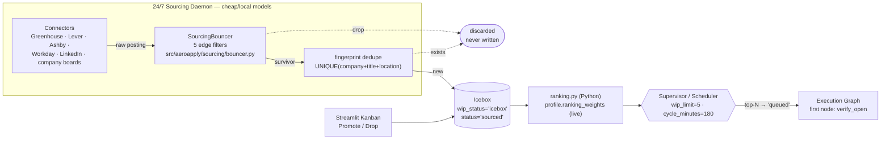
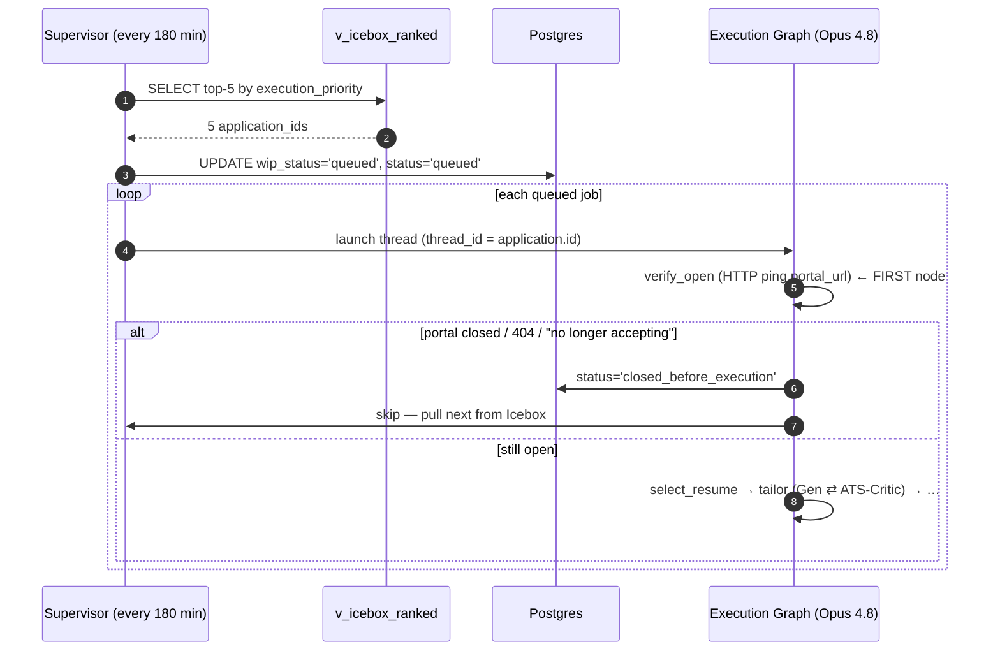

# Sourcing, Bouncer & Ranking

> Purpose: defines how AeroApply discovers roles 24/7 on cheap/local models, drops junk at the edge before any DB write, dedupes and parks survivors in the Icebox, ranks them in Python from live config weights, lets the operator curate, and feeds the WIP-limited execution graph — all while spending zero frontier tokens until a job is actually queued.

This document is subordinate to `docs/PROJECT_BRIEF.md`; where they disagree, the brief wins.

---

## 1. Why sourcing is its own subsystem

Sourcing and execution have opposite economics, so AeroApply splits them into two tiers (see brief §5.1):

- **Sourcing is high-volume, low-judgment, and continuous.** It runs as a persistent daemon, scrapes hundreds of postings, and must cost almost nothing per item. It uses the cheapest models we have: `claude-haiku-4-5` or a **local Llama via Ollama** on the operator's Mac, both at `temperature=0` in JSON mode (brief §10). No Opus, no Sonnet — those are reserved for drafting and critique.
- **Execution is low-volume, high-judgment, and bounded.** Only the **top-N** survivors ever reach the LangGraph execution graph and consume `claude-opus-4-8` (1M context, fast mode) for tailoring.

The boundary between them is the **Icebox** (`application.wip_status = 'icebox'`): an indefinitely-deep parking lot of jobs that survived the edge filters but have not yet earned capacity. The contract is simple — *nothing reaches the Icebox without passing the SourcingBouncer, and nothing leaves it without ranking + the scheduler's WIP gate.*



---

## 2. The 24/7 sourcing daemon

The daemon is part of the persistent always-on runtime (brief §4 — *not* a one-shot script). It loops over enabled `source` rows, respecting each source's `rate_limit` JSONB for anti-ban pacing (brief §13.4), and for every raw posting:

1. Normalizes the connector payload into a candidate `job` shape (`company`, `title`, `location`, `remote_mode`, `lat/lon`, `salary_min/max`, `posted_at`, `closing_date`, `applicant_count`, `portal_url`, `portal_type`, …).
2. Runs it through the **SourcingBouncer** (§3). Drops never touch Postgres.
3. Computes a `fingerprint` and dedupes (§4).
4. Inserts the surviving `job` row plus an `application` row at `wip_status='icebox'`, `status='sourced'` (§5).

Extraction/classification inside the loop (e.g., parsing a salary band out of free-text description) is the only LLM work here, and it is deliberately routed to the cheap tier via `model_config['sourcing.parser']`. The bouncer's own rules are **pure Python regex/geometry, no LLM** — they must be deterministic, auditable, and free.

---

## 3. SourcingBouncer edge filters

Reference implementation: **`src/aeroapply/sourcing/bouncer.py`**. Thresholds and regex patterns come from `config/profile.yaml` (`bouncer:` block) so they are operator-tunable; the canonical default patterns and thresholds below — including `drop_title_regex` and `legal_blocker_regex` — ship in `config/profile.example.yaml` under `bouncer:`. The filters run in cheap-to-expensive order and short-circuit on the first drop — the geo distance calc (geopy) is the most expensive, so the regex gates run first in practice.

| # | Filter | Rule | Drop condition | Source of truth |
|---|---|---|---|---|
| 1 | **Geo fence** | Remote → keep. Hybrid/Onsite → keep only within the configured commute radius of the home anchor (from `config/profile.yaml`) via geopy | onsite/hybrid AND distance > radius | `max_commute_miles` |
| 2 | **Seniority / industry** | Regex-drop wrong-level or wrong-domain titles | title matches `drop_title_regex` (seniority junk like `junior\|entry-level\|intern` plus operator-chosen industry exclusions) | `drop_title_regex` |
| 3 | **Salary floor** | Evaluate the **MAX** of the posted band against the floor; **unlisted (0/NULL) passes through** to the Icebox | `salary_max > 0` AND `salary_max < floor` | `min_salary_floor` |
| 4 | **Clearance / visa gate** | Drop roles incompatible with the operator's actual work authorization | text matches `\b(active ts/sci\|top secret\|polygraph\|clearance required\|no c2c\|w2 only\|us citizens only)\b` | `legal_blocker_regex` |
| 5 | **Ghost-job** | Drop stale listings unlikely to still be live | `posted_at` older than **45 days** | `max_age_days: 45` |

Two rules carry the most subtlety and must not regress:

- **Salary floor uses band MAX, not min, and unlisted passes.** With a `$120k` floor (illustrative), a posting of `$95k–$130k` is *kept* because its max (130k) clears it — the operator can negotiate toward the top. A posting with no band parsed (`salary_max` is 0 or NULL) is **not** dropped; it flows to the Icebox where the operator decides. We only drop when we have a positive max that is genuinely below floor. This mirrors `search_profile.salary_floor` and brief §2/§5.3.3.
- **The clearance/visa gate is honesty-driven, not preference.** It exists because the operator cannot truthfully claim an active TS/SCI or accept "US citizens only / W2-only / no-C2C" terms that don't match their authorization. This is the *sourcing-side* expression of the brief's never-fabricate rule (§13.1); the execution-side honesty gate in `routing.py` is the second line of defense.
- **The two regexes match different fields, by design.** The seniority/industry regex (filter 2) is applied to the **title only** (`job.title`), while the clearance/visa regex (filter 4) is applied to the **description** (the role's body text). This scoping prevents false drops: a legitimate `AI Product Manager` posting that merely *mentions* an excluded industry (e.g., "experience in healthcare a plus") somewhere in its body is **not** dropped, because the industry keywords are only matched against the title. Conversely, clearance/visa blockers ("US citizens only", "active TS/SCI") routinely appear in the body, not the title, so that gate must read the description to catch them. Keeping the seniority/industry filter title-scoped is the difference between dropping a wrong-level/wrong-domain *role* and discarding a perfectly valid AI PM role over an incidental word in its description.
- **Monitor for false positives.** Because regexes are blunt, the structured drop logs (below) should be aggregated to **count drops by reason** (`geo_fence`, `seniority_industry`, `salary_floor`, `clearance_visa`, `ghost_job`). A sudden spike in any one reason — especially `seniority_industry` or `clearance_visa` — is the signal that a pattern is over-matching and needs tightening in `config/profile.yaml`. Tuning the regexes against real per-reason drop rates is the intended feedback loop.

```python
# src/aeroapply/sourcing/bouncer.py  (canonical shape — illustrative)
class SourcingBouncer:
    def admit(self, job: JobCandidate) -> BouncerVerdict:
        # 2 + 4: cheap regex first (short-circuit before geopy)
        # Filter 2 matches the TITLE only; filter 4 matches the DESCRIPTION.
        if self.DROP_TITLE_RE.search(job.title or ""):
            return BouncerVerdict.drop("seniority_industry")
        if self.LEGAL_BLOCKER_RE.search((job.description or "").lower()):
            return BouncerVerdict.drop("clearance_visa")

        # 5: ghost-job
        if job.posted_at and job.posted_at < utcnow() - timedelta(days=self.max_age_days):
            return BouncerVerdict.drop("ghost_job")

        # 3: salary floor on band MAX; unlisted (0/None) passes through
        if job.salary_max and job.salary_max > 0 and job.salary_max < self.min_salary_floor:
            return BouncerVerdict.drop("salary_floor")

        # 1: geo fence (remote always passes; geopy only for hybrid/onsite)
        if job.remote_mode in ("hybrid", "onsite"):
            if self.miles_from_home(job.lat, job.lon) > self.max_commute_miles:
                return BouncerVerdict.drop("geo_fence")

        return BouncerVerdict.admit()
```

Every drop emits a structured log line with the reason code (`geo_fence`, `seniority_industry`, `salary_floor`, `clearance_visa`, `ghost_job`) so we can tune regexes against real drop rates — but, by design, **no `application_event` row** is written for a drop, because there is no application yet.

---

## 4. Dedupe via fingerprint

The same role surfaces on LinkedIn, the company's Greenhouse board, and an aggregator. We collapse those with a content hash stored in `job.fingerprint`:

```sql
fingerprint VARCHAR(64) NOT NULL UNIQUE   -- hash of company+title+location
```

Computed as `sha256(f"{company}|{title}|{location}".lower())` (truncated/encoded to 64 chars). Because the column is `UNIQUE`, dedupe is enforced at the database, not just in app code: a re-scrape does an idempotent `INSERT ... ON CONFLICT (fingerprint) DO NOTHING`. The bouncer runs *before* the fingerprint check, so we never pay the geopy/parse cost twice for a job we'd drop anyway, and a job that previously survived is not re-evaluated or duplicated.

This pairs with `application`'s `UNIQUE (user_id, job_id)` constraint: one application per operator per job, so re-sourcing can never create a second pipeline record for a role already in flight.

---

## 5. The Icebox (Tier 1 backlog)

A survivor becomes two rows: the immutable `job` (raw posting) and an `application` that starts its life as:

```sql
wip_status = 'icebox'   -- scheduler state machine: icebox | queued | active | parked | done
status     = 'sourced'  -- lifecycle state machine (brief §8)
```

The Icebox has **no depth limit** — cheap models can scrape thousands of roles and let them wait indefinitely. Nothing here has cost frontier tokens. Two independent state machines live on `application` and must not be conflated: `wip_status` is *internal scheduler bookkeeping*; `status` is the *operator-facing lifecycle*. A job sits at (`icebox`, `sourced`) until either the scheduler promotes it or the operator curates it.

---

## 6. Execution-priority ranking

Ranking is computed in **Python** by `src/aeroapply/sourcing/ranking.py` (`rank_jobs`/`score_job`), which reads `profile.ranking_weights` **live** — so weights are tunable without a migration (see docs/CALIBRATION.md). The supervisor scores Icebox rows in Python and pulls the top-N. The `v_icebox_ranked` SQL view mirrors the same formula with **frozen** weights and is a **debug/fallback only** — handy for ad-hoc SQL, never the source of truth for ordering. `manual_override` is an absolute trump worth `+100.0`, which dominates any combination of the weighted factors (whose weighted sum maxes out at `1.0`), guaranteeing a Promoted job sorts above everything organic.

| Factor | Weight | Rule |
|---|---|---|
| **Manual promote** | trump | `manual_override = TRUE` → `+100.0` |
| **Title alignment** | 35% | best-matching `profile.target_roles` alignment (core `1.0`, adjacent `0.6`); else baseline `0.3` |
| **Location & flexibility** | 25% | Remote → `1.0`; configured hybrid-hint locations → `0.8`; else `0.0` |
| **Recency** | 20% | ≤2 days → `1.0`; ≤7 days → `0.5`; else `0.1` |
| **Competition (applicants)** | 10% | `<50` → `1.0`; `<150` → `0.5`; else `0.0` |
| **Urgency (closing soon)** | 10% | closes ≤3 days → `1.0`; else `0.0` |

The five weighted factors sum to `1.0` and are operator-tunable via `config/profile.yaml` → `ranking_weights`, applied live in `ranking.py` (`RankingWeights` validates the sum). The SQL view below mirrors the formula with **frozen** weights (debug/fallback only):

```sql
CREATE OR REPLACE VIEW v_icebox_ranked AS
SELECT
    a.id AS application_id, a.job_id,
    j.company, j.title, j.remote_mode, j.posted_at, j.closing_date, j.applicant_count,
    (
      -- Manual promote = absolute trump
      (CASE WHEN a.manual_override THEN 100.0 ELSE 0.0 END)
      -- Title alignment (35%)
      + 0.35 * (CASE
          WHEN j.title ILIKE '%Product Manager%'
            OR j.title ILIKE '%Solutions Architect%' THEN 1.0
          WHEN j.title ILIKE '%Business Analyst%'
            OR j.title ILIKE '%Project Manager%' THEN 0.6
          ELSE 0.3 END)
      -- Location & flexibility (25%)
      + 0.25 * (CASE
          WHEN j.remote_mode = 'remote' THEN 1.0
          WHEN j.location ILIKE '%Springfield%' THEN 0.8
          ELSE 0.0 END)
      -- Recency (20%)
      + 0.20 * (CASE
          WHEN j.posted_at >= now() - INTERVAL '2 days' THEN 1.0
          WHEN j.posted_at >= now() - INTERVAL '7 days' THEN 0.5
          ELSE 0.1 END)
      -- Competition / applicants (10%)
      + 0.10 * (CASE
          WHEN j.applicant_count < 50  THEN 1.0
          WHEN j.applicant_count < 150 THEN 0.5
          ELSE 0.0 END)
      -- Urgency / closing soon (10%)
      + 0.10 * (CASE
          WHEN j.closing_date IS NOT NULL AND j.closing_date <= now() + INTERVAL '3 days' THEN 1.0
          ELSE 0.0 END)
    ) AS execution_priority
FROM application a
JOIN job j ON j.id = a.job_id
WHERE a.wip_status = 'icebox'
  AND a.status = 'sourced'
ORDER BY execution_priority DESC;
```

Two facts worth flagging for anyone editing this view: the `WHERE` clause restricts to (`icebox`, `sourced`) so curated-but-not-yet-run items and in-flight items naturally fall out of the ranking; and the title/location `CASE` arms encode the same persona as the bouncer (the role/region level only — concrete coordinates and the salary floor stay in `config/profile.yaml` per the brief's PII boundary, §2). Because the **canonical** ordering is `ranking.py`, the Streamlit Kanban and the scheduler call the *same* Python function and agree with no drift; this view intentionally lags live weight changes and exists only for ad-hoc inspection.

---

## 7. Manual curation (Streamlit Kanban)

The operator reviews the ranked Icebox in the Kanban view and has exactly two levers, which map to specific column writes — this is the operator's "judgment 10%" (brief §3):

- **Promote** → set `manual_override = TRUE`. The job jumps to `+100.0` in `v_icebox_ranked` and is guaranteed into the next scheduler pull regardless of organic score. (It stays `wip_status='icebox'` until the scheduler actually moves it; the trump just guarantees pole position.)
- **Drop** → set `status = 'user_rejected'`. This is deliberately a **terminal lifecycle status**, not a delete. Because the dedupe `fingerprint` and the `UNIQUE (user_id, job_id)` row both persist, a `user_rejected` job **cannot be silently re-added** by a later scrape — `ON CONFLICT DO NOTHING` sees the existing row and skips it. Dropping is sticky.

```sql
-- Promote: pin to the top of the next pull
UPDATE application SET manual_override = TRUE, updated_at = now() WHERE id = $1;

-- Drop: terminal, and immune to re-sourcing (row + fingerprint remain)
UPDATE application SET status = 'user_rejected', updated_at = now() WHERE id = $1;
```

Both actions append to `application_event` (`actor='human'`) for the audit trail (brief §13.6). Note the asymmetry: Promote rides the *trump* path, Drop rides the *terminal-status* path — and the `v_icebox_ranked` `WHERE status='sourced'` clause means a Dropped job vanishes from the ranking the instant it's set, without any extra filtering in the UI.

---

## 8. WIP scheduler — pulling top-N

The supervisor (the persistent scheduler) wakes on `scheduler.cycle_minutes` (default **180** min), ranks the Icebox in Python (`ranking.rank_jobs` over `profile.ranking_weights`), and promotes up to `scheduler.wip_limit` (default **5**) jobs into the execution queue. (A SQL-only fallback using the frozen `v_icebox_ranked` view is shown below.)

```sql
-- Promote the top-N ranked icebox jobs to the WIP-limited queue.
WITH picks AS (
  SELECT application_id
  FROM v_icebox_ranked
  LIMIT :wip_limit                       -- already ORDER BY execution_priority DESC
)
UPDATE application a
SET wip_status = 'queued', status = 'queued', updated_at = now()
FROM picks
WHERE a.id = picks.application_id;
```

Only `queued` jobs ever consume `claude-opus-4-8` tokens (brief §5.1). The WIP limit is what keeps a 24/7 firehose of sourcing from translating into an unbounded frontier-model bill — it is the throttle between the two tiers.



---

## 9. Stale-queue guard (`verify_open`)

Between sourcing and execution, hours pass — postings close. The execution graph's **first** node is `verify_open` (brief §5.1, §5 diagram), which HTTP-pings the job's `portal_url` *before* any drafting work. On a `404` or a "no longer accepting applications" signal, it sets:

```sql
status = 'closed_before_execution'
```

and the supervisor pulls the next-highest job from the Icebox. This is the cheap-fails-first principle: a single `httpx` GET protects an entire Opus-driven tailoring run from being wasted on a dead listing. `closed_before_execution` is a distinct terminal branch in the status state machine (brief §8) — it is explicitly *not* `error` (nothing went wrong) and *not* `user_rejected` (the operator didn't decline it), which keeps the ledger honest about *why* a job didn't proceed.

---

## 10. Invariants (do not break)

1. **No DB write for a dropped job.** The bouncer is an edge filter; drops are logged with a reason code but create no `job`/`application` row.
2. **`fingerprint` is the dedupe authority.** It is `UNIQUE`; all inserts are `ON CONFLICT (fingerprint) DO NOTHING`.
3. **Salary floor is band-MAX with unlisted pass-through.** Never drop on a missing/zero band; never evaluate against the min.
4. **Ranking lives in Python** (`ranking.py`), reading `profile.ranking_weights` **live**; UI and scheduler call the same function so they agree. The `v_icebox_ranked` SQL view is a frozen-weight debug/fallback, **not** the ordering source of truth.
5. **`manual_override` is a numeric trump (+100), not a queue bypass.** It guarantees top rank; the scheduler still moves the row.
6. **Drop = `status='user_rejected'` (terminal), never a delete.** The retained row + fingerprint are what make re-sourcing idempotent.
7. **Only `queued` jobs spend frontier tokens.** Icebox is free; the WIP limit is the throttle.
8. **`verify_open` runs first, always.** Confirm the listing is live before drafting.

These map 1:1 to the canonical decisions in `PROJECT_BRIEF.md` (§4, §5.1–§5.3) and the schema in `scripts/bootstrap.sql`. Backend reminder for both tiers: local Docker Postgres + pgvector in dev, Railway in prod (brief §4) — **not** Supabase.
