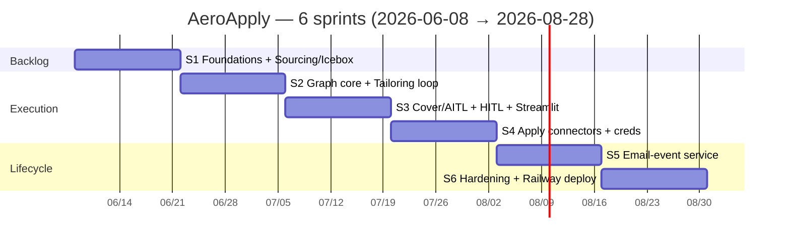
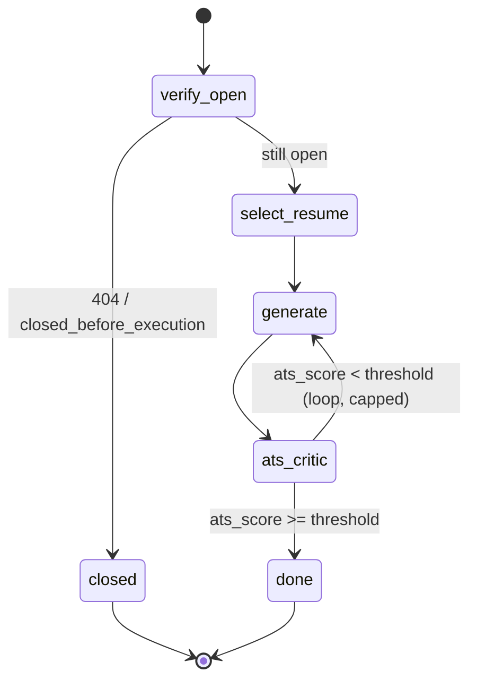
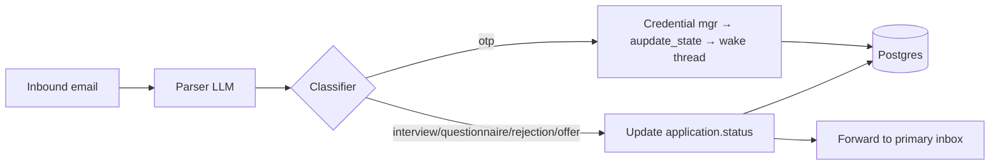

# AeroApply — Sprint Plan

> Purpose: the canonical six-sprint (12-week) delivery plan that takes AeroApply from an empty repo to a Railway-deployed, secure-by-default autonomous job-application daemon. Consistent with `ROADMAP.md`, `PROJECT_BRIEF.md`, `scripts/bootstrap.sql`, and the `backlog/` sprint assignments.

Six 2-week sprints. Sprint 1 begins the week of **2026-06-08**; Sprint 6 closes **2026-08-28**. Each sprint ends with a runnable demo against the local Docker Postgres (`infra/docker-compose.yml`) — prod (Railway) only enters in Sprint 6. Definition-of-done is uniform across sprints: code merged behind the **cross-vendor build-time review** CI gate (`PEER_REVIEW.md` — a different vendor reviews than authored), `ruff` + `mypy` clean, `pytest` green, and the sprint's demo reproducible from a fresh `docker compose up`.



Dependency spine: **S1 → S2 → S3 → S4 → S5 → S6**. S2 cannot start the WIP scheduler until S1 lands `v_icebox_ranked`; S4's submit gate consumes the `ats_score`/`agent_confidence` produced in S2–S3; S5's OTP injection wakes the paused Playwright thread built in S4.

---

## Sprint 1 — Foundations + Sourcing & Icebox (06/08–06/19)

**Goal.** Stand up the skeleton and the entire Tier-1 backlog so that ranked, deduped, bouncer-survived jobs flow into the Icebox 24/7 — using only cheap/local models.

**Scope / stories.**
- Repo scaffold per `PROJECT_BRIEF.md §14`: `uv` + Python 3.12, Pydantic v2, `ruff`/`mypy`/`pytest`, GitHub Actions CI wiring the cross-vendor review gate.
- `infra/docker-compose.yml`: Postgres 16 + **pgvector**; `.env.example` (incl. `AEROAPPLY_FERNET_KEY`).
- **Alembic** migration generated from `scripts/bootstrap.sql` — the canonical schema is the source; LangGraph `checkpoints*` are *not* hand-written (created later by `checkpointer.setup()`).
- Config loader: parse `config/profile.yaml` (operator, `search_profile`, `bouncer`, `ranking_weights`, `scheduler`, `autonomy`) into typed Pydantic models.
- **Model-router skeleton** (`src/aeroapply/models/router.py`): reads `model_config[node]` → `{provider, model_id, params, fallback}`; registers `claude-opus-4-8` (1M context, fast mode), `claude-sonnet-4-6`, `claude-haiku-4-5`, and a local Ollama provider. No node calls it yet beyond sourcing.
- **Connectors** (Tier A, API): Greenhouse, Lever, Ashby (`src/aeroapply/connectors/`). Seed `source` rows with `kind='api'`, `autonomy_tier='A'`.
- **SourcingBouncer** (`src/aeroapply/sourcing/bouncer.py`): the five edge filters — geo fence (40 mi, geopy), seniority/industry regex, salary-floor (band **max** vs `$115k`, unlisted passes), clearance/visa gate, 45-day ghost-job — dropping junk *before* any DB write.
- **Dedupe/fingerprint**: `fingerprint = sha256(company+title+location)` → `job.fingerprint UNIQUE`; `ON CONFLICT DO NOTHING`.
- **Icebox writes**: survivors insert a `job` row and an `application` row at `wip_status='icebox'`, `status='sourced'`.
- **`v_icebox_ranked`**: ship verbatim from `bootstrap.sql` (weighted CASE; `manual_override → +100`).

```python
# sourcing pipeline — bouncer runs BEFORE persistence
for raw in connector.fetch():           # greenhouse | lever | ashby
    job = normalize(raw)
    if not bouncer.passes(job):          # geo · seniority · salary · clearance · ghost
        continue
    upsert_job(job)                      # INSERT ... ON CONFLICT (fingerprint) DO NOTHING
    ensure_application(job, wip='icebox', status='sourced')
```

**Dependencies.** None (sprint zero).
**Demo.** `docker compose up` → run the sourcing daemon against the three ATS APIs → `SELECT company, title, execution_priority FROM v_icebox_ranked LIMIT 10;` returns ranked survivors; junk (e.g. a `$90k` or `clearance required` post) is provably absent.
**Definition-of-done.** Ranked jobs flow into the Icebox; bouncer drop-reasons unit-tested; fingerprint dedupe verified on re-run (no dup rows).
**Epics/components landed.** Infra/CI · Data model (Alembic from `bootstrap.sql`) · Model-router skeleton · **Epic: Sourcing & Ranking** (connectors, bouncer, Icebox, ranking view).

---

## Sprint 2 — Execution graph core + Tailoring loop (06/22–07/03)

**Goal.** Turn a queued Icebox job into a tailored resume with an `ats_score` — the heart of the LangGraph execution graph and the runtime peer-review loop.

**Scope / stories.**
- **Supervisor + WIP scheduler** (`src/aeroapply/graph/`): every `cycle_minutes` (180), read `v_icebox_ranked`, promote top-`wip_limit` (5) to `wip_status='queued'`, `status='queued'`.
- **`verify_open`** (graph's *first* node): HTTP-ping `job.portal_url`; on 404 / "no longer accepting" set `status='closed_before_execution'` and pull the next job — no frontier tokens wasted.
- **`select_resume`**: choose `resume_variant` by `role_focus` vs target title (AI PM base vs Senior BA base).
- **Generator ⇄ ATS-Critic cyclic subgraph**: Generator (`claude-opus-4-8`, fast mode, `temperature≈0.6`) drafts; ATS-Critic (`claude-sonnet-4-6`, `temperature=0`) scores keyword coverage and flags gaps; loop until `ats_score ≥ threshold` or max-iteration cap. See `TAILORING_AND_ATS.md`.
- **Postgres checkpointer**: `langgraph-checkpoint-postgres` over psycopg3 `AsyncConnectionPool`; `await checkpointer.setup()` auto-creates `checkpoints*`; `thread_id = application.id`.
- **Resume/QA embeddings + retrieval**: chunk resumes into `resume_chunk` and seed `qa_history`, embed with `text-embedding-3-small` (1536-d — must match the schema vector width), HNSW cosine retrieval feeding the Generator.



**Dependencies.** S1 (`v_icebox_ranked`, `application` rows, model-router, schema).
**Demo.** Promote a queued job → graph runs `verify_open → select_resume → tailor loop` → `application.tailored_resume_text` populated and `ats_score` written; kill the process mid-loop and resume from checkpoint to prove durability.
**Definition-of-done.** A queued job yields a tailored resume + `ats_score`; critic loop terminates on threshold or cap (no infinite loops); checkpoint resume verified.
**Epics/components landed.** **Epic: Execution Graph** (supervisor, WIP scheduler, `verify_open`, `select_resume`, checkpointer) · **Epic: Tailoring & ATS** (Generator⇄Critic subgraph, embeddings/retrieval).

---

## Sprint 3 — Cover letter + AITL + HITL gate + Streamlit (07/06–07/17)

**Goal.** Complete the drafting half end-to-end and put a human in front of it: cover letters, AITL question-answering, the runtime submission router, and the Streamlit control surface.

**Scope / stories.**
- **`cover_letter`** node (`claude-opus-4-8`): generate only when the application requires one; persist to `application.cover_letter`.
- **`answer_questions` (AITL)**: embed each screening question, similarity-search `qa_history`; on a high-confidence match emit `{answer, source, confidence}` into `application.answers`. **Never fabricate** — any `sensitive` field (`eeo`/`visa`/`clearance`/self-ID) or unmatched/novel question routes to human.
- **`evaluate_submission_route(state)`** (`src/aeroapply/graph/routing.py`): the conditional edge enforcing all gates — Source (browser/DOM → always escalate), Quality (`ats_score ≥ 0.90` **and** `agent_confidence ≥ 0.95`), Preference (`auto_submit = TRUE`), Honesty (any unseen/sensitive field → escalate). Default for anything not clearing every gate: `escalate_to_human_review`.
- **`pause_and_checkpoint`**: write `needs_human=TRUE` + `blockers`, set `status='needs_review'` / `wip_status='parked'`, interrupt the thread.
- **Streamlit app** (`src/aeroapply/ui/`): **Inbox** (paused threads + blockers), **Ledger** (full `application` history + `application_event` audit), **Kanban** (status columns). Curation actions: **Promote** (`manual_override=TRUE`) and **Drop** (`status='user_rejected'`), each writing an `application_event`.

```python
def evaluate_submission_route(state) -> str:
    if state["portal_type"] in BROWSER_PORTALS:          # workday|taleo|linkedin|custom
        return "escalate_to_human_review"
    if state["ats_score"] < 0.90 or state["agent_confidence"] < 0.95:
        return "escalate_to_human_review"
    if not state["auto_submit"]:                          # operator opt-in, per app
        return "escalate_to_human_review"
    if state["has_unmatched_or_sensitive_answer"]:        # honesty gate
        return "escalate_to_human_review"
    return "auto_submit"
```

**Dependencies.** S2 (graph, tailoring loop, `ats_score`, checkpointer, embeddings).
**Demo.** Run a job through `tailor → cover_letter → answer_questions → evaluate_submission_route`; it pauses at `needs_review` and surfaces in the Streamlit Inbox with its blockers; operator approves the draft (no live submission yet — that is S4).
**Definition-of-done.** End-to-end to a **human-approved draft**; sensitive/novel questions always escalate (tested); Promote/Drop mutate state and audit log.
**Epics/components landed.** **Epic: HITL/AITL** (`answer_questions`, routing, `pause_and_checkpoint`) · **Epic: UI** (Streamlit Inbox/Ledger/Kanban + curation) · cover-letter node.

---

## Sprint 4 — Apply connectors + credentials (07/20–07/31)

**Goal.** Actually submit — through clean APIs for Tier A, through Playwright for one DOM portal — backed by an encrypted credential vault. This is the first sprint that touches the outside world transactionally.

**Scope / stories.**
- **API submit (Tier A)**: `submit` node posts structured payloads to Greenhouse/Lever/Ashby; on success set `status='submitted'`, `submitted_at=now()`, `wip_status='done'`.
- **Playwright submit (one DOM portal)**: drive one Tier-B portal end-to-end; this path is **always HITL-gated** (per the Source gate) and ends by parking the thread to await any verification step.
- **Account creation + Fernet vault** (`src/aeroapply/db/` credentials): on a portal, derive `company_domain`; look up `portal_credentials` → decrypt (Fernet) and log in, or generate a strong password via `secrets`, sign up, and store a new `portal_credentials` row, attaching `credential_id` to the application. Passwords **Fernet-encrypted at rest** (`AEROAPPLY_FERNET_KEY`); never logged, never shown in the UI. Account creation is Tier B by definition (always HITL).
- Every submit/login/signup writes an `application_event` (`actor='agent'`).

**Dependencies.** S3 (approved drafts, routing gate, Inbox).
**Demo.** A real submission to a **Tier-A sandbox** (Greenhouse/Lever/Ashby test posting): app transitions `approved → submitting → submitted` with a captured confirmation in `application_event`; separately, the Playwright path logs into a DOM portal using a freshly created, Fernet-encrypted credential and parks for review.
**Definition-of-done.** Live submission to a Tier-A sandbox succeeds; credential round-trips (encrypt → store → decrypt → login) verified with no plaintext leakage; DOM path reaches its HITL pause cleanly.
**Epics/components landed.** **Epic: Apply Connectors** (API submit, Playwright submit) · **Epic: Credentials & Automation** (account creation, Fernet vault).

---

## Sprint 5 — Email-event service (08/03–08/14)

**Goal.** Close the loop with the inbox: auto-inject OTPs into paused threads, and let lifecycle emails drive `application.status` with zero manual data entry.

**Scope / stories.**
- **FastAPI inbound webhook** (`services/email_webhook/app.py`): `POST /v1/webhooks/inbound-email`; verify the Mailgun/SendGrid signature, parse **multipart form** (`await request.form()` — not JSON), match sender domain to an active application, extract OTP (`\b\d{4,7}\b`), and wake the paused Playwright thread via `await graph.aupdate_state(config, {"verification_code": code}, as_node="account_node")` (note: `aupdate_state` is on the **compiled graph**, not the checkpointer).
- **IMAP poller + classifier + forward**: hourly IMAP login → fast classifier (local/`claude-haiku-4-5`, `temperature=0`, structured output) maps each message to `interview | questionnaire | rejection | offer | none` → update `application.status` → forward full message to the operator's primary inbox via `aiosmtplib` (fire-and-forget through FastAPI `BackgroundTasks`). Persist every message to `email_event`.
- **Status state machine**: enforce the canonical transitions `submitted → questionnaire → interview → offer → accepted` plus terminals (`rejected`, `withdrawn`, `error`); high-priority events flag the Streamlit Inbox.



**Dependencies.** S4 (paused Playwright thread to wake; submitted applications to track).
**Demo.** Send an OTP email to the agent address → webhook wakes the parked thread, the agent types the code and proceeds unsupervised; send a mock "interview" email → `application.status` flips to `interview`, the message lands in the Inbox and is forwarded to the primary inbox.
**Definition-of-done.** OTP auto-injected end-to-end; lifecycle emails update status and forward; webhook signature verification enforced; every inbound message recorded in `email_event`.
**Epics/components landed.** **Epic: Lifecycle & Email** (inbound webhook, IMAP poller/classifier/forward, status state machine).

---

## Sprint 6 — Hardening + deploy (08/17–08/28)

**Goal.** Make it safe to run unattended and ship it to Railway: calibrate autonomy, lock down observability and anti-ban hygiene, and cut over from local Docker to production.

**Scope / stories.**
- **Autonomy calibration**: validate `min_ats_score=0.90` / `min_agent_confidence=0.95` against real drafts; confirm secure-by-default — only Tier A (`greenhouse`, `lever`, `ashby`) is `auto_submit` eligible; `workday`/`taleo`/`linkedin`/`custom` stay human-gated.
- **Audit/observability**: ensure every agent/human/system action lands in `application_event`; add `run`-level tracing and operational dashboards/log views.
- **Rate-limiting / anti-ban**: enforce per-`source.rate_limit` pacing; conservative LinkedIn/DOM cadence; **no CAPTCHA defeat, no anti-bot evasion** — escalate when blocked.
- **Railway deploy**: co-located FastAPI engine + Postgres + pgvector on Railway (the prod target — **not** Supabase); inbound email webhook reachable 24/7; Alembic migration applied to prod.
- **Secrets/KMS**: production Fernet key from a KMS-backed source (not the dev env var); secrets in the platform secret manager, never committed; verify inbound-webhook signatures in prod.

**Dependencies.** S1–S5 (entire daemon: sourcing, graph, UI, apply, email).
**Demo.** AeroApply running on Railway: sourcing daemon filling the Icebox, the execution graph drafting and pausing for review by default, with **opt-in Tier-A auto-submit** firing only when every gate passes; an end-to-end lifecycle email updates a live application.
**Definition-of-done.** Running on Railway, **review-default with opt-in Tier-A auto-submit**; prod secrets KMS-backed; audit log complete; anti-ban pacing active; no plaintext credentials anywhere.
**Epics/components landed.** **Epic: Security & Compliance** (autonomy calibration, audit/observability, anti-ban) · **Epic: Deploy** (Railway, secrets/KMS).

---

### Cross-sprint definition-of-done (applies to every sprint)
1. Merged behind the cross-vendor build-time review CI gate (a different vendor reviews than authored — `PEER_REVIEW.md`).
2. `ruff` + `mypy` clean; `pytest` green.
3. Demo reproducible from a fresh `docker compose up` (S1–S5) or a fresh Railway deploy (S6).
4. No real resumes, credentials, or PII committed; concrete values stay in `config/profile.yaml` / `.env`.
5. Current model IDs only (`claude-opus-4-8`, `claude-sonnet-4-6`, `claude-haiku-4-5`); never legacy IDs.
