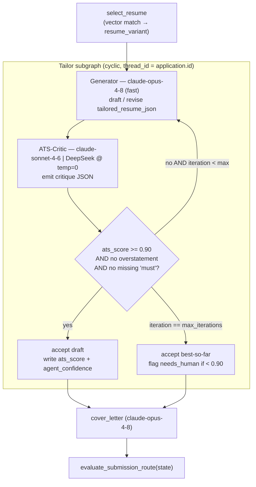

# Resume Tailoring & ATS (Generator vs Critic)

> **Purpose:** Specifies how the Execution Graph turns one Icebox `job` into a submission-ready, ATS-optimized resume + cover letter through the cyclic **Generator ⇄ ATS-Critic** subgraph, and how the resulting `ats_score` and `agent_confidence` feed the secure-by-default submission gate.

This document is subordinate to `PROJECT_BRIEF.md`. Where this doc and the brief disagree, the brief wins. It expands node 2 ("Tailor subgraph") of the Execution Graph and the runtime peer-review system described in `PROJECT_BRIEF.md` §9.

---

## 1. Where this fits in the Execution Graph

The Supervisor promotes the top-N (default 5, `scheduler.wip_limit`) Icebox applications to `wip_status = 'queued'`. Inside the LangGraph Execution Graph the order is fixed: `verify_open → select_resume → tailor (Generator ⇄ ATS-Critic) → cover_letter → answer_questions → evaluate_submission_route`. Tailoring only ever runs on a job that `verify_open` confirmed is still live, so we never spend frontier-model tokens drafting against a `closed_before_execution` posting.

Everything tailoring produces lands on the `application` row: `tailored_resume_json`, `tailored_resume_text`, `cover_letter`, `ats_score`, and `agent_confidence`. The whole subgraph runs under one `thread_id` (= the application id), so each Generator/Critic turn is a durable checkpoint — a crash mid-loop resumes exactly where it stopped.

---

## 2. Resume-variant selection (vector match: role vs `resume_chunk`)

The operator maintains a small set of base resumes in `resume_variant` (e.g. `'AI Product Manager - base'`, `'Senior BA - base'`), each exploded into `resume_chunk` rows (`section_name ∈ {Experience, Skills, Education, Summary}`) with a `vector(1536)` `embedding` (OpenAI `text-embedding-3-small` by default). The selection node picks the *base* variant whose chunks collectively sit closest to the target job, so the Generator starts from the most relevant raw material instead of editing a generic resume.

We embed the job's signal (title + `description` + `requirements`) once, then score each variant by the mean cosine similarity of its top-k chunks (HNSW index `idx_resume_chunk_embed`, `vector_cosine_ops`). Cosine distance is `<=>` in pgvector, so similarity is `1 - (embedding <=> query)`.

```sql
-- Best base resume_variant for a given job embedding (:q is the 1536-d query vector).
WITH ranked AS (
  SELECT rv.id              AS resume_variant_id,
         rv.profile_name,
         1 - (rc.embedding <=> :q) AS sim,
         row_number() OVER (PARTITION BY rv.id
                            ORDER BY rc.embedding <=> :q) AS rnk
  FROM   resume_variant rv
  JOIN   resume_chunk   rc ON rc.resume_id = rv.id
  WHERE  rv.user_id = :user_id
)
SELECT resume_variant_id, profile_name, avg(sim) AS variant_score
FROM   ranked
WHERE  rnk <= 8                       -- top-k chunks per variant
GROUP  BY resume_variant_id, profile_name
ORDER  BY variant_score DESC
LIMIT  1;
```

The winning `resume_variant_id` is written to `application.resume_variant_id` and the variant's `structured_json` becomes the Generator's editable scaffold (section-level edits, not a freeform rewrite). If no variant clears a minimum similarity floor, we fall back to `resume_variant.is_default = TRUE` and lower the starting `agent_confidence` — a weak base is itself a signal that this role may need human review. The mean-of-top-k score is also a convenient seed for `application.match_score`.

---

## 3. The cyclic Generator ⇄ ATS-Critic subgraph

This is the **runtime peer-review system** (distinct from the build-time `cross-review` CI gate; see `PROJECT_BRIEF.md` §9 — do not conflate them). Two roles, two different model tiers, deliberately asymmetric:

| Role | Model (`model_config` node) | Settings | Job |
|---|---|---|---|
| **Generator** | `claude-opus-4-8` (`tailor.generator`) | 1M context, **fast mode**, `temperature ≈ 0.6`, high `max_tokens` | Rewrite the selected resume against the JD — nuanced, human-sounding prose. |
| **ATS-Critic** | `claude-sonnet-4-6` *or* DeepSeek (`tailor.critic`) | `temperature = 0`, JSON-mode | Strict, deterministic scorer: keyword coverage, `ats_score`, missing requirements, overstatement flags. |

The asymmetry is the point: a warm, creative writer (fast Opus) paired with a cold, cheap, deterministic auditor (Sonnet/DeepSeek at `temperature=0`). Models are read from `model_config` per node, never hard-coded (`PROJECT_BRIEF.md` §10) — the Critic can be swapped to DeepSeek for cost without touching graph code.



State carried between turns (a slice of the LangGraph `tailor` state): `tailored_resume_json`, `latest_critique`, `iteration`, `best_score`, `best_draft`. We always retain `best_draft` so that hitting the iteration cap still yields the strongest attempt rather than the most recent one.

---

## 4. ATS keyword extraction from the job description

Before the loop runs, a cheap extraction pass (`claude-haiku-4-5` or local Llama via Ollama, `temperature=0`, JSON-mode — the same tier the SourcingBouncer and email classifier use) distills `job.description` + `job.requirements` into a structured keyword set. This is what makes the Critic's scoring objective instead of vibes-based; both Generator and Critic receive the identical extracted set so they optimize against the same target.

```json
{
  "must_have": ["AI product roadmap", "LLM evaluation", "stakeholder management", "RAG"],
  "nice_to_have": ["LangGraph", "Streamlit", "agentic workflows"],
  "hard_requirements": ["5+ years product management", "B.S. or equivalent"],
  "title_keywords": ["AI Product Manager"],
  "disqualifiers": ["active TS/SCI", "on-site only"]
}
```

`must_have` and `hard_requirements` drive `missing_requirements`; `must_have` + `nice_to_have` define the denominator for `keyword_coverage`. Any `disqualifiers` should already have been caught by the SourcingBouncer (`legal_blocker_regex`, geo, salary) before the job was ever written to the DB — surfacing them here is a defense-in-depth backstop, and a hard requirement the operator cannot truthfully meet routes straight to human review rather than being papered over.

---

## 5. The critique contract

The ATS-Critic returns **only** this JSON object (JSON-mode, `temperature=0` → reproducible). It is the API between Critic and Generator; the Generator's next turn is driven entirely by these fields.

| Field | Type | Meaning |
|---|---|---|
| `ats_score` | float 0–1 | Weighted keyword coverage; the loop's exit metric. Persisted to `application.ats_score`. |
| `keyword_coverage` | object | Which `must_have` / `nice_to_have` terms are present vs. absent in the draft. |
| `missing_requirements` | string[] | `must_have` / `hard_requirements` terms not yet evidenced — the Generator's to-do list. |
| `overstatement_flags` | object[] | **Honesty guard** (see below). Each flags a claim the draft asserts beyond the operator's source resume. |
| `confidence` | float 0–1 | Critic's certainty in its own assessment; folds into `agent_confidence`. |
| `verdict` | enum | `pass` \| `revise` \| `human_review`. |
| `notes` | string | Short rationale for the audit log (`application_event`). |

### Overstatement guard (never inflate experience)

This is the non-negotiable that keeps tailoring honest, mirroring the brief's "**Never fabricate**" rule (`PROJECT_BRIEF.md` §13.1). The Critic is explicitly instructed that **raising `ats_score` by inventing experience is a failure, not a win.** Every claim in the draft must trace to a `resume_chunk` from the selected variant. If the JD wants "8 years managing ML teams" and the source resume supports 4, the Critic emits an `overstatement_flag` — it does **not** let the Generator close the gap with fiction. A draft with one unresolved overstatement cannot pass, regardless of `ats_score`. The honest ceiling is a feature: it forces genuinely under-qualified roles to `verdict: human_review` instead of producing a polished lie.

### Example critique JSON

```json
{
  "ats_score": 0.86,
  "keyword_coverage": {
    "present": ["AI product roadmap", "stakeholder management", "LLM evaluation", "RAG"],
    "absent":  ["agentic workflows"],
    "coverage_ratio": 0.86
  },
  "missing_requirements": [
    "Explicit mention of 'agentic workflows' (listed as nice_to_have)"
  ],
  "overstatement_flags": [
    {
      "claim": "Led a 12-person ML platform team for 8 years.",
      "source_support": "resume_chunk 'Experience' supports ~4 years leading a 5-person analytics team.",
      "severity": "high",
      "instruction": "Reduce to the years and team size the source resume substantiates; do not invent tenure."
    }
  ],
  "confidence": 0.78,
  "verdict": "revise",
  "notes": "Strong keyword match; one high-severity tenure overstatement blocks pass. One nice_to_have gap is addressable truthfully via the LangGraph project bullet."
}
```

On this critique the loop continues: `ats_score 0.86 < 0.90` **and** an unresolved high-severity overstatement. The Generator's next turn is told to (a) truthfully fold in "agentic workflows" using the existing LangGraph experience and (b) correct the tenure claim downward. `ats_score` is on the **0–1 scale project-wide**; the `application.ats_score` column is `NUMERIC(5,4)`, and the gate threshold is `autonomy.min_ats_score: 0.90`.

---

## 6. Loop / exit conditions + max-iteration cap

The conditional edge after the Critic (canonical predicate, conceptually alongside `evaluate_submission_route` in `src/aeroapply/graph/routing.py`):

```python
def tailor_route(state: TailorState) -> str:
    crit = state["latest_critique"]
    # Track the strongest attempt so the cap never throws away good work.
    if crit["ats_score"] > state["best_score"]:
        state["best_score"] = crit["ats_score"]
        state["best_draft"] = state["tailored_resume_json"]

    blocking_overstatement = any(
        f["severity"] == "high" for f in crit["overstatement_flags"]
    )
    has_missing_must = bool(crit["missing_requirements"])

    # PASS: clears the ATS bar, fully honest, no missing must-haves.
    if (crit["ats_score"] >= 0.90
            and not blocking_overstatement
            and not has_missing_must):
        return "accept"

    # HARD STOP: under-qualified — escalate rather than fabricate.
    if crit["verdict"] == "human_review":
        return "escalate"

    # CAP: out of iterations — keep best_draft, flag if still short.
    if state["iteration"] >= state["max_iterations"]:   # default 4
        return "cap"

    state["iteration"] += 1
    return "revise"
```

- **PASS** (`accept`): `ats_score ≥ 0.90`, zero high-severity overstatements, no missing must-haves → write `best_draft` to `application.tailored_resume_json/_text` and proceed to `cover_letter`.
- **REVISE**: anything fixable and budget remaining → loop back to the Generator with the critique as instructions.
- **CAP** (`cap`): `iteration` hits `max_iterations` (default **4**) → persist `best_draft` and `best_score`. If `best_score < 0.90`, set `application.needs_human = TRUE` and record the blocker in `application.blockers`. The cap exists so a stubborn JD (or a genuinely poor fit) can't spin Opus forever — bounded cost is the contract.
- **ESCALATE**: an honesty-impossible role (Critic returns `human_review`) short-circuits the loop straight to the HITL Inbox; we never burn iterations trying to fabricate our way to a pass.

Every Generator turn, Critic turn, and exit is appended to `application_event` (`actor='agent'`) so the operator can audit exactly how a draft converged.

---

## 7. Cover-letter composition

After tailoring passes (or caps), `cover_letter` runs **only if the portal/job requires one** — it's a separate Generator call on `claude-opus-4-8` (1M context, fast mode, `temperature ≈ 0.6`), drawing on the just-finalized `tailored_resume_json`, the extracted keyword set, and the operator's headline/persona from `config/profile.yaml` (Senior BA/PM → AI Product Manager). It inherits the same honesty constraint: the letter may only assert what the tailored resume already substantiates — no new claims appear in the cover letter that survived the overstatement guard in the resume. Output is written to `application.cover_letter`. The cover letter is *not* re-scored by the ATS-Critic (cover letters rarely pass through keyword ATS parsers); its honesty is bounded by reusing only vetted resume content.

---

## 8. How `ats_score` + `agent_confidence` feed the submission gate

Tailoring produces two of the four signals `evaluate_submission_route(state)` checks before auto-submit (`PROJECT_BRIEF.md` §6). The route is a **runtime conditional edge**, evaluated per-application — not a static `interrupt_before`.

- **`ats_score`** ← the accepted critique's score, persisted to `application.ats_score`.
- **`agent_confidence`** ← a composite folding in the Critic's `confidence`, the resume-variant match strength from §2, whether the loop passed cleanly vs. hit the cap, and the `answer_questions` node's certainty. Written to `application.agent_confidence` (`NUMERIC(5,4)`).

### `agent_confidence` formula (deterministic)

`agent_confidence` is computed deterministically — no LLM call — so the quality gate is reproducible and unit-testable. It is the **minimum** of three component signals (a chain is only as strong as its weakest link), then **gated to 0** if the tailor loop hit its `max_iterations` cap without clearing threshold:

```python
def compute_agent_confidence(state) -> float:
    crit = state["latest_critique"]

    critic_confidence  = crit["confidence"]                 # 0–1, from the critique contract (§5)
    match_score        = clamp01(state["match_score"])      # 0–1, mean-of-top-k variant similarity (§2)
    answer_certainty   = clamp01(state["answer_certainty"]) # 0–1, min certainty across answer_questions

    # loop_converged: the loop PASSED (verdict 'accept'), it did not merely hit the cap.
    loop_converged = (state["verdict"] == "accept")

    base = min(critic_confidence, match_score, answer_certainty)
    return base if loop_converged else 0.0   # cap-without-pass cannot auto-submit

def clamp01(x: float) -> float:
    return max(0.0, min(1.0, x))
```

- **Components** (each already on 0–1): `critic_confidence` = the accepted critique's `confidence`; `match_score` = the §2 resume-variant similarity (also seeds `application.match_score`); `answer_certainty` = the **minimum** per-question certainty emitted by `answer_questions` (one shaky answer drags the whole application down).
- **`loop_converged` gate:** if `tailor_route` returned `cap` (hit `max_iterations` without a clean `accept`), `agent_confidence = 0.0`, which can never satisfy the `≥ 0.95` quality gate — a capped draft always routes to human review. A clean `accept` lets the `min(...)` stand.
- **Testable invariants:** output is always in `[0, 1]`; it never exceeds any single component; and `loop_converged = False` forces exactly `0.0` regardless of the components. The result is rounded to fit `NUMERIC(5,4)` on write.

The **quality gate** requires `ats_score ≥ 0.90` **and** `agent_confidence ≥ 0.95` (`autonomy.min_ats_score` / `autonomy.min_agent_confidence`). But these are necessary, not sufficient — auto-submit fires only when **every** gate clears:

1. **Source gate** — Tier A clean-API ATS only (`greenhouse`, `lever`, `ashby`, per `source.autonomy_tier = 'A'`). Browser/DOM portals (Workday, Taleo, LinkedIn, custom) are **always** `escalate_to_human_review`, no matter how high the scores.
2. **Quality gate** — `ats_score ≥ 0.90` AND `agent_confidence ≥ 0.95`.
3. **Preference gate** — `application.auto_submit = TRUE` (operator opt-in per role/source).
4. **Honesty gate** — any novel/unmatched question, or any EEO/visa/clearance/self-ID field not matched to `qa_history` with high confidence → escalate.
5. **Default** — anything not clearing all gates → `escalate_to_human_review`.

So a flawless `ats_score = 0.97` resume for a Workday role still routes to the operator's Inbox (source gate), and a Greenhouse role with `auto_submit = FALSE` waits for review (preference gate). The overstatement guard reinforces the same posture from the other end: a draft can only legitimately reach `ats_score ≥ 0.90` *honestly*, so a high score is evidence of a genuinely strong, truthful fit — exactly the only thing we let the daemon submit unsupervised. When the gate escalates, the thread checkpoints to `status = 'needs_review'` and surfaces in the Streamlit Inbox; the operator's approval flips it toward `approved → submitting`.
