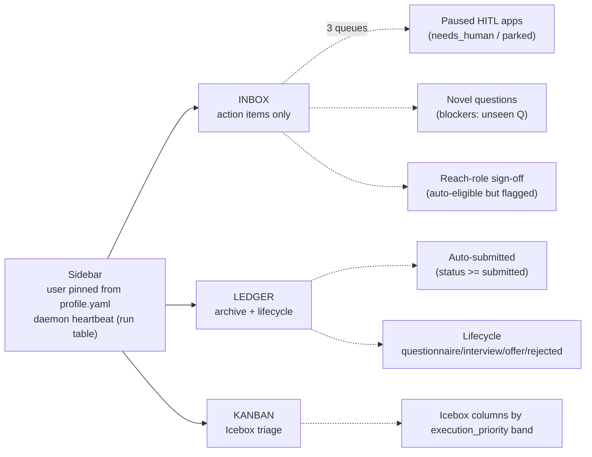
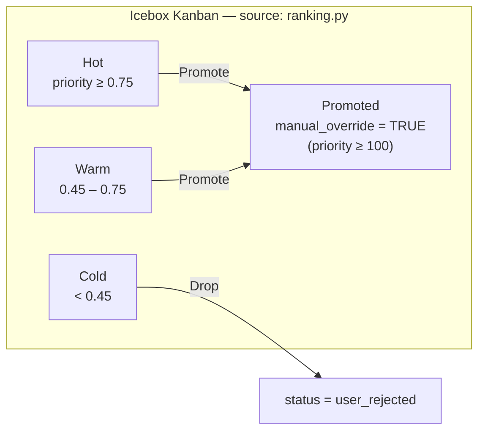
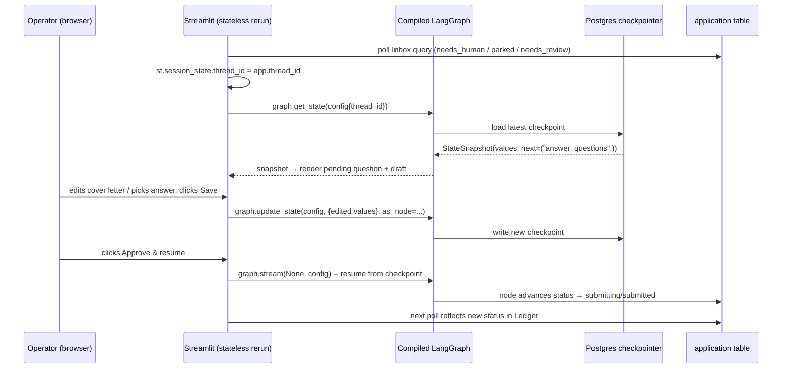

# UI / UX (Streamlit dual-view)

> Purpose: define the v1 operator console for AeroApply — a Streamlit dual-view (Inbox + Ledger) plus a Kanban over the Icebox — and the precise Streamlit↔LangGraph state bridge that surfaces paused HITL threads, injects operator edits, and resumes the graph, with the FastAPI + Next.js successor documented as a deferred path.

---

## 1. What the UI is for (and what it is not)

AeroApply runs as a persistent always-on daemon: the Sourcing Daemon, the WIP-limited execution graph, and the FastAPI email-event service all advance state in Postgres without anyone watching. The Streamlit app is therefore **not** the system — it is a thin, stateless window onto two things:

1. **The execution graph paused at a checkpoint**, waiting for a judgment call (the *Inbox*).
2. **Everything Postgres already knows** — auto-submitted applications, lifecycle status, the raw Icebox backlog (the *Ledger* and *Kanban*).

This framing matters for every design decision below. The UI owns no durable state of its own; LangGraph's Postgres checkpointer and the `application` table are the source of truth. Streamlit reruns its whole script top-to-bottom on every widget interaction, so the only thing we keep in `st.session_state` is the `thread_id` of the application currently in focus. Everything else is re-read from the checkpointer or the DB on each rerun. This keeps the daemon and the console honestly decoupled: closing the browser pauses nothing and loses nothing.

The console is single-operator (multi-tenant is out of scope for v1), so there is no auth layer, no per-user view scoping in the UI itself — `user_id` is pinned from `config/profile.yaml` at startup.

---

## 2. Information architecture

Three top-level views, selected from a sidebar radio. The sidebar also shows a live daemon heartbeat (last Supervisor cycle time, active WIP count) read from the `run` table.



### 2.1 Inbox — the judgment 10%

The Inbox is the only screen the operator is *expected* to act on. It is a filtered feed of applications where the graph has stopped and is asking a question. It draws from exactly the states the brief defines as human-gated. The query is precise:

```sql
SELECT a.id, a.thread_id, j.company, j.title, j.portal_type,
       a.status, a.wip_status, a.needs_human, a.blockers,
       a.ats_score, a.agent_confidence, a.auto_submit
FROM application a
JOIN job j ON j.id = a.job_id
WHERE a.user_id = %(uid)s
  AND (
        a.needs_human = TRUE                       -- explicit escalation
     OR a.wip_status = 'parked'                    -- scheduler-parked, awaiting input
     OR a.status = 'needs_review'                  -- drafted, secure-by-default review gate
  )
ORDER BY a.updated_at DESC;
```

Within the Inbox, items group into three queues that map to the three reasons `evaluate_submission_route(state)` escalates:

- **Paused HITL apps** — Tier-B / DOM-portal applications (`portal_type IN ('workday','taleo','custom')` or LinkedIn) that **always** route to human review per the source gate, plus any drafted-but-unsubmitted app sitting in `needs_review` under the default review-before-submit posture. Each card offers **inline resume/cover-letter editing** and **chat-with-agent** (see §3).
- **Novel questions** — applications whose `blockers` JSON flags an unseen screening question or an EEO/visa/clearance/self-ID field that `qa_history` could not match with high confidence. Per the honesty non-negotiable, the agent never fabricates here; it parks and asks. The card renders the exact question text and any candidate answers the agent retrieved (with their `confidence`), and the operator either picks one or types the truth.
- **Reach-role sign-off** — applications that *cleared* the quality gate (`ats_score ≥ 0.90` AND `agent_confidence ≥ 0.95`) and have `auto_submit = TRUE`, but were flagged for a final look because the role is a stretch (e.g., a core `AI Product Manager` posting at a tier-1 company). This is the one queue where "approve" is the common action and the draft is usually already good.

An empty Inbox is the success state — render it as such ("Nothing needs you. The daemon is working."), not as an error.

### 2.2 Ledger — the mechanical 90%

The Ledger is a read-heavy archive: every application the agent auto-submitted without bothering the operator, plus the full lifecycle status of everything in flight. It is the audit surface that proves the autonomy is behaving. It is paginated, filterable by `status`, and each row expands into the `application_event` audit trail (append-only, every `agent | human | system` action) and the `email_event` rows that drove status transitions.

```sql
SELECT a.id, j.company, j.title, a.status, a.ats_score, a.agent_confidence,
       a.submitted_at, a.updated_at
FROM application a
JOIN job j ON j.id = a.job_id
WHERE a.user_id = %(uid)s
  AND a.status IN ('submitting','submitted','questionnaire',
                   'interview','offer','accepted','rejected',
                   'closed_before_execution','withdrawn','error')
ORDER BY a.submitted_at DESC NULLS LAST, a.updated_at DESC;
```

The lifecycle column is a horizontal status ribbon driven straight by the canonical state machine (`submitted → questionnaire → interview → offer → accepted`, with `rejected`/`withdrawn`/`error` as terminals). Because the IMAP poller advances `application.status` hourly and the inbound webhook can flip a thread mid-flight, **the Ledger must poll** (see §5) — a row can change while the operator is staring at it.

### 2.3 Kanban — Icebox triage

The Kanban sits over **Tier-1, the Icebox** (`wip_status = 'icebox'`, `status = 'sourced'`). It is how the operator curates raw sourcing volume before the Supervisor ever spends frontier tokens. Cards are ordered by `ranking.py` (the same `rank_jobs` the scheduler calls, over `profile.ranking_weights`; the `v_icebox_ranked` view remains a SQL-inspection fallback), and bucketed into columns by priority band:



Two actions only, matching the brief's curation verbs:

- **Promote** → sets `manual_override = TRUE`. This is the absolute `+100.0` trump in the ranking view, so the job jumps to the front of the next Supervisor pull regardless of its computed score. (Promote does **not** itself move `wip_status`; the Supervisor still owns the icebox→queued transition under its WIP limit. Promote only guarantees it is next.)
- **Drop** → sets `status = 'user_rejected'` and `wip_status = 'done'` (retiring it from the scheduler's Icebox), removing it from `v_icebox_ranked` (the view filters `status = 'sourced'`) so it never resurfaces.

```sql
-- Promote
UPDATE application SET manual_override = TRUE, updated_at = now()
WHERE id = %(app_id)s AND user_id = %(uid)s;

-- Drop
UPDATE application SET status = 'user_rejected', wip_status = 'done', updated_at = now()
WHERE id = %(app_id)s AND user_id = %(uid)s;
```

A card surfaces the human-legible inputs to the score — `company`, `title`, `remote_mode`, `posted_at`, `applicant_count`, `closing_date` — so the operator can sanity-check *why* something ranked where it did before promoting it.

> **Implemented (lite).** `aeroapply ui` ships the lite Kanban: a single Python-ranked Icebox list of cards (title · company · location, the five score components, and `execution_priority`) with **Promote** / **Drop** buttons — read + curate only, no submit/apply/credential path. The priority-band columns above remain the next step. Cards are assembled by `src/aeroapply/ui/board.py` (pure, over `rank_jobs`) and rendered by `src/aeroapply/ui/kanban.py`; Promote/Drop go through `db/repo.py`, which also appends the `application_event` audit row (actor `human`). The live score components shown are the seam `ranking_debug` (#80) will later persist.

---

## 3. Layout sketch

```
┌──────────────────────────────────────────────────────────────────────────────┐
│ AeroApply ▸ console                       daemon: last cycle 12m ago · WIP 4/5 │
├────────────┬─────────────────────────────────────────────────────────────────┤
│  ○ Inbox   │  INBOX — 3 items need you                                         │
│  ● Ledger  │  ┌───────────────────────────────────────────────────────────┐   │
│  ○ Kanban  │  │ ◆ NOVEL QUESTION   Acme Corp · AI Product Manager          │   │
│            │  │   portal: greenhouse · ats 0.93 · conf 0.91               │   │
│  ───────   │  │   Q: "Describe a time you shipped an ML feature end-to-end"│   │
│  Filters   │  │   ┌ retrieved candidates (qa_history) ────────────────┐    │   │
│  status ▾  │  │   │ • "Led rollout of …"            conf 0.71  [use]  │    │   │
│  source ▾  │  │   └──────────────────────────────────────────────────┘    │   │
│            │  │   [ answer textbox ........................... ] [Submit] │   │
│            │  ├───────────────────────────────────────────────────────────┤   │
│            │  │ ◆ PAUSED HITL      Globex · Sr Business Analyst (Workday)  │   │
│            │  │   reason: DOM portal → always human · wip_status=parked    │   │
│            │  │   ┌ Tabs: [Resume] [Cover letter] [Answers] [Chat] ──────┐ │   │
│            │  │   │ tailored_resume_text  (editable) ……………………………………… │ │   │
│            │  │   │ > ATS-Critic flagged: missing "stakeholder mgmt"     │ │   │
│            │  │   └──────────────────────────────────────────────────────┘ │   │
│            │  │   [Save edits → update_state]  [Approve & resume → stream] │   │
│            │  └───────────────────────────────────────────────────────────┘   │
└────────────┴─────────────────────────────────────────────────────────────────┘
```

The two action buttons on a paused card are the entire HITL contract: **Save edits** writes the operator's changes into the checkpoint via `update_state`; **Approve & resume** calls `stream(None)` to let the graph continue from exactly where it stopped. **Chat-with-agent** is a tab that lets the operator ask the drafting model (`claude-opus-4-8`, 1M context, fast mode) to revise in place — "tighten the summary," "pull the Workday-specific keywords forward" — and the revised text lands back in the same editable field before it is committed to state.

---

## 4. The Streamlit ↔ LangGraph state bridge

This is the load-bearing part of the design. A paused application *is* a LangGraph thread frozen at a checkpoint; the Inbox card is a rendering of that thread's pending state, and the operator's actions mutate the checkpoint and resume it. The bridge has four moves: **identify the thread**, **detect the pause**, **inject the edit**, **resume**.



### 4.1 The key state-bridge code pattern

`update_state` / `stream` are methods on the **compiled graph**, not on the checkpointer (the same correctness point the brief flags for the email webhook's `aupdate_state`). The `thread_id` we use is the `application.id` — the schema makes them the same value on purpose (`application.thread_id` column), so the UI never needs a side table to map applications to checkpoints.

```python
import streamlit as st
from aeroapply.graph import build_execution_graph  # compiled with the Postgres checkpointer

graph = build_execution_graph()  # cached; wraps PostgresSaver / AsyncPostgresSaver

def config_for(thread_id: str) -> dict:
    return {"configurable": {"thread_id": thread_id}}

# 1) IDENTIFY — thread_id is the only durable UI state we keep.
thread_id = st.session_state["thread_id"]        # == application.id
cfg = config_for(thread_id)

# 2) DETECT THE PAUSE — read the live checkpoint and see where it stopped.
snapshot = graph.get_state(cfg)
paused_at = snapshot.next                          # e.g. ("answer_questions",) or ()
is_paused = bool(paused_at)                         # empty tuple => graph is done, not paused
draft     = snapshot.values                         # tailored_resume_text, cover_letter, answers, blockers

if is_paused:
    edited_cover = st.text_area("Cover letter", value=draft.get("cover_letter", ""))
    answer       = st.text_input("Answer to novel question")

    # 3) INJECT THE EDIT — patch state as the node that was about to run.
    if st.button("Save edits"):
        graph.update_state(
            cfg,
            {"cover_letter": edited_cover,
             "answers": {**draft.get("answers", {}), draft["pending_question"]: answer}},
            as_node=paused_at[0],                    # attribute the write to the paused node
        )
        st.rerun()

    # 4) RESUME — stream(None) continues from the checkpoint, no re-run of prior nodes.
    if st.button("Approve & resume"):
        for _event in graph.stream(None, cfg, stream_mode="values"):
            pass                                     # node persists status → submitting/submitted
        st.toast("Resumed — moved to Ledger.")
        st.rerun()
```

Three details that are easy to get wrong:

- **`as_node` is mandatory for honest edits.** Writing without it can mis-attribute the patch and confuse the conditional-edge router; we always pass the node named in `snapshot.next`, so the operator's cover-letter rewrite or chosen answer is fed in exactly where `evaluate_submission_route(state)` expects it.
- **`stream(None)` resumes — it does not restart.** Passing `None` as input tells LangGraph "no new input, continue from the saved checkpoint." We drain the generator (we do not need the streamed tokens in the Inbox; the Ledger will show the result) and then rerun the Streamlit script so the card disappears from the Inbox and reappears in the Ledger.
- **The webhook can resume the *same* thread out-of-band.** For Tier-B account-creation, the FastAPI inbound-email service injects an OTP into a paused Playwright thread with `await graph.aupdate_state(config, {"verification_code": code}, as_node="account_node")` and resumes it — the UI is not the only writer to a checkpoint. The console therefore must never assume it holds an exclusive lock on a thread; it re-reads `get_state` on every rerun.

### 4.2 Why this is safe under Streamlit's rerun model

Because we persist only `thread_id` and re-derive everything from `get_state`, there is no stale-draft hazard: if the email webhook advanced the thread while the operator was typing, the next rerun's `get_state` reflects it, and a no-longer-paused `snapshot.next == ()` collapses the editor to a read-only Ledger view. Optimistic UI is unnecessary and would be actively wrong here.

---

## 5. Polling for async status changes

The daemon mutates Postgres continuously and asynchronously — the Supervisor promotes Icebox jobs every `cycle_minutes` (180 by default), execution nodes advance `status`, and the hourly IMAP poller plus the real-time inbound webhook flip `status` and `email_event`. Streamlit has no native push, so each view runs a bounded auto-refresh:

```python
from streamlit_autorefresh import st_autorefresh

# Inbox/Ledger refresh every 20s; Kanban can be lazier (60s) since the Icebox moves slowly.
st_autorefresh(interval=20_000, key="inbox_poll")
```

The refresh simply re-runs the view's SQL (and, for any focused thread, `get_state`). This is deliberately crude and correct for a single-operator tool: at this scale a 20-second poll against local Docker Postgres (dev) or co-located Railway Postgres (prod) is negligible, and it avoids standing up a websocket/SSE layer we do not yet need. Both dev and prod keep the checkpointer and the application tables in the **same** Postgres the brief mandates (local Docker → Railway, explicitly **not** Supabase), so `get_state` and the view query hit one backend with low latency.

---

## 6. Deferred path: FastAPI + Next.js

Streamlit is the v1 internal UI precisely because it collapses "render a DB row" and "mutate graph state" into a few lines of Python in the same process as the graph builder. Its limits are known and acceptable for one operator: full-script reruns, poll-only updates, single concurrent session, and coarse layout control.

The documented successor is a **FastAPI + Next.js** split:

- **FastAPI** exposes the same operations as a typed API: `GET /v1/inbox`, `POST /v1/applications/{id}/state` (wrapping `update_state` with `as_node`), `POST /v1/applications/{id}/resume` (wrapping `stream(None)`), `POST /v1/jobs/{id}/promote`, `POST /v1/jobs/{id}/drop`. It already co-exists with the email-event service on Railway, so the engine host is shared.
- **Next.js** delivers a real component model, optimistic-but-reconciled mutations, and — replacing the poll — **server-sent events** off LangGraph's `astream_events` so paused→resumed transitions and lifecycle changes push to the browser instead of being polled.

This is a v2+ item, not v1 scope. The contract to preserve across the migration is exactly the §4 bridge: `thread_id == application.id`, `get_state` to detect a pause, `update_state(as_node=...)` to inject edits, `stream(None)` to resume. Anything that honors that contract can drive the same daemon without touching the graph.
